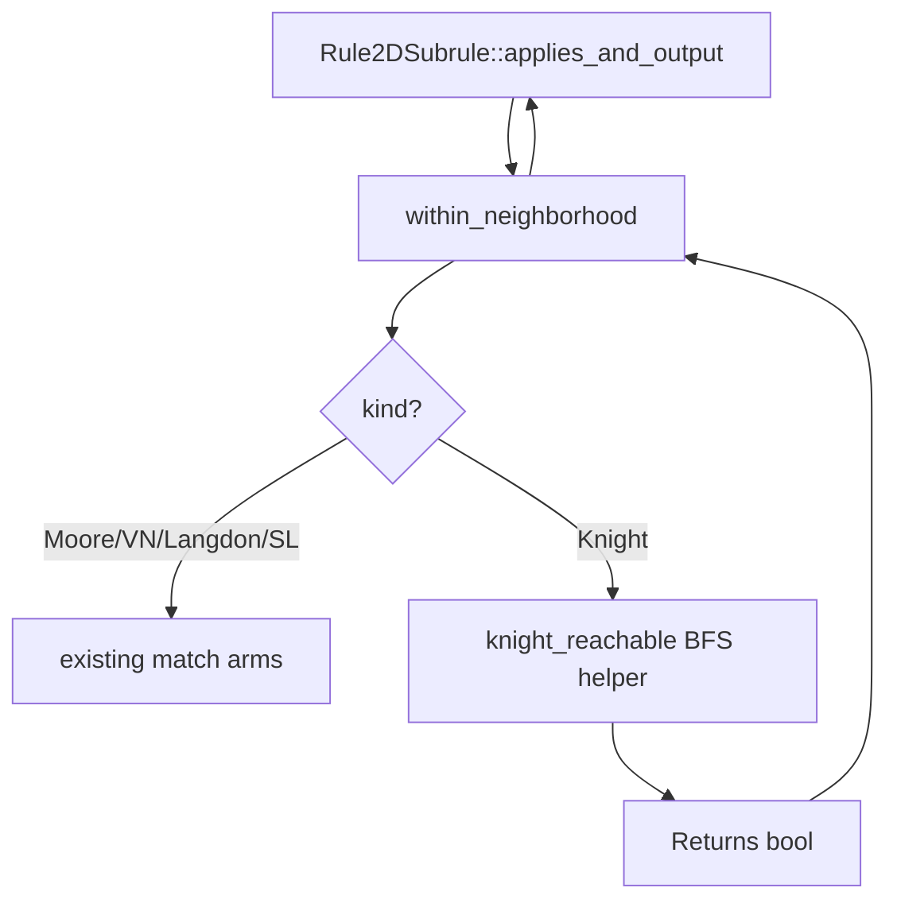

# Requirements

### Overview & Goals
Add a `Knight` variant to `Neighborhood2D` that defines neighboring cells as those reachable by a chess knight piece. The `range` parameter of a `Rule2DSubrule` is reinterpreted as the **maximum number of knight moves** (1–N), so `range=1` gives exactly the 8 classic L-shaped squares and `range=3` includes every cell reachable in 1, 2, or 3 knight hops.

### Scope
**In Scope**
- New `Neighborhood2D::Knight` enum variant in `rules.rs`.
- Pre-computed reachability logic: for range=N, a cell (dx, dy) is included if it can be reached in ≤N knight jumps from the origin.
- JSON/serde round-trip support (the variant serialises as `"Knight"`).
- A demo config file `configs/2d_knight_neighborhood.json`.
- GUI rule editor: `Knight` selectable in the neighborhood `ComboBox` for 2D subrules.
- GUI hover diagram: `neighborhood_ascii` extended to render the Knight pattern.
- Unit tests covering: range=1 classic squares, range=2 reachability, cells that are *not* reachable, and a full grid step.

**Out of Scope**
- Any changes to 1D rules or Grid1D.
- New Makefile targets (existing `test`/`test-all` targets already cover the new tests).

### User Stories
- As a rule designer, I want to use `"neighborhood": "Knight"` in a JSON subrule so that cells affected are those a chess knight can reach within the given number of moves.
- As a developer, I want `range=1` to produce exactly the 8 classic knight-move squares so that I can build chess-inspired automata.
- As a developer, I want `range=N` (N>1) to union all cells reachable in 1..=N hops so that range naturally scales the influence zone.
- As a GUI user, I want to select "Knight" from the neighborhood dropdown in the Rule Editor so that I can configure Knight-based automata without editing JSON manually.
- As a GUI user, I want the neighborhood preview diagram to show which cells are Knight neighbors so that I can visually verify the shape before applying the rule.

# Technical Design

### Current Implementation
Neighborhood filtering is entirely self-contained in `cella_lib/src/rules.rs`:

```
fn within_neighborhood(dx: i32, dy: i32, n: i32, kind: Neighborhood2D) -> bool
```

This predicate returns `true` when `(dx, dy)` belongs to the neighborhood of radius `n`. It is called inside `applies_and_output` which already iterates `dy in -n..=n, dx in -n..=n`. No other file needs to know the internal geometry.

`Neighborhood2D` is a C-like enum with `#[derive(Serialize, Deserialize)]`; adding a new variant is automatically JSON-compatible via serde.

### Key Decisions

 Decision | Choice | Rationale |
---|---|---|
 Reachability definition | BFS/flood-fill over knight moves up to depth N | Exact — avoids closed-form approximations that have edge cases |
 Iteration window | Extend to `(-4n)..=(4n)` on each axis | A knight of range N can reach at most `2N` steps per axis (N hops × max 2 per hop), so `4n` is a safe upper bound (`2*n` would miss some cells at range 2+) |
 BFS caching | Compute per call, no global cache | Subrule evaluation is already O(range²); BFS at depth N over a bounded board is negligible |
 Zero-distance exclusion | `(0,0)` always excluded | Consistent with all other neighborhoods |

### Proposed Changes

#### 1. `cella_lib/src/rules.rs`

**Add variant to enum:**
```rust
pub enum Neighborhood2D {
    Moore,
    VonNeumann,
    Langdon,
    StraightLine,
    Knight,   // ← new
}
```

**Update `within_neighborhood`:**
```rust
Neighborhood2D::Knight => {
    if dx == 0 && dy == 0 { return false; }
    knight_reachable(dx, dy, n as u8)
}
```

**Add helper (private fn in `rules.rs`):**
```rust
/// Returns true if (dx,dy) is reachable from (0,0) in at most `max_moves` knight hops.
fn knight_reachable(dx: i32, dy: i32, max_moves: u8) -> bool {
    // BFS on (x, y, moves_used)
    // Terminate early when (dx,dy) found or all states exhausted
    ...
}
```

**Update `applies_and_output` iteration window for Knight:**
The existing `-n..=n` loop for `dy`/`dx` under-reaches for `Knight` when `n > 1`. The simplest fix is to iterate a wider window conditionally:
```rust
let half = if self.neighborhood == Neighborhood2D::Knight { self.range as i32 * 2 } else { n };
for dy in -half..=half {
    for dx in -half..=half {
        if !Self::within_neighborhood(dx, dy, n, self.neighborhood) { continue; }
        ...
    }
}
```

#### 2. `src/gui/app.rs` — GUI Rule Editor

Two locations in `app.rs` need updating:

**A. Neighborhood ComboBox** (around line 892): add `Knight` as a selectable option:
```rust
egui::ComboBox::from_id_salt(format!("d2_nh_{}", i))
    .selected_text(match nb {
        Neighborhood2D::Moore => "Moore",
        Neighborhood2D::VonNeumann => "VonNeumann",
        Neighborhood2D::Langdon => "Langdon",
        Neighborhood2D::StraightLine => "StraightLine",
        Neighborhood2D::Knight => "Knight",   // ← new
    })
    .show_ui(ui, |ui| {
        // ... existing variants ...
        ui.selectable_value(&mut nb, Neighborhood2D::Knight, "Knight");  // ← new
    });
```

**B. Hover tooltip text** (around line 889): extend description to include Knight:
```
"Moore = square; VonNeumann = Manhattan distance; Langdon = diagonals;
StraightLine = cardinal lines only; Knight = chess knight L-moves (range = max hops)"
```

**C. `neighborhood_ascii` function** (lines 1460-1487): add `Knight` arm and widen the iteration window for Knight (same `2*n` widening as `applies_and_output`):
```rust
Neighborhood2D::Knight => "Knight",  // in the name match

// In the rendering loop, use a wider window when kind == Knight:
let half = if kind == Neighborhood2D::Knight { n * 2 } else { n };
for dy in -half..=half {
    for dx in -half..=half {
        // ... use within_neighborhood (or replicate the BFS logic) for the '#' decision
    }
}
```

Because `within_neighborhood` is a private method on `Rule2DSubrule`, the cleanest solution is to make `knight_reachable` a pub(crate) free function in `rules.rs` so `neighborhood_ascii` can call it directly, or to expose a small `pub fn neighborhood_contains(dx,dy,n,kind)` helper.

#### 3. `configs/2d_knight_neighborhood.json` (new file)
A small demonstration scenario using `"neighborhood": "Knight"` with `range: 1` in a Conway-style ruleset so users can load it immediately.

### Architecture Diagram


### Risks
 Risk | Mitigation |
---|---|
 Iteration window too small for range > 1 | Use `2*range` half-width; documented in comments |
 BFS performance for large range values | Knight neighborhoods are practically used at small ranges (1–3); BFS depth is bounded and fast |
 Breaking serde of existing configs | New variant is purely additive; old JSON files deserialise unchanged |
 `neighborhood_ascii` calling private `within_neighborhood` | Expose a `pub(crate) fn neighborhood_contains(dx,dy,n,kind)` free function in `rules.rs`; reuse it in both `within_neighborhood` and `neighborhood_ascii` |

# Testing

### Validation Approach
Extend the existing unit-test suite in `cella_lib/src/lib.rs` (inline tests) and `cella_lib/tests/edge_cases.rs`.

### Key Scenarios
 Scenario | Expected Result |
---|---|
 `range=1`: all 8 classic knight squares are neighbours | All 8 (±1,±2) and (±2,±1) positions count; nothing else |
 `range=1`: adjacent (dx=1,dy=0) is NOT a neighbour | Predicate returns false |
 `range=2`: cells reachable in exactly 2 hops only | Position (2,2) reachable in 2 hops is included |
 `range=2`: position (0,0) excluded | Always false |
 Full grid step with `Knight` subrule | Grid advances, knight-reachable cells change state correctly |
 Serde round-trip | JSON `"Knight"` deserialises to `Neighborhood2D::Knight` and re-serialises identically |

### Edge Cases
- `range=1` on a very small grid (e.g. 2×2) — knight squares fall outside bounds, treated as `Inactive`.
- `range=0` — already rejected by existing `InvalidRange2D` validation (no change needed).
- Symmetric correctness: `(1,2)`, `(-1,2)`, `(1,-2)`, `(-1,-2)`, `(2,1)`, `(-2,1)`, `(2,-1)`, `(-2,-1)` all return `true` for `range=1`.

# Delivery Steps

###   Step 1: Add Knight variant to Neighborhood2D and within_neighborhood predicate
The `Neighborhood2D::Knight` variant exists and `within_neighborhood` correctly classifies cells for any range.

- Add `Knight` to the `Neighborhood2D` enum in `cella_lib/src/rules.rs`.
- Implement the private `knight_reachable(dx, dy, max_moves)` BFS helper function in `rules.rs`.
- Add the `Knight` match arm inside `within_neighborhood`, delegating to the BFS helper.
- Add a doc-comment to the `Neighborhood2D` enum describing the `Knight` variant and its `range` semantics.

###   Step 2: Widen the iteration window in applies_and_output for Knight neighborhoods
The neighbor-counting loop in `Rule2DSubrule::applies_and_output` covers the full knight reachability zone for any range.

- Detect when `self.neighborhood == Neighborhood2D::Knight` and use a half-width of `2 * self.range` (instead of `self.range`) for the `dx`/`dy` iteration bounds.
- Verify via code inspection that the wider window is used in both the single-threaded and parallel paths in `Grid2D::step` (both delegate to `applies_and_output`, so no grid-side change is needed).
- Add an inline code comment explaining why the wider window is required for knight moves.

###   Step 3: Add unit tests for the Knight neighborhood
All correctness properties of the Knight neighborhood are covered by automated tests.

- In `cella_lib/src/lib.rs` (or `cella_lib/tests/edge_cases.rs`), add tests for:
  - `range=1` — all 8 classic knight squares are neighbours, non-knight adjacents are not.
  - `range=2` — cells reachable in exactly 2 hops (e.g. `(2,2)`, `(0,4)`) are included.
  - `(0,0)` always excluded.
  - Serde round-trip: `"Knight"` serialises and deserialises correctly.
  - A full `Grid2D::step` scenario where a Knight subrule causes a known state change.

###   Step 4: Update GUI to expose the Knight neighborhood in the Rule Editor
Users can select "Knight" from the neighborhood dropdown and see a live ASCII diagram of which cells are included.

- In `src/gui/app.rs` `neighborhood_ascii` (lines 1460–1487): expose `knight_reachable` as `pub(crate)` in `rules.rs` so the GUI can call it; widen the iteration window to `2*n` for Knight; add `"Knight"` to the name `match`.
- In the 2D subrule `ComboBox` (around line 892): add `Neighborhood2D::Knight => "Knight"` to the `selected_text` match and add `ui.selectable_value(&mut nb, Neighborhood2D::Knight, "Knight")` inside `show_ui`.
- Update the hover tooltip string (line 889) to describe the Knight neighborhood: `"Knight = chess knight L-moves (range = max hops)"`.

###   Step 5: Add demo config file for the Knight neighborhood
Users can immediately load and run a Knight-neighborhood scenario without writing any code.

- Create `configs/2d_knight_neighborhood.json` using the existing config schema (`dim: "2d"`, `Rule2DSubrule` with `neighborhood: "Knight"`, `range: 1`).
- Model a simple life-like rule (e.g. birth on exactly 2 or 3 knight neighbours, survival on 1–4) as a concrete demonstration.
- Verify the file parses correctly via `CellaConfig::from_file` in a quick manual or automated check.