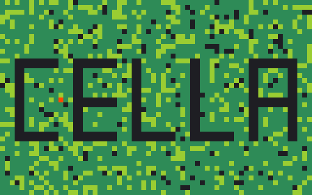

# Cella — Cellular Automata Engine

Cella is a Rust project for simulating **1D and 2D cellular automata**. It is
split into two crates:

| Crate | Description |
|-------|-------------|
| **`cella_lib`** | Core library — grids, rules, serialisation, multi-threaded stepping |
| **`cella`** | Binary — interactive CLI menu **and** an egui-based GUI |



---

## Quick Start

```bash
# Build everything
cargo build --release

# Launch the GUI
cargo run --release -- --gui

# Launch the CLI demo menu
cargo run --release
```

### GUI Window Size

```bash
cargo run --release -- --gui --size=1280x720
cargo run --release -- --gui --width=1920 --height=1080
```

If only `--width` or `--height` is given the other dimension is inferred with
a 16∶9 aspect ratio.

---

## CLI Demo Menu

Running without `--gui` opens an interactive menu:

```
Cella demos (CLI):
1) 2D Game of Life (approx)
2) 1D Wolfram Rule 30 (n=1)
3) 1D Wolfram n=2 demo
4) 1D Custom (Wolfram code + n)
5) Load from configuration file (JSON)
6) Langton's ant (placeholder)
7) 1D three-state cycle demo
8) 2D three-state cycle demo
9) 2D StraightLine neighborhood demo
0) Exit
```

### Running a JSON Config from the CLI

```
Select an option: 5
Enter path to JSON config: configs/life.json
Enter number of steps to run [10]: 20
```

Pre-built configs ship in the `configs/` directory (Game of Life, Rule 30,
multi-state cycles, various neighborhood types, etc.).

---

## Using `cella_lib` as a Library

Add the dependency to your `Cargo.toml`:

```toml
[dependencies]
cella_lib = { path = "cella_lib" }
```

### Minimal Rust Example — Conway's Game of Life

```rust
use cella_lib::*;
use cella_lib::config::CellaConfig;

fn main() {
    // Load a pre-made config
    let cfg = CellaConfig::from_file("configs/life.json").unwrap();
    let mut grid = cfg.build_grid2d().unwrap();

    for _ in 0..50 {
        grid.step();
    }
    // counts_current is keyed by the interned type handle (Spur)
    let alive = CellType::from("Alive");
    println!("Step {} — Alive cells: {}",
        grid.step,
        grid.counts_current.get(&alive.0).unwrap_or(&0));

    // Serialise to JSON for later
    let state = GridState::from_grid2d(&grid);
    std::fs::write("snapshot.json", state.to_json_pretty()).unwrap();
}
```

### Minimal Rust Example — 1D Rule 30

```rust
use cella_lib::*;

fn main() {
    // CellType is an interned symbol — construct via From<&str>
    let x = CellType::from("X");
    let inactive = CellType::inactive();

    let rule = Rule1D { subrules: vec![
        Rule1DSubrule {
            current_type: x.clone(), criteria_type: x.clone(),
            wolfram_code: 30, n: 1, randomness: None,
            output_type: x.clone(),
        },
        Rule1DSubrule {
            current_type: inactive.clone(), criteria_type: x.clone(),
            wolfram_code: 30, n: 1, randomness: None,
            output_type: x.clone(),
        },
    ]};

    let width = 81;
    let mut init = vec![inactive; width];
    init[width / 2] = x.clone();

    let mut grid = Grid1D::new(width, 5, init, rule);
    for _ in 0..40 {
        grid.step();
        let line: String = (0..width)
            .map(|i| if grid.cell_type(i) == x { '#' } else { '.' })
            .collect();
        println!("{}", line);
    }
}
```

---

## Thread Configuration

Create (or edit) a `cella.properties` file at the project root:

```properties
# Number of worker threads for grid stepping.
# Set to 1 to disable parallelism.
threads=4
```

If the file is absent the engine uses
`std::thread::available_parallelism()` (typically the number of logical
CPUs).

---

## JSON Configuration Format

Configs are JSON files with a `"dim"` discriminator (`"1d"` or `"2d"`).

<details>
<summary>2D example — Game of Life</summary>

```json
{
  "dim": "2d",
  "width": 10,
  "height": 10,
  "history_limit": 5,
  "initial": ["Inactive","Inactive","...","Alive","Alive","Alive","..."],
  "rule": {
    "subrules": [
      { "current_type":"Alive", "criteria_type":"Alive", "count":4,
        "op":"gt", "range":1, "neighborhood":"Moore",
        "randomness":null, "output_type":"Inactive" },
      { "current_type":"Alive", "criteria_type":"Alive", "count":2,
        "op":"gt", "range":1, "neighborhood":"Moore",
        "randomness":null, "output_type":"Alive" },
      { "current_type":"Inactive", "criteria_type":"Alive", "count":3,
        "op":"eq", "range":1, "neighborhood":"Moore",
        "randomness":null, "output_type":"Alive" }
    ]
  }
}
```

</details>

<details>
<summary>1D example — Wolfram Rule 30</summary>

```json
{
  "dim": "1d",
  "width": 257,
  "history_limit": 4,
  "initial": ["Inactive","...","X","...","Inactive"],
  "rule": {
    "subrules": [
      { "current_type":"X", "criteria_type":"X",
        "wolfram_code":"30", "n":1,
        "randomness":null, "output_type":"X" },
      { "current_type":"Inactive", "criteria_type":"X",
        "wolfram_code":"30", "n":1,
        "randomness":null, "output_type":"X" }
    ]
  }
}
```

</details>

2D subrule notes: `op` (`"lt"`/`"gt"`/`"eq"`) is **inclusive** for `gt`/`lt`
("at least" / "at most"); `neighborhood` is one of `"Moore"`, `"VonNeumann"`,
`"Langton"`, `"StraightLine"`, `"Knight"`; an optional `"limit"` field turns
`gt`/`lt` into an inclusive between-range (e.g. `"count":2, "op":"gt",
"limit":3` = survive with 2–3 neighbors). `"randomness"` and `"limit"` may be
omitted.

See the [`configs/`](configs/) directory for complete working examples.

---

## GUI Features

The egui GUI (launched with `--gui`) provides:

- **Preset demos** — Game of Life, Rule 30, three-state cycles, specialized neighborhoods (StraightLine, Langton, Knight, …)
- **Live rule editor** — add/remove subrules, change operators, neighborhoods, and ranges
- **Grid viewport** — zoomable, pannable cell grid with click-to-paint drawing
- **Playback controls** — play/pause, step, adjustable speed
- **Resize & reset** — change grid dimensions on the fly
- **Color customisation** — per-type color picker plus configurable Inactive/background color
- **Statistics panel** — live population counts and line charts (via `egui_plot`)
- **Import / Export** — load/save JSON configs, save snapshots, export animated GIFs
- **Font scaling** — adjustable UI text size

---

## Detailed Documentation

| Document | Contents |
|----------|----------|
| [Library Documentation](docs/lib.md) | Architecture, module reference, rule system, serialisation, threading |
| [Application Documentation](docs/app.md) | CLI usage, GUI workbench tour, editing, layers, Explore tab, configuration guide |
| [Explore Guide](docs/explore.md) | Ensembles, evolution and MAP-Elites for any rule or model; genes, metrics, drivers, CLI, honest reading of results |
| [Primer: Monte Carlo](docs/primer-monte-carlo.md) | Plain-language: why run a simulation many times, probability maps, Brier score, particle filters, seeds |
| [Primer: Genetic Algorithms](docs/primer-genetic-algorithms.md) | Plain-language: populations, selection, crossover, mutation, what goes wrong, novelty search and MAP-Elites |
| [Performance Review](docs/performance.md) | Engine internals, optimizations, known issues, recommendations, Hashlife notes |

### Generating Rust API Docs

```bash
# Library docs (opens in browser)
cargo doc --open -p cella_lib

# Full workspace docs
cargo doc --open
```

---

## Project Layout

```
cella/
├── Cargo.toml              # Workspace root (binary crate)
├── cella.properties        # Thread configuration
├── configs/                # Pre-built JSON scenario files
│   ├── life.json
│   ├── 1d_rule30_center.json
│   ├── 2d_life_like_moore.json
│   └── ...
├── docs/
│   ├── lib.md              # Library reference
│   ├── app.md              # Application guide
│   ├── explore.md          # Ensembles / evolution / illumination guide
│   ├── primer-monte-carlo.md          # Beginner primer
│   ├── primer-genetic-algorithms.md   # Beginner primer
│   └── performance.md      # Performance review & roadmap
├── src/                    # Binary crate
│   ├── main.rs             # Entry point (CLI menu / --gui)
│   ├── gui.rs              # GUI module shim
│   ├── gui/
│   │   ├── app.rs          # egui application (CellaApp)
│   │   ├── render.rs       # Color palette
│   │   └── export.rs       # GIF export
│   └── demos/
│       ├── mod.rs           # Demo helpers & re-exports
│       ├── one_d.rs         # 1D demo builders & runners
│       └── two_d.rs         # 2D demo builders & runners
├── cella_lib/              # Library crate
│   ├── Cargo.toml
│   └── src/
│       ├── lib.rs           # Public API & re-exports
│       ├── types.rs         # CellType, CellState
│       ├── rules.rs         # Rule1D, Rule2D, subrules, neighborhoods
│       ├── grid1d.rs        # Grid1D
│       ├── grid2d.rs        # Grid2D
│       ├── state.rs         # GridState serialisation
│       ├── config.rs        # JSON config loading/building
│       └── threads.rs       # Thread configuration
└── cella_lib/tests/         # Integration & snapshot tests
```

---

## License

See the repository for license details.
