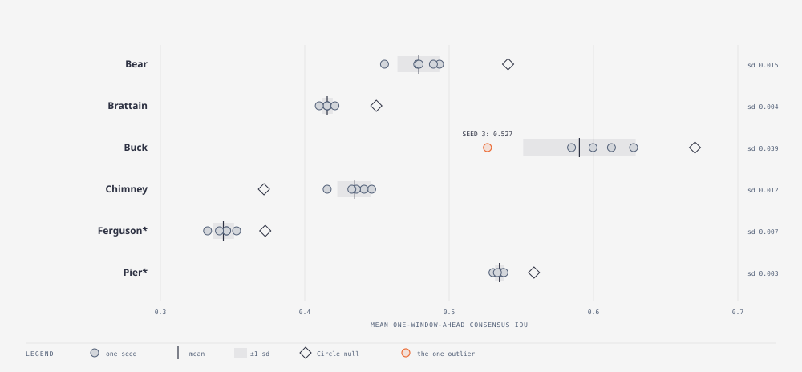

# E33 — the noise floor: five seeds of the recommended ensemble · finding (the bar for the round)

_Round 5 (2026-09-05) · 5 seeds · all six fires incl. holdout · runner `exp_r5_noise.py` · results `exp33_noise.json` · terms: [GLOSSARY.md](GLOSSARY.md)_

**In short.** Every comparison in Rounds 4–5 had been one run against one run. E25d had two extra replicates, and E31
showed the same configuration scoring 0.456 and 0.473 under the old
engine. Before judging anything else in this round we measured how much
two runs of the *same* configuration differ, from five seeds per fire.
The answer: little. Five of six fires have a standard deviation of 0.015
or less. Buck is 0.039 because of one seed, in which every member had
stopped by day 12 while the real fire kept growing, and a stopped
population cannot restart. That is a design gap in the filter, not bad
luck, and it became E38. The per-fire sd is the bar for the rest of the
round: a smaller difference is a tie.

**Question.** How much do two runs of the recommended configuration
differ?

**What we ran.** The recommended configuration (assim, β 10, σ 0.2,
immigrants 0.2, containment only, 32 members), seeds 0–4 (seed 0 is the
E31 row), all six fires. The seed sets the prior draw, every member's
dice and the daily containment rolls. Nothing else varies.

**How we scored it.** Mean one-window-ahead consensus IoU and Brier per
seed; mean ± sd over the five.

**Result.**

| Fire | seeds 0–4 (mean consensus IoU) | mean ± sd | Brier mean ± sd | Circle IoU / Brier |
|---|---|---|---|---|
| Bear | 0.478 0.479 0.493 0.455 0.489 | 0.479 ± 0.015 | 0.0510 ± 0.0030 | 0.541 / 0.0547 |
| Brattain | 0.415 0.416 0.415 0.410 0.421 | 0.416 ± 0.004 | 0.1090 ± 0.0042 | 0.450 / 0.1229 |
| Buck | 0.600 0.585 0.612 **0.527** 0.628 | 0.590 ± 0.039 | 0.0468 ± 0.0037 | 0.670 / 0.0408 |
| Chimney | 0.446 0.441 0.436 0.433 0.416 | 0.434 ± 0.012 | 0.1276 ± 0.0065 | 0.372 / 0.1591 |
| Ferguson* | 0.353 0.346 0.346 0.333 0.341 | 0.344 ± 0.007 | 0.1380 ± 0.0030 | 0.373 / 0.1675 |
| Pier* | 0.535 0.530 0.537 0.538 0.533 | 0.535 ± 0.003 | 0.1093 ± 0.0027 | 0.559 / 0.1047 |

How to read it: five scores per fire, then their mean and standard
deviation; IoU higher is better, Brier lower. `*` is the holdout pair.
Bold is the one outlier seed. Pooled rms sd 0.018; median 0.010.
Effective sample size after each learning step 28–31 of 32 on every fire
and seed: the population never collapsed.

- **The floor is small.** Five of six fires have sd ≤ 0.015 in mean IoU
  and ≤ 0.0065 in Brier. The 0.02 / 0.005 bars E31 borrowed from E25d
  were about right for IoU and slightly tight for Brier on Chimney.
- **Buck is the exception, and it is one seed.** Four seeds sit at
  0.585–0.628; seed 3 scores 0.527. Its per-day trace matches the others
  for eleven days and then falls (0.56 → 0.53) while the others rise
  (0.60 → 0.66–0.70): its members were all contained by day 12 while the
  real fire kept growing, and **a contained population cannot recover**.
  Immigrants take a fresh genome but inherit their parent's *state*,
  including the contained flag, so once every member has stopped there is
  no member left that can burn. The same lock-in is visible, milder, in
  Bear seed 3 (final-day 0.435 vs 0.464–0.493).
- Final-day IoU is noisier than the mean (Buck 0.417–0.566), as expected
  from a single day versus an average of thirty.

**What it means.** Round 4's single-run comparisons were mostly safe;
E28's Bear gain was not (E31), and this bar catches that class of claim.
The lock-in is a design gap: the filter has no way back once every member
has stopped.

**Questions this raises.**

- Can an immigrant that starts with a fresh state (uncontained) repair
  the lock-in? → E38: yes, +0.105 on the locked seed, ties elsewhere.
- How often does lock-in happen in other settings? → E34: every one of 54
  runs ends 100 % contained with a flat tail; one in thirty freezes early
  enough to cost 0.06–0.10.

**Verdict.** Finding. The bar for the rest of Round 5 is the per-fire sd
above (round numbers: 0.02 on Bear and Chimney, 0.01 on Brattain,
Ferguson and Pier, 0.04 on Buck). Any claimed gain smaller than that on
a fire is a tie; a gain has to clear it on several fires at once.

**Later.** E32, E34, E35, E36, E37 (all judged against this bar), E38.
