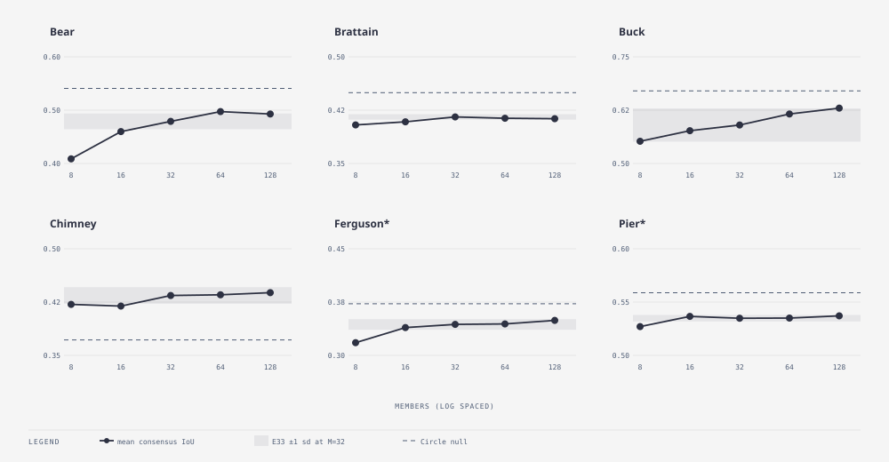

# E32 — ensemble size: 8 to 128 members · finding — 32 is the knee for the consensus map; Brier keeps improving

_Round 5 (2026-09-05) · 1 seed per size · all six fires incl. holdout · runner `exp_r5_members.py` · results `exp32_members.json` · terms: [GLOSSARY.md](GLOSSARY.md)_

**In short.** 32 members was a guess in E24 and never questioned. Members
cost memory and time linearly, and a probability map from 8 members has
steps of 12.5 %. We ran 8, 16, 64 and 128 (32 is E33 seed
0) and asked where forecast skill stops improving. Eight is clearly too
few. From 32 upward the consensus map does not improve on five of six
fires. Buck keeps gaining slowly, and the Brier score (calibration) keeps
improving on most fires up to 128. Keep 32 as the default; use more when
the probability map itself is the product.

**Question.** Where does forecast skill stop improving with more members,
and does calibration stop at the same place?

**What we ran.** The recommended configuration with M = 8, 16, 64 and
128, one seed each, all six fires; judged against E33's per-fire sd. Wall
time and memory scale with M: the 128-member runs took four times the
32-member ones.

**How we scored it.** Mean one-window-ahead consensus IoU and Brier.

**Result.**

| Fire | 8 | 16 | 32 | 64 | 128 | E33 sd | Circle |
|---|---|---|---|---|---|---|---|
| Bear | 0.409 | 0.460 | 0.478 | **0.497** | 0.493 | 0.015 | 0.541 |
| Brattain | 0.404 | 0.409 | 0.415 | 0.414 | 0.413 | 0.004 | 0.450 |
| Buck | 0.552 | 0.577 | 0.600 | 0.616 | **0.630** | 0.039 | 0.670 |
| Chimney | 0.422 | 0.419 | 0.446 | 0.435 | 0.438 | 0.012 | 0.372 |
| Ferguson* | 0.318 | 0.339 | 0.353 | 0.344 | 0.349 | 0.007 | 0.373 |
| Pier* | 0.527 | 0.537 | 0.535 | 0.535 | 0.537 | 0.003 | 0.559 |

How to read it: forecast consensus IoU by member count, higher is
better; the "E33 sd" column is the noise bar for that fire; `*` is the
holdout pair; bold marks a size that beats 32 by more than the sd.

Mean Brier (lower is better; Circle in the last column):

| Fire | 8 | 16 | 32 | 64 | 128 | Circle |
|---|---|---|---|---|---|---|
| Bear | 0.0571 | 0.0501 | 0.0473 | 0.0480 | 0.0477 | 0.0547 |
| Brattain | 0.1069 | 0.1125 | 0.1051 | 0.1125 | 0.1153 | 0.1229 |
| Buck | 0.0513 | 0.0475 | 0.0480 | 0.0428 | **0.0411** | 0.0408 |
| Chimney | 0.1177 | 0.1158 | 0.1355 | 0.1253 | 0.1258 | 0.1591 |
| Ferguson* | 0.1452 | 0.1410 | 0.1360 | 0.1349 | **0.1327** | 0.1675 |
| Pier* | 0.1137 | 0.1099 | 0.1120 | 0.1092 | **0.1068** | 0.1047 |

Effective sample size after learning stayed at 92–96 % of M at every
size, so the filter is not collapsing at any M.

- **8 members is clearly too few**: −0.03 to −0.07 IoU against 32 on
  Bear, Buck, Ferguson and Chimney, all well past the bar, and the worst
  Brier on four fires. The consensus of eight coin-flips is not a
  probability map.
- **Skill flattens at 32 on five of six fires.** From 32 to 128,
  Brattain, Chimney, Ferguson and Pier move by less than their sd; Bear
  gains 0.019 at 64 (one sd) and holds.
- **Buck keeps gaining**: 0.600 → 0.616 → 0.630, monotone over five
  sizes, and its Brier falls from 0.0480 to 0.0411, reaching the
  Circle's 0.0408. The IoU gain (+0.030) is inside Buck's own sd
  (0.039), so by the bar it is a tie, but a monotone trend over five
  points plus a matching Brier trend is not what noise looks like. Buck
  is the fire whose members disagree most about *when* it stops, and
  more members average that disagreement better.
- **Brier improves past 32 more reliably than IoU**: 128 is best or
  within 0.001 of best on Bear, Buck, Ferguson and Pier. Chimney's
  32-member Brier (0.1355) is seed noise: E33's Chimney Brier sd is
  0.0065 and this seed sits at the top of that spread.

**What it means.** The 0.5-threshold map saturates at 32 members;
calibration keeps benefiting from more. Future comparisons of methods
can stay at 32 without fear of being member-limited.

**Questions this raises.**

- Would more members also reduce Buck's lock-in risk (E33)? Open; E38
  addressed lock-in directly instead.

**Verdict.** Keep 32 as the default. Use 64–128 when the product is the
probability map itself or when members disagree about stopping, as on
Buck; never go below 16.

**Later.** All later Round 5 runs stayed at 32.
