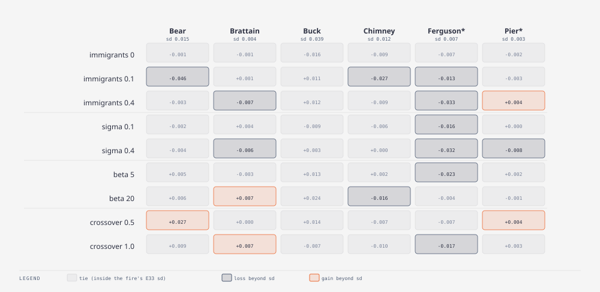

# E34 — operator ablation inside the filter · finding — the operators sit on a plateau; what moves the score is when the population locks in

_Round 5 (2026-09-05) · 1 seed · all six fires incl. holdout · runner `exp_r5_operators.py`, 54 runs · results `exp34_operators.json` · terms: [GLOSSARY.md](GLOSSARY.md)_

**In short.** E25 chose β 10, σ 0.2 and 20 % immigrants from one run each.
With the noise floor known, we moved one knob at a time and added genome
crossover, which the offline GA uses and the filter never had. Thirty-
eight of fifty-four cells are ties. No setting wins on more than two
fires. Ferguson is the one fire that punishes noise in the genome. The
large cells are not operator effects but lock-in events: every single
run ends with all members contained and a flat tail, and the score at
which a run freezes is decided by the containment dice, not the
operators. Crossover 0.5 is the one setting worth replicating.

**Question.** Which operator carries the filter's gain, and is crossover
worth adding?

**What we ran.** From the base configuration (β 10, σ 0.2, immigrants
0.2, containment only, M 32, seed 0), one knob at a time: immigrants 0 /
0.1 / 0.4, σ 0.1 / 0.4, β 5 / 20, and crossover 0.5 / 1.0 (new: a
resampled child takes each gene from either of two parents before
mutation).

**How we scored it.** Change in mean one-window-ahead consensus IoU from
the base, judged against E33's per-fire sd; Brier and effective sample
size alongside.

**Result.** Change in mean consensus IoU from the base (bold = beyond the
fire's sd):

| setting | Bear | Brattain | Buck | Chimney | Ferguson* | Pier* |
|---|---|---|---|---|---|---|
| immigrants 0 | −0.001 | −0.001 | −0.016 | −0.009 | −0.007 | −0.002 |
| immigrants 0.1 | **−0.046** | +0.001 | +0.011 | **−0.027** | **−0.013** | −0.003 |
| immigrants 0.4 | −0.003 | **−0.007** | +0.012 | −0.009 | **−0.033** | **+0.004** |
| σ 0.1 | −0.002 | +0.004 | −0.009 | −0.006 | **−0.016** | 0.000 |
| σ 0.4 | −0.004 | **−0.006** | +0.003 | 0.000 | **−0.032** | **−0.008** |
| β 5 | +0.005 | −0.003 | +0.013 | +0.002 | **−0.023** | +0.002 |
| β 20 | +0.006 | **+0.007** | +0.024 | **−0.016** | −0.004 | −0.001 |
| crossover 0.5 | **+0.027** | 0.000 | +0.014 | −0.007 | −0.007 | **+0.004** |
| crossover 1.0 | +0.009 | **+0.007** | −0.007 | −0.010 | **−0.017** | +0.003 |
| E33 sd | 0.015 | 0.004 | 0.039 | 0.012 | 0.007 | 0.003 |

How to read it: each cell is (this setting − base); positive is better;
a cell is bold only if its size exceeds the fire's sd in the last row.
`*` is the holdout pair. Brier: β 5 is best on Bear, Ferguson and Pier and
β 20 worst on four fires, as in E25; crossover 0.5 has the best Buck
Brier (0.0420) and the worst Brattain (0.1167); immigrants 0 is *better*
than the base on Chimney (0.1203 vs 0.1355) and Buck. Effective sample
size 28–31 in every setting except β 20 (26–29).

- **Thirty-eight of fifty-four cells are ties.** No setting beats the
  base on more than two fires; none loses on more than three. E25's
  preference for 20 % immigrants was a single-seed reading: immigrants 0
  is a tie on all six fires here.
- **Ferguson is the one fire that punishes noise in the genome.** It
  loses under σ 0.4 (−0.032), immigrants 0.4 (−0.033), β 5 (−0.023),
  σ 0.1 and crossover 1.0. Ferguson's answer (p0 ≈ 0.35, the top of what
  the filter finds anywhere) sits near the edge of the prior, and each of
  those settings dilutes a population that has found it.
- **The large cells are lock-in events, not operator effects.** Bear
  under immigrants 0.1 (−0.046, three sd) tracks the base for eight days
  and then decays to a flat 0.37 from day 13 on, every member contained;
  the base holds 0.46. Immigrants 0 and 0.4 on the same fire are ties, so
  the 0.1 result cannot be a dose effect. **Every one of the 54 runs ends
  with 100 % of members contained and a per-day score that is flat for the last five to ten days.** The score at which a population
  freezes is decided by the containment dice in the days before, and that
  is a larger source of spread than any operator: it is what E33 saw on
  Buck seed 3, and it is why E38 exists.
- **Crossover 0.5 is the only setting that gains beyond the bar on more
  than one fire** (Bear +0.027, Pier +0.004, Buck +0.014 inside its sd,
  nothing lost). The Bear gain is a late-fire effect too (tail 0.51
  against 0.46), so it may be the same dice in a kinder mood.
- β 20 buys Buck +0.024 and Brattain +0.007 for Chimney −0.016 and the
  worst calibration, repeating E25.

**What it means.** With the containment operator doing the stopping, the
filter is not sensitive to its GA operators within a factor of two
either way. The open question is the lock-in, which no operator setting
touches.

**Questions this raises.**

- Does crossover 0.5 survive five seeds? Open; listed as a next step.
- Can lock-in be repaired? → E38: `immigrant_reset`.
- Why does Ferguson alone punish genome noise? Because its answer sits
  at the prior's edge; → E35 on prior width.

**Verdict.** Keep β 10, σ 0.2, immigrants 0.2 (a plateau, and 0.2
immigrants is cheap insurance against a bad prior, E35). Do not add
crossover to the default yet.

**Later.** E35, E38, Round 5 conclusion 7.
