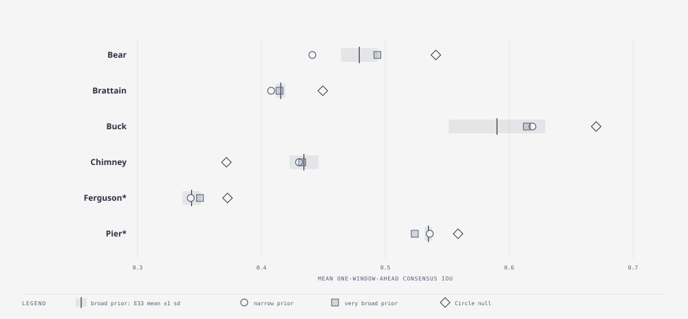

# E35 — prior width: narrow, broad, very broad · finding — the filter recovers from a prior that is too wide, not from one that is too narrow

_Round: Round 5 — 2026-09-05: the methods themselves_

**Why.** The E25 prior (p0 0.08–0.6 log, burn duration 5–20, wind × 0–1.5)
was set by hand. If the filter learns the knobs from the perimeter, the
prior should matter little; if it still decides the answer, then every
result since E24 is partly a statement about that prior. Two directions:
does an *informed* narrow prior (centred on what earlier runs learned)
help, and does a much wider one hurt?

**Method.** `exp_r5_prior.py`: three priors, same operators, seed 0, all
six fires. **narrow** = ±25 % around the E28/E31 posterior medians (p0
0.18–0.32 log, duration 11–17, wind × 0.5–0.9); **broad** = the E25 prior
(E33 seed 0); **very broad** = p0 0.02–0.95 log, duration 2–60, wind × as
broad. Containment genes at their default ranges in all three. Judged
against E33's per-fire sd.

| Fire | narrow | broad | very broad | E33 sd | learned p0 / wind ×: narrow · broad · very broad |
|---|---|---|---|---|---|
| Bear | **0.441** | 0.478 | 0.494 | 0.015 | 0.24/0.75 · 0.23/0.59 · 0.20/0.90 |
| Brattain | 0.408 | 0.415 | 0.415 | 0.004 | 0.25/0.73 · 0.27/0.80 · 0.19/0.65 |
| Buck | 0.619 | 0.600 | 0.614 | 0.039 | 0.25/0.72 · 0.22/0.67 · 0.14/0.79 |
| Chimney | 0.430 | 0.446 | 0.433 | 0.012 | 0.25/0.72 · 0.35/0.65 · 0.32/0.63 |
| Ferguson* | 0.343 | 0.353 | 0.350 | 0.007 | 0.25/0.73 · 0.35/0.94 · 0.44/0.81 |
| Pier* | 0.536 | 0.535 | **0.524** | 0.003 | 0.24/0.71 · 0.24/0.93 · 0.13/0.92 |

(*holdout. Brier: very broad is best or equal on four fires — Bear 0.0482,
Brattain 0.1021, Buck 0.0420, Chimney 0.1268, Pier 0.1063 — narrow is worst
on Bear and Brattain.)

**Findings.**

- **The narrow prior hurts, and it hurts most where it was meant to
  help.** Bear loses 0.037 (2.5 sd), Chimney 0.016, Ferguson 0.010,
  Brattain 0.007; Buck's +0.019 is inside its sd. The narrow p0 range
  (0.18–0.32) excludes the region Bear settles in under the broad prior
  (p0 0.15–0.25 across the E33 seeds), so on Bear the population is
  hemmed in at the bottom of its box: day-3 consensus 0.48 versus 0.62
  for the broad prior. The narrow prior's learned knobs are the same on
  every fire (p0 ≈ 0.25, wind × ≈ 0.72): it did not learn, it stayed in
  the box. Note what "±25 % around the posterior median" got wrong: the
  *within-fire* posterior is that narrow, but the *between-fire* answers
  (p0 0.13–0.44 under the wide priors) are not. A prior has to cover the
  spread across fires, not the spread within one.
- **The very broad prior is nearly free.** Ties within the bar on Bear,
  Brattain, Buck, Chimney and Ferguson; a small real loss on Pier
  (−0.011 against sd 0.003), where the population wandered to p0 0.13.
  Brier is *better* on four fires: a wider prior spreads early
  probability more honestly. The filter pulls a population from a
  ten-fold p0 range onto the fire within two or three days.
- **Learning is asymmetric.** Selection can only choose among what the
  prior offers; mutation moves a knob by σ × range per step and is clamped
  to the range. A too-narrow prior cannot be escaped; a too-wide one is
  simply searched. So the cost of erring wide is a day of weaker
  forecasts; the cost of erring narrow is permanent.

**Verdict.** Keep the E25 broad prior (or widen it further when a new
fire looks unlike the six here). Never tune the prior toward past
posteriors: that is the E20 mistake in a new costume. When the prior must
be narrowed for cost reasons, narrow the knobs that the posteriors agree
on across fires (burn duration 10–16, containment slope) and leave p0 and
wind wide.
