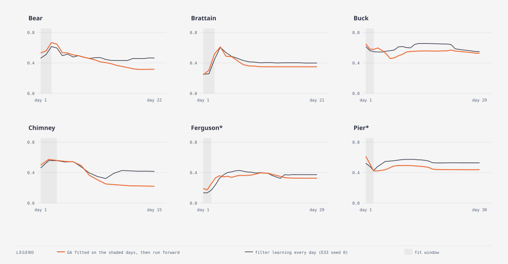

# E36 — fit the first three days, then forecast · finding — the filter beats the offline GA on every fire; a three-day fit overfits to the box edges

_Round: Round 5 — 2026-09-05: the methods themselves_

**Why.** E20 fitted knobs per fire with an optimiser that saw the whole
perimeter series, then E25 argued that a filter which learns day by day
is the honest form of the same idea. That argument was never tested
head-on: an optimiser that sees only what an operations room would have
(the first days), with the rest of the run scored as a forecast. Is
learning-as-it-burns better than fitting the start and extrapolating, or
is the filter just a slow way to reach the same knobs?

**Method.** `exp_r5_offline.py` → `wildfire_smc evolve`. A genetic
algorithm (population 24, 20 generations, 2 repeats, the same genes and
weather schedule as the filter, the library's `Evolution` with the
wildfire driver) maximises the mean IoU against the first **three**
observed perimeters. The winning genome is then run forward as a
32-member *open* ensemble (every member the fitted knobs with its own
dice) and scored on every observation. Days 4 onward are forecasts and
are compared with the filter's forecasts on the same days (E33 seed 0).
Same seed, same fires, nothing chosen per fire.

| Fire | fit IoU (days 1–3) | GA forward, days 4+ | filter, days 4+ | Δ | fitted p0 / duration / wind × |
|---|---|---|---|---|---|
| Bear | 0.590 | 0.418 | 0.470 | **−0.052** | 0.096 / 20 / 0.0 |
| Brattain | 0.363 | 0.387 | 0.431 | **−0.045** | 0.476 / 5 / 1.5 |
| Buck | 0.612 | 0.542 | 0.602 | **−0.061** | 0.121 / 20 / 1.5 |
| Chimney | 0.551 | 0.323 | 0.427 | **−0.104** | 0.323 / 5 / 0.0 |
| Ferguson* | 0.213 | 0.352 | 0.377 | **−0.025** | 0.600 / 16 / 0.13 |
| Pier* | 0.525 | 0.456 | 0.542 | **−0.085** | 0.080 / 19 / 1.5 |

(*holdout. Every Δ is past the fire's E33 sd. Brier: the GA ensemble is
better on Chimney, Ferguson and Pier and worse on Bear, Brattain and
Buck. The GA's fit score stopped improving after generation 8 on every
fire.)

**Findings.**

- **Learning as it burns wins on every fire, by 0.025 to 0.104.** The
  filter's forecast on days 4+ beats the fitted genome's on all six,
  holdout included, and the gap is two to eight times the noise.
- **Three days is enough to fit and not enough to learn.** Look at the
  fitted knobs: wind × is 0.0 or 1.5 on five fires, burn duration 5 or 20
  on four, p0 0.08 or 0.60 on two. The GA drove the knobs to the edges of
  their boxes, because with three perimeters the objective rewards
  whatever reproduces the *early* growth, and extreme knobs do that.
  Chimney is the clean case: the fit put the containment intercept at its
  maximum (−1) so members stop almost at once, matched the slow first
  days perfectly (0.551), and then forecast a fire that stops while the
  real one runs: 0.323 forward, flat at 0.23 for the last week.
- **The one place the GA leads is the first forecast day on Ferguson**
  (0.33 vs 0.24 on day 4, 0.36 vs 0.32 on day 5). The fit found the high
  p0 Ferguson needs immediately; the filter takes until day 7 to learn it
  and then overtakes. A fitted start plus a filter (initialise the
  population near the fit, then learn) is the obvious hybrid, and the
  Ferguson curve says it would be worth a day or two of skill on a fire
  the prior is wrong about.
- The two approaches cost about the same: 24 × 2 × 3 days of simulation
  per generation for twenty generations is roughly the whole 32-member
  run. The filter spends its compute on all thirty days; the GA spends it
  re-simulating the first three.

**Verdict.** E25's argument holds and is now a measurement: the filter
is not a slow route to E20's knobs, it is a better forecaster than any
fixed knob set fitted to the start. Retire per-fire offline fitting as a
forecasting method (it stays useful as a diagnostic of what the model
*can* match, E20's original role). Candidate follow-up: seed the filter's
initial population from a short offline fit and measure whether the
first-week skill on Ferguson-like fires improves without paying later.
