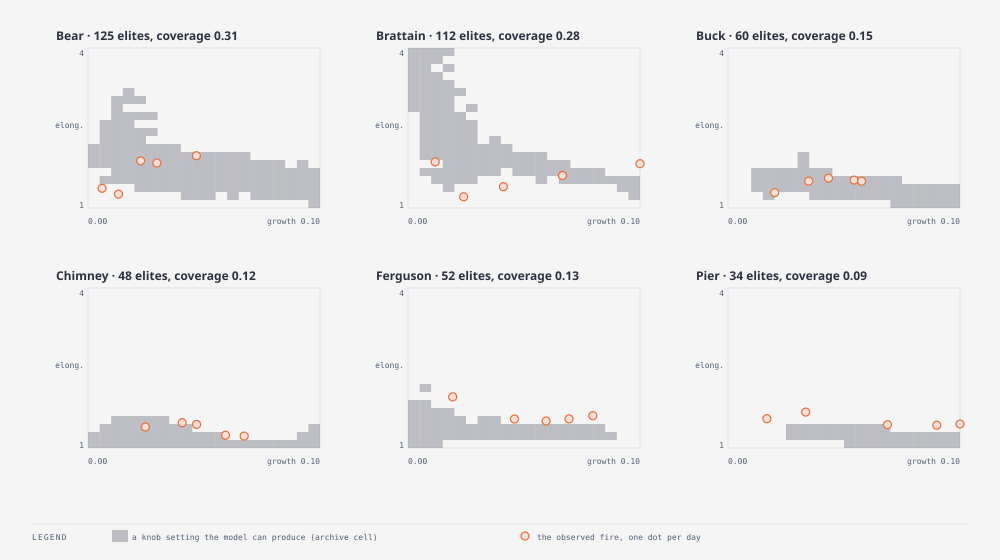

# E37 — illuminate the fire model: what shapes can it make? · finding — a wedge: the model is elongated only while small; the observed fires are big and elongated, and four of six sit outside anything the knobs can reach

_Round: Round 5 — 2026-09-05: the methods themselves_

**Why.** E12 measured that the model's fires are rounder than the real
ones (Brattain elongation 2.7 observed vs 1.05 modelled at E1's knobs) and
E19/E22 argued the wind kernel widens rather than stretches. Both were
statements about particular knob settings. Illumination asks the whole
knob space at once: over every p0, burn duration and wind multiplier, what
combinations of *size* and *shape* can this model produce at all on this
landscape with this weather? If the observed fire's size-and-shape is not
in the reachable set, no calibration will ever find it, and the remedy has
to be structural (E30).

**Method.** `exp_r5_illuminate.py` → `wildfire_smc map`: MAP-Elites
(library `Evolution`, `map_elites` search, batch 32, 30 generations, iso
+ line emitter) over p0 0.08–0.6 (log), burn duration 5–20 and wind × 0–1.5,
no stopping rule and **no objective** (pure illumination). Behaviour axes
after five days of the scenario's own weather: **growth** (burned share
of the grid, axis 0–0.10, 20 bins; explosive settings pile into the top
bin) × **elongation** (√(λ₁/λ₂) of the burned set's second-moment matrix,
E12's measure, axis 1–4, 20 bins). The observed perimeter's growth and
elongation on the same five days are plotted in the same coordinates.
960 evaluations per fire.

| Fire | cells filled | model elongation, any size | model elongation at the observed size | observed (day 5) growth / elongation | reachable? |
|---|---|---|---|---|---|
| Bear | 125 (31 %) | 3.19 | 2.03 | 0.047 / 1.98 | yes |
| Brattain | 112 (28 %) | 5.52 | 1.35 | 0.110 / 1.83 | **no** |
| Buck | 60 (15 %) | 1.95 | 1.49 | 0.058 / 1.50 | borderline |
| Chimney | 48 (12 %) | 1.54 | 1.35 | 0.067 / 1.22 | yes |
| Ferguson* | 52 (13 %) | 2.06 | 1.38 | 0.080 / 1.61 | **no** |
| Pier* | 34 (9 %) | 1.39 | 1.15 | 0.102 / 1.45 | **no** |

(*holdout. "At the observed size" = the most elongated elite whose growth
is at least the observed day-5 growth.)

**Findings.**

- **The reachable region is a wedge.** On every fire the archive fills
  from the bottom-left: small fires can be any shape up to 2–5, large
  fires are round (elongation 1.1–1.35). Size and shape trade off. The
  most elongated elites are always the same recipe: burn duration 5, p0
  0.08–0.18, **wind × ≈ 0**. Their shape comes from terrain and fuel
  (a fire creeping along a ridge or a fuel strip), not from wind.
- **Wind does not stretch the fire.** Across all six archives, raising
  wind × moves a setting *right* (bigger) and *down* (rounder). The
  biggest elites have wind × 0.5–0.75 and elongation 1.1–1.35. This is
  E19's "wind changes speed 5–10 %" and E12's "too round" measured over
  the entire knob space rather than at one point: the exponential wind
  factor is a speed knob, not a shape knob.
- **Four observed fires sit outside the wedge.** Brattain (1.83 at growth
  0.11), Ferguson (1.61 at 0.08) and Pier (1.45 at 0.10) are all above the
  most elongated fire the model can make at their size (1.35, 1.38, 1.15).
  Buck is on the edge. Bear and Chimney, the round slow fires, are inside.
  For the three outside, **no p0 / duration / wind setting reproduces
  the observed shape**, so the filter's residual on those fires is not a
  calibration error; it is a shape the model cannot draw. That is exactly
  the E31/E33 pattern: Bear and Chimney are where the ensemble beats or
  approaches the Circle, and Brattain/Ferguson/Pier are where it trails.
- The archive says what would have to change: a mechanism that makes a
  *large* fire elongated, i.e. a wind response that lengthens the head
  relative to the flanks, rather than raising every direction's
  probability. That is E30's kernel refit, now with a target: after the
  refit, re-run this map and the observed dots should fall inside the
  shaded region.
- Method note: with no objective every elite scores 1, so the archive is
  a pure map of reachability, and coverage (9–31 %) is the size of the
  model's behavioural repertoire on each landscape. The growth axis cap
  (0.10) was needed because the natural range (−1 … 1) puts every fire in
  one bin; 96–253 evaluations per fire ran past the cap into the top bin
  (explosive settings, all round).

**Verdict.** Finding, and the most useful one in the round for the model
work: the illumination map is a reachability test that separates
"calibrate better" from "the model cannot do this". Three of six fires
(two holdout) are in the second class. Re-run `exp_r5_illuminate.py`
after E30 as its acceptance test.
