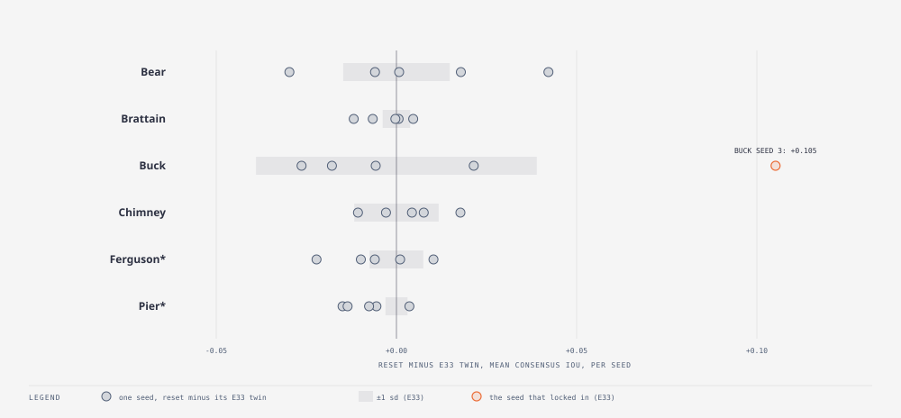

# E38 — immigrants start fresh · KEPT as an option — it repairs the lock-in E33 found (+0.105 on the locked seed) and is a tie elsewhere, with a small Brier cost

_Round: Round 5 — 2026-09-05: the methods themselves_

**Why.** E33's one outlier (Buck seed 3, 0.527 against 0.585–0.628 for the
other seeds) was a population in which every member had been contained by
day 12 while the real fire kept growing. Immigrants take a fresh genome
but inherit their parent's driver *state*, contained flag included, so
once every member has stopped nothing can start again. E34 then showed
that every one of its 54 runs ended fully contained with a flat tail, so
the effect is general even when it is not catastrophic. The fix is one
option, `immigrant_reset`: an immigrant starts from an empty driver state,
so the wildfire driver reads p0 from the immigrant's own genome and the
member is uncontained. Prediction (TEST_PLAN v1.7 addendum): a large gain
on Buck seed 3, ties elsewhere.

**Method.** `exp_r5_immreset.py`: the base configuration with
`SMC_IMM_RESET=1`, seeds 0–4 matched to E33's, all six fires; each seed is
compared with its own E33 twin.

| Fire | seed 0 | seed 1 | seed 2 | seed 3 | seed 4 | mean Δ | mean ± sd, reset | mean ± sd, E33 |
|---|---|---|---|---|---|---|---|---|
| Bear | +0.001 | +0.018 | −0.030 | +0.042 | −0.006 | +0.005 | 0.484 ± 0.014 | 0.479 ± 0.015 |
| Brattain | +0.005 | +0.001 | −0.012 | 0.000 | −0.007 | −0.003 | 0.413 ± 0.006 | 0.416 ± 0.004 |
| Buck | −0.026 | +0.021 | −0.006 | **+0.105** | −0.018 | +0.015 | 0.606 ± **0.021** | 0.590 ± 0.039 |
| Chimney | −0.011 | −0.003 | +0.004 | +0.008 | +0.018 | +0.003 | 0.437 ± 0.003 | 0.434 ± 0.012 |
| Ferguson* | −0.010 | +0.001 | −0.022 | +0.010 | −0.006 | −0.005 | 0.338 ± 0.009 | 0.344 ± 0.007 |
| Pier* | −0.015 | −0.006 | −0.014 | −0.008 | +0.004 | **−0.008** | 0.527 ± 0.007 | 0.535 ± 0.003 |

(*holdout. Brier, reset vs E33 mean: Bear 0.0513/0.0510, Brattain
0.1122/0.1090, Buck 0.0448/0.0468, Chimney 0.1315/0.1276, Ferguson
0.1369/0.1380, Pier 0.1157/0.1093. Members still contained at the end:
58–100 % with reset, 100 % without.)

**Findings.**

- **The prediction held.** Buck seed 3 goes from 0.527 to 0.632 (+0.105):
  its trace, identical to the E33 twin for ten days, climbs to 0.69 from
  day 8 instead of sinking to 0.42. The population was given members that
  could burn, and the filter did the rest. Buck's seed-to-seed sd halves
  (0.039 → 0.021): the lock-in was the outlier, and it is gone.
- **Everywhere else the means tie.** Bear +0.005, Brattain −0.003,
  Chimney +0.003, Ferguson −0.005 are inside their sd. But the per-seed
  deltas on Bear (−0.030 … +0.042) are wider than E33's own spread: the
  reset does not remove the containment dice, it re-rolls them. Which
  seeds lock in changes; roughly as many improve as worsen.
- **Pier pays a little** (−0.008, worse on four of five seeds, sd 0.003)
  and Brier is worse by 0.003–0.006 on four fires. Fresh immigrants late
  in a fire that has genuinely stopped spread probability where nothing
  will burn. Pier is the fire the containment operator describes best
  (100 % contained at the end in both versions, and the E33 tail matched
  the observed stall), so re-igniting members there is pure noise.
- Chimney ends with only 58 % of members contained under reset (100 %
  without) and its sd falls to 0.003: on the fast fire the live members
  are the ones tracking the truth.

**Verdict.** Kept as an option, default off. It fixes the one failure
mode the filter had no answer to and costs about one sd of Brier where
the fire really has stopped. The obvious next step is to gate it on the
evidence: reset immigrants only while the consensus *under-predicts* the
observed area (area ratio < 1 at the last assimilation), which is exactly
the signal that the population has stopped and the fire has not. That is
E39, one line in the runner plus a config field. Until then: switch the
reset on for fires still growing after their first week, off for fires
that have plateaued.
