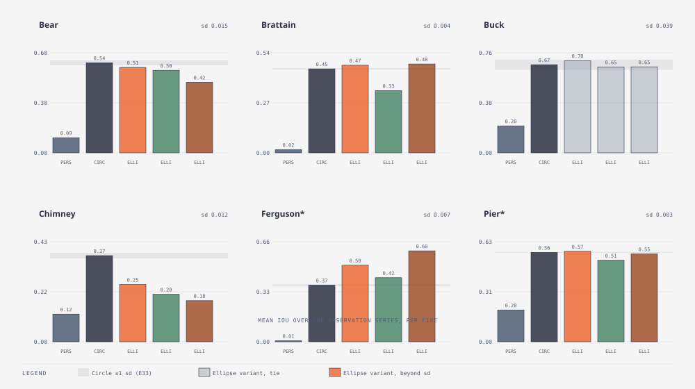

# E41 — the Ellipse null · FINDING — the signal is *which way* the fire runs, not *how stretched*; E30 should target the kernel's sign, not add anisotropy

_Round 6 (2026-09-11) · no ensemble, deterministic nulls only · runner `exp_r6_ellipse.py` (`nulls` mode) · results `exp41_ellipse.json` · pre-registered TEST_PLAN v1.8, post-hoc control added same day after review · terms: [GLOSSARY.md](GLOSSARY.md)_

**In short.** A third dumb forecaster, next to persistence and the
Circle: an ellipse stretched along the window's wind instead of a plain
disc, area-matched the same way. The prediction, written before the run,
was that the ordinary `ellipse_era5` variant would only tie the Circle
everywhere (ERA5 winds here are too gentle, LB ≈ 1.0–1.4). It did not.
`ellipse_era5` beats the Circle beyond the E33 noise floor on Brattain
(+0.019) and Ferguson (+0.131), ties on Buck, and loses on Bear and
Chimney. But a rear-focus ellipse bakes in a front/back rate skew from
`LB` alone — `(a + c)/(a − c) ≈ 2.4` already at `LB = 1.1`, before any
visible stretch — so a post-hoc control (`ellipse_era5_centred`, ignition
at the ellipse's *centre*, no front/back skew possible) was added after
seeing this to ask whether the win is the *stretch* or just the *sign* of
the wind. It is the sign: the centred control ties the Circle on Bear,
Buck and Chimney, and only marginally beats or loses elsewhere (Brattain
−0.005, Ferguson +0.009, Pier +0.006 — an order of magnitude smaller than
the rear-focus version's ±0.02–0.13). Almost all of Brattain's and
Ferguson's gain, and almost all of Chimney's loss, comes from which way
round the ellipse points, not from how sharply it is stretched. The
pre-registered fallback still fires — wind direction carries real shape
signal on Brattain and Ferguson — but it points E30 at a narrower target
than "make the kernel more anisotropic": get the *sign* of the wind
response right first.

**Question.** Does wind *direction*, in the inputs this campaign actually
has (ERA5 daily, or the nearest weather station), carry any shape signal
on these six fires — before spending any effort making the fire model's
own wind response better at using it?

**What we ran.** A new `nulls` mode in `wildfire_smc`: no ensemble
members, just the deterministic forecasters computed window by window
from `truth.json` and `scenario.json`/`station_hourly.json`. The Circle
grows a chamfer-distance disc from the ignition mask, thresholded to the
observed burned area each day (unchanged from Round 4 on). The Ellipse
grows the same way but anisotropically: a Dijkstra minimum-travel-time
search where the cost of a step is `|offset| / r(θ)`, `θ` the angle
between the step and the window's wind-*toward* direction, and
`r(θ) = b² / (a − c·cos θ)` with `a = LB(U)`, `b = 1`,
`c = √(a² − b²)` — an ellipse with the ignition sitting at the *rear*
focus, not the centre. Concretely, at `LB = 3`: head rate (downwind)
`a + c ≈ 5.83`, back rate (upwind) `a − c ≈ 0.17`, flank rate (crosswind)
`b²/a ≈ 0.33` — about 34× faster downwind than upwind, 17× faster downwind
than sideways. `LB(U) = 0.936·e^{0.2566U} + 0.461·e^{−0.1548U} − 0.397`
(Anderson 1983, U at 10 m, clamped to [1, 8]). The Ellipse's mask is
carried forward window to window the same way the Circle's threshold
order effectively is — it grows from *its own* previous mask, never from
the observed mask directly. Three variants, all pre-registered:
`ellipse_era5` (the scenario's ERA5 daily wind, the campaign's default
input), `ellipse_station` (the vector mean — average the per-hour wind as
an arrow, speed and direction together, then read the length and
direction back off the sum — of `station_hourly.json`'s hourly rows
falling inside each window; rotating from the station's compass bearing
to the grid's toward-angle commutes with that averaging, so the mean is
computed directly in grid coordinates), `ellipse_era5x3` (ERA5 wind speed
× 3, direction unchanged — a sensitivity probe from E9c, not a
forecaster). Grid convention checked against `wind_toward_grid_deg`'s own
doc and tests before writing the direction cost: a west wind
(`from_deg = 270`) blows *toward* +x on this north-up, +y-down grid,
confirmed by a unit test that grows the Ellipse under that exact wind and
checks the mask reaches at least twice as far right of the seed as it
reaches up or down.

**Post-hoc control, added after seeing the results (not pre-registered —
see the TEST_PLAN v1.8 addendum).** The rear-focus template above cannot
separate two different reasons an ellipse might match the truth better
than a circle: it could be genuinely more *stretched* in the right axis,
or it could just have its long/short ends the right way round — and the
second of those needs only the wind's rough sign, not any real anisotropy
at all, because `(a + c)/(a − c)` is already ≈ 2.4 at `LB = 1.1` (about
Ferguson's own peak wind), long before the ellipse "looks" stretched.
`ellipse_era5_centred` uses the same ERA5 wind and the same `LB(U)` but
moves the ignition to the ellipse's *centre*: `r(θ) = a·b / √(b²·cos²θ +
a²·sin²θ)` makes head and back both equal `a` (no skew at all is
possible), and only the flank (`b = 1`) differs. If this control still
beats the Circle where the rear-focus version does, the stretch itself is
informative; if it only ties there, the rear-focus version's edge was the
sign, not the shape. Unit test: at `LB = 3`, wind toward +x, the grown
set's left extent from the seed is within 10% of its right extent —
confirmed, unlike the rear-focus version's ≥ 2× right-over-up/down.

**How we scored it.** IoU and binary Brier at every observation, mean and
final over the series, exactly as the Circle — all six fires, nothing
chosen per fire. A difference from the Circle smaller than the fire's E33
five-seed sd (Bear 0.015, Brattain 0.004, Buck 0.039, Chimney 0.012,
Ferguson 0.007, Pier 0.003) is a tie.

**Result.**

| Fire | persistence | Circle | ellipse_era5 | ellipse_station | ellipse_era5x3 | ellipse_era5_centred (post-hoc) | sd (E33) |
|---|---|---|---|---|---|---|---|
| Bear | 0.091 / 0.042 / 0.086 | 0.541 / 0.524 / 0.055 | 0.513 / 0.486 / 0.060 **LOSES** | 0.496 / 0.442 / 0.066 **LOSES** | 0.424 / 0.401 / 0.076 **LOSES** | 0.533 / 0.509 / 0.056 tie | 0.015 |
| Brattain | 0.017 / 0.007 / 0.162 | 0.450 / 0.435 / 0.123 | 0.469 / 0.470 / 0.114 **BEATS** | 0.333 / 0.341 / 0.161 **LOSES** | 0.475 / 0.496 / 0.108 **BEATS** | 0.444 / 0.428 / 0.125 **LOSES** (barely) | 0.004 |
| Buck | 0.205 / 0.138 / 0.085 | 0.670 / 0.616 / 0.041 | 0.701 / 0.717 / 0.036 tie | 0.654 / 0.723 / 0.041 tie | 0.654 / 0.677 / 0.043 tie | 0.662 / 0.596 / 0.042 tie | 0.039 |
| Chimney | 0.119 / 0.052 / 0.139 | 0.372 / 0.262 / 0.159 | 0.247 / 0.179 / 0.199 **LOSES** | 0.205 / 0.157 / 0.213 **LOSES** | 0.178 / 0.136 / 0.223 **LOSES** | 0.369 / 0.253 / 0.161 tie | 0.012 |
| Ferguson* | 0.007 / 0.003 / 0.185 | 0.373 / 0.361 / 0.167 | 0.503 / 0.498 / 0.121 **BEATS** | 0.421 / 0.397 / 0.155 **BEATS** | 0.598 / 0.608 / 0.092 **BEATS** | 0.382 / 0.373 / 0.163 **BEATS** (barely) | 0.007 |
| Pier* | 0.199 / 0.144 / 0.152 | 0.559 / 0.544 / 0.105 | 0.566 / 0.553 / 0.103 **BEATS** (barely) | 0.510 / 0.458 / 0.123 **LOSES** | 0.550 / 0.535 / 0.109 **LOSES** (barely) | 0.565 / 0.547 / 0.103 **BEATS** (barely) | 0.003 |

How to read it: each cell is mean IoU / final IoU / mean Brier (IoU
higher is better, Brier lower is better). **BEATS**/**LOSES** marks a
mean-IoU difference from the Circle bigger than the fire's sd in that
direction; unmarked ellipse cells are ties. `*` is the holdout pair.
The last variant is the post-hoc control, not pre-registered — compare
its magnitude to `ellipse_era5`'s on the same row, not just its BEATS/
LOSES tag, since several of its differences are barely over a very small
sd. Wall time (the whole `nulls` run, all six forecasters now that the
control is included, one fire): Bear 1.1 s, Buck 1.5 s, Brattain 4.3 s,
Chimney 3.5 s, Pier 5.8 s, Ferguson 15.9 s (1155×1316, the largest grid)
— 32.2 s total, run in parallel across three fires at a time.

**Prediction vs. result, line by line** (pre-registered predictions only —
the centred control has no prediction, it is a diagnostic added after the
fact):

- *"ellipse_era5 ties the Circle (inside sd) on all six fires."* — **Wrong
  on four of six.** It ties only on Buck (+0.031, sd 0.039). It beats the
  Circle beyond sd on Brattain (+0.019, sd 0.004), Ferguson (+0.131, sd
  0.007) and — barely — Pier (+0.007, sd 0.003), and loses beyond sd on
  Bear (−0.028, sd 0.015) and Chimney (−0.124, sd 0.012).
- *"ellipse_station moves Chimney and Brattain by more than sd in some
  direction."* — **Right**, and both moves are losses: Chimney −0.167,
  Brattain −0.117. (It also moves Bear −0.045, Ferguson +0.049 and Pier
  −0.049 beyond their sd; the prediction did not say those two were the
  only ones that would move.)
- *"ellipse_era5x3 beats the Circle on Chimney only."* — **Wrong,
  reversed.** It *loses* to the Circle on Chimney (−0.194, the biggest
  loss in the table) and instead beats it on Brattain (+0.026) and
  Ferguson (+0.225); it ties on Buck and loses narrowly on Bear and Pier.
- *"If instead ellipse_station or era5x3 beats the Circle on Brattain,
  Ferguson or Pier, wind direction carries shape and E30 is worth its
  cost."* — **Triggered.** era5x3 beats the Circle on Brattain and
  Ferguson; era5 does too, and also (barely) on Pier; station beats it on
  Ferguson. This is the clause that decides the verdict, and it fired —
  but see the caveat below on *what part* of the ellipse did the work.

- **Chimney's loss is not a surprise in hindsight.** README already
  records that Chimney "grows *against* the ERA5 wind" (E9). Stretching
  an ellipse along wind that points the wrong way spends area on cells
  that never burned instead of spreading it evenly like the Circle does
  — worse than guessing symmetrically. All three pre-registered Ellipse
  variants lose on Chimney, and lose *harder* the more wind is trusted
  (era5 −0.124, era5x3 −0.194): consistent, not noise. The centred
  control ties (−0.003): with no front/back to get wrong, there is
  nothing left to lose from a backwards sign.
- **Ferguson's gain is large despite a tiny LB — and it is almost
  entirely the sign, not the stretch.** ERA5 speed on Ferguson peaks at
  0.79 m/s, `LB` never exceeds 1.16 — barely elliptical per window, but
  even at `LB = 1.16` the rear-focus skew `(a+c)/(a−c) ≈ 3.1` is already
  large. The rear-focus version's +0.131 mean-IoU gain shrinks to +0.009
  (barely over Ferguson's tiny 0.007 sd) once the skew is removed: 93% of
  the apparent gain was "which end is the front", 7% or less was any real
  stretch.
- **Brattain's gain reverses sign once the skew is removed.** Rear-focus
  beats the Circle by +0.019; centred *loses* to it by −0.005 (just past
  its 0.004 sd). The entire pre-registered win — and then a little more —
  was the front/back sign; there is no evidence of a real stretch signal
  on Brattain at all.
- **Bear and Chimney both lose on every pre-registered variant, but tie
  once centred.** Bear is the one calibration fire besides Chimney where
  the rear-focus Ellipse never wins; the centred control removes the
  loss (tie, −0.008), so Bear's issue is also a sign problem, just one
  with no recorded cause the way Chimney's has (E9).
- **Buck ties everywhere, rear-focus or centred.** Its sd (0.039) is far
  the widest of the six (E33), so this is the fire where "tie" means
  least — even the ±0.03 swings here are inside noise on Buck alone.

**What it means.** The pre-registered fallback still fires — on two of
the three fires used to gate E30 (Brattain, Ferguson), an ellipse
oriented by the *existing* ERA5 wind beats the area-matched Circle beyond
the campaign's own noise floor — but the post-hoc control changes what
that result is evidence *for*. A rear-focus ellipse encodes two things at
once: a front/back **sign** (this end is downwind, that end is upwind)
that needs only the wind's rough direction, and a front/back **stretch**
(how much faster downwind than upwind) that needs `LB` to actually be
large. At the LBs these six fires' ERA5 winds produce (1.0–2.3), the sign
is nearly free — `(a+c)/(a−c)` is already 2–3× at `LB` as low as 1.1 —
while the stretch is barely there. The centred control, which can express
only the *shape* (long axis vs. short axis) and never the sign, ties the
Circle on four of six fires and only marginally moves on the other two
(Brattain −0.005, Ferguson +0.009 — both close to their own sd, both an
order of magnitude smaller than the rear-focus deltas). That is direct
evidence that **almost all of this experiment's signal was the sign, not
the stretch.** For E30: the fire model's wind kernel does not need to
learn to draw sharper ellipses at these wind speeds; it needs to get the
*direction* of its bias right — favouring the downwind side over the
upwind side by roughly the right amount, which the Alexandridis
`c1`/`c2` kernel may or may not already do correctly (E24–E38 show it
losing to the Circle on shape on exactly Brattain and Ferguson, so today
it is not extracting even the sign). Chimney is the clean counter-case:
its ERA5 wind sign is backwards, so a rear-focus ellipse actively loses
by trusting it, while the centred control (no sign to get wrong) simply
ties — the same lesson from the other direction. Bear's tie under the
centred control but loss under rear-focus says its issue is a sign
problem too, unlike Chimney with no recorded explanation for it yet.

**Questions this raises.**

- Does the win on Brattain and Ferguson come from the ellipse's *stretch*
  or just its front/back *sign*? — **Answered here** by the post-hoc
  centred control: overwhelmingly the sign (Ferguson's gain falls from
  +0.131 to +0.009, Brattain's flips from +0.019 to −0.005 once the sign
  cannot be expressed).
- Chimney's ERA5 wind points against the true spread direction; does the
  terrain-adjusted field (E26, "NULL at this kernel") do better once
  there is a directional null to check it against? Open.
- Bear's sign-only loss (ties centred, loses rear-focus) has no matching
  prior finding the way Chimney's does; worth a one-fire look (per-window
  wind vs. per-window true growth direction) before E30 is scoped
  broadly. Open.
- Does a kernel change (E30) that fixes the *sign* of the model's wind
  bias — not its magnitude — reproduce the rear-focus Ellipse's gain on
  Brattain and Ferguson without needing Chimney's wind trusted at all?
  Open: **E30**.

**Verdict.** FINDING. The fallback in the pre-registration fired, but the
post-hoc control (added after review, not pre-registered) narrows what it
means: wind direction carries real shape signal on Brattain and Ferguson,
and that signal is almost entirely the *sign* of the front/back
asymmetry, not the *magnitude* of the stretch — at the LBs these winds
produce, the sign is nearly free and the stretch is barely there. E30
should be scoped as "does the kernel's wind response favour the right
side, by roughly the right amount" rather than "make the kernel more
anisotropic"; the latter is not what this null's win was made of. On
Chimney the same sign points the wrong way and actively costs both
ellipse variants, so a sign-focused kernel fix is not a free win
everywhere either.

**Later.** E30 (not yet run).
