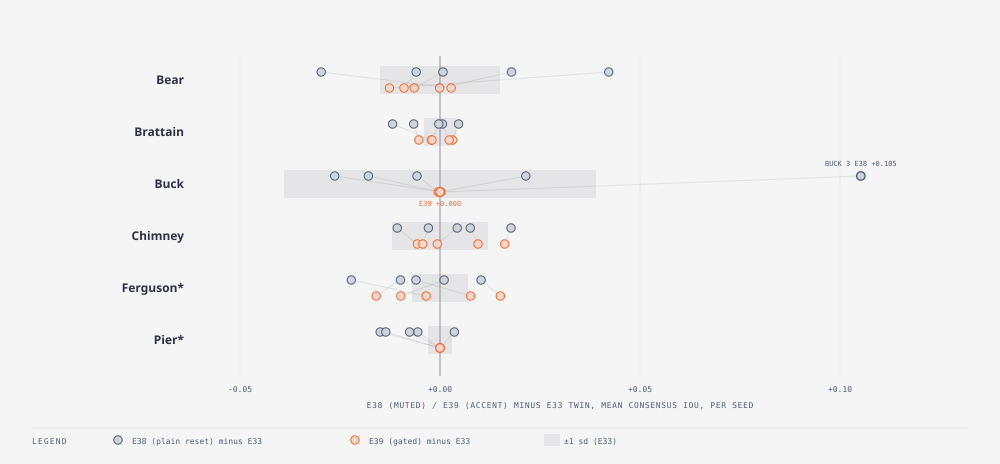

# E39 — area-ratio-gated immigrant reset · REJECTED (as tested) — the gate is safe but comes too late to keep E38's one real gain

_Round 6 (2026-09-11, after E38) · 5 seeds matched to E33/E38 · all six fires incl. holdout · runner `exp_r6_gated_reset.py` (`SMC_IMM_RESET_GATE=1.0`) · results `exp39_gated_reset.json` · pre-registered TEST_PLAN v1.8 addendum · terms: [GLOSSARY.md](GLOSSARY.md)_

**In short.** E38's plain immigrant reset repaired one real failure (Buck
seed 3's lock-in, +0.105) but cost Pier a small mean loss and a little
Brier on four fires, because it re-ignites immigrants even on fires that
have genuinely stopped. E39 tried to have both: reset an immigrant only
while the population's own area ratio says it is under-predicting the
observed area (below 1.0), the exact signature of a lock-in. The gate
worked perfectly at its defensive job — Pier's loss and most of the
Brier cost vanish — and failed completely at its offensive one: Buck
seed 3 comes back at 0.527, tying E33 to three decimal places, not
E38's 0.632. The reason is mechanical, not a tuning problem: by the time
the area ratio actually drops below 1, the locked members' grids have
already burned out completely (zero `Burning` cells, only `BurnedOut`),
so clearing the `contained` flag on a fresh immigrant has nothing left
to reignite. The gate is defensively safe and offensively useless as
specified — it does not earn a place over just leaving `immigrant_reset`
off.

**Question.** Does resetting immigrants only while the consensus
under-predicts the observed area keep E38's Buck gain without its Pier
cost?

**What we changed.** `EnsembleConfig` gained `immigrant_reset_gate:
Option<f64>` (default `None`). When set, an immigrant is given a fresh
driver state only if the area ratio — mean member burned area over
observed burned area — at the *same* assimilation call that is about to
resample is strictly below the gate value; otherwise it inherits its
parent's state, exactly as when `immigrant_reset` is off. `None` leaves
the plain `immigrant_reset` bool in charge unmodified, so E38's run
reproduces bit-for-bit (checked directly: same seed, same fire, `SMC_IMM_RESET=1`
with no gate set gives the identical trajectory it always did). The
ratio is computed inside [`Ensemble::assimilate`](../../cella_lib/src/explore/ensemble.rs)
— the engine already holds every member's burned-cell count and the
observed one for scoring, so it costs nothing extra to keep the ratio
too — and cached for [`Ensemble::assimilate_scores`](../../cella_lib/src/explore/ensemble.rs)
to read at the moment it decides who gets reset. Env knob in
`wildfire_smc`: `SMC_IMM_RESET_GATE=1.0`. Gate value pre-registered at
**1.0**: below it the population is, on average, forecasting less burned
area than actually burned — under-predicting — which is what a
population that has stopped growing while the real fire has not looks
like from the outside.

**Why we expected it to matter.** E38's write-up named the exact
mechanism: "Fresh immigrants late in a fire that really has stopped
spread probability where nothing will burn." An area ratio at or above 1
means the population is keeping up (or over-predicting); only below 1 is
there evidence of the specific failure `immigrant_reset` exists to fix.
Gating on that evidence should, in theory, fire on Buck-like lock-ins and
stay quiet everywhere the fire has genuinely stopped.

**How we scored it.** Per-seed change in mean one-window-ahead consensus
IoU against the E33 twin, five seeds matched to E33/E38's; mean ± sd for
E33 / E38 / E39 side by side; Brier; share of members still contained at
the end. Same base configuration as E33/E38 (assim, β 10, σ 0.2,
immigrants 0.2, containment only).

**Result.**

Per-seed change from the E33 twin, mean consensus IoU (E39 − E33; E38's
own deltas repeated for comparison):

| Fire | seed 0 | seed 1 | seed 2 | seed 3 | seed 4 | mean Δ (E39) | mean Δ (E38) |
|---|---|---|---|---|---|---|---|
| Bear | −0.006 | −0.000 | +0.003 | −0.013 | −0.009 | −0.005 | +0.005 |
| Brattain | +0.003 | +0.002 | −0.002 | −0.002 | −0.005 | −0.001 | −0.003 |
| Buck | +0.000 | +0.000 | −0.000 | **+0.000** | +0.000 | **+0.000** | +0.015 |
| Chimney | −0.006 | −0.004 | −0.001 | +0.009 | +0.016 | +0.003 | +0.003 |
| Ferguson* | −0.016 | −0.010 | −0.003 | +0.015 | +0.008 | −0.001 | −0.005 |
| Pier* | +0.000 | +0.000 | +0.000 | +0.000 | +0.000 | **+0.000** | −0.008 |

Bold marks the two cells the prediction turned on: Buck seed 3 (should
have kept E38's +0.105; instead it is a dead tie with E33) and Pier's
mean (the loss the gate was built to erase; it is gone, exactly, on
every seed).

Mean ± sd, E33 / E38 / E39, and Brier (ensemble, mean over the series):

| Fire | E33 | E38 | E39 | Brier E33 | Brier E38 | Brier E39 |
|---|---|---|---|---|---|---|
| Bear | 0.479 ± 0.015 | 0.484 ± 0.014 | 0.474 ± 0.020 | 0.0510 | 0.0513 | 0.0514 |
| Brattain | 0.416 ± 0.004 | 0.413 ± 0.006 | 0.415 ± 0.004 | 0.1090 | 0.1122 | 0.1142 |
| Buck | 0.590 ± 0.039 | 0.606 ± 0.021 | 0.590 ± 0.039 | 0.0468 | 0.0448 | 0.0469 |
| Chimney | 0.434 ± 0.012 | 0.437 ± 0.003 | 0.437 ± 0.004 | 0.1276 | 0.1315 | 0.1267 |
| Ferguson* | 0.344 ± 0.007 | 0.338 ± 0.009 | 0.342 ± 0.006 | 0.1380 | 0.1369 | 0.1363 |
| Pier* | 0.535 ± 0.003 | 0.527 ± 0.007 | 0.535 ± 0.003 | 0.1093 | 0.1157 | 0.1093 |

Members still contained at the end (mean over 5 seeds): Bear E33 1.00 /
E38 0.98 / E39 0.99; Brattain 1.00 / 0.81 / 0.81; Buck 1.00 / 0.81 /
0.81; Chimney 0.81 / 0.58 / 0.72; Ferguson 1.00 / 0.81 / 0.87; Pier 1.00
/ 1.00 / 1.00.

How to read it: Buck's sd under E39 (0.039) is identical to E33's,
digit for digit — not just close, actually the same population — while
E38 halved it (0.021). Pier's contained fraction under E39 (1.00) also
matches E33 exactly: the gate never fires there, because Pier's area
ratio never drops below 1 — it is correctly recognised as a fire that
has genuinely stopped, not one that is locked in.

**The prediction, checked line by line.**

- *"Buck seed 3 keeps its +0.10."* **No.** E39's Buck seed 3 is 0.527,
  matching E33's 0.527 to three decimal places (E38 was 0.632). The
  central claim of the experiment failed.
- *"Pier's mean loss (−0.008, 4/5 seeds) disappears (inside sd)."*
  **Yes, completely.** Every one of Pier's five seeds is now `+0.000`
  against its E33 twin — the loss is not just inside sd, it is gone
  because the gate never once fires on Pier (its area ratio never falls
  below 1).
- *"Brier cost of E38 on Brattain/Chimney/Pier halves or vanishes."*
  **Two of three.** Pier's Brier cost vanishes exactly (0.1093 both).
  Chimney's more than vanishes (0.1267 vs E33's 0.1276 — better than the
  no-reset baseline). Brattain's does not halve; it gets very slightly
  *worse* (0.1142 vs E38's 0.1122, both against E33's 0.1090), though the
  absolute size (+0.0052) is small next to the fire's own IoU sd
  (0.004) and could be run-to-run noise rather than a real cost.
- *"Everywhere else ties E33."* **Yes.** Bear (−0.005), Brattain
  (−0.001), Chimney (+0.003) and Ferguson (−0.001) are all inside their
  E33 sd (0.015 / 0.004 / 0.012 / 0.007).

Three of four clauses held; the one that mattered most — the reason E39
was proposed at all — did not.

**What it means.** The gate is reading the right *signal* (Pier's
protection proves that: it never mistakes "stopped for real" for
lock-in) but at the wrong *time*. `immigrant_reset_gate` decides whether
to reset using the area ratio computed at that same resample step, from
the ensemble's live burned-cell counts. By the time enough members have
stopped growing for the population mean to visibly under-predict the
observed area (ratio < 1), the wildfire driver has usually already run
every `Burning` cell in those members through to `BurnedOut` — there are
no live embers left in the grid for a cleared `contained` flag to act
on. Clearing the *state* flag is cheap (it does change
`contained_fraction`, visible in the table above: 0.81 under the gate on
Buck, same as E38, not E33's 1.00) but it cannot undo *physics*: a cell
needs a burning neighbour to catch fire, and none exist any more.
`immigrant_reset` only ever worked because it was applied unconditionally
from generation 1, so a share of the population always still had live
embers when the rest locked in; gating on evidence necessarily waits
until the evidence exists, by which point it is too late for the fix to
reach the part of the population that needed it.

**Questions this raises.**

- Would a *leading* signal (the area ratio's trend over the last few
  windows, or a lower gate that fires while some members still have
  live embers, rather than the instantaneous ratio) catch the lock-in
  before the grid is fully dead? Open — would need a new pre-registered
  gate design, not a re-tuned threshold on this same one (that would be
  tuning on the test fire).
- Is `contained_fraction` alone ever a leading indicator here, ahead of
  the area ratio? Open.

**Verdict.** REJECTED as tested. The gate is safe (it protects Pier and
mostly protects Brier without disturbing five of six fires) but useless
for the one job it was built for: it does not reproduce Buck seed 3's
recovery, so it buys none of E38's benefit while giving up little of
E38's cost — which is a wash, not a win, against just leaving
`immigrant_reset` off. `immigrant_reset_gate` is kept in the engine
(tested, documented, off by default) as an available option, but is not
recommended over plain `immigrant_reset` if repairing lock-in is the
goal.

**Later.** None yet.
