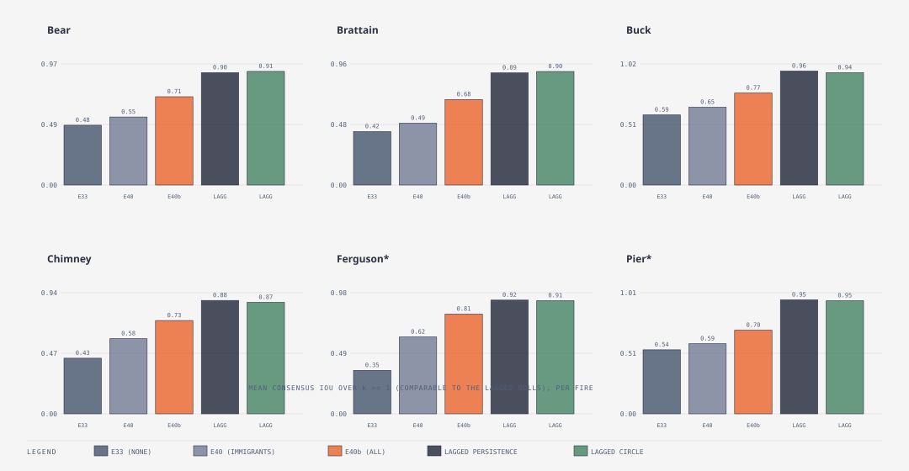

# E40 — immigrants seeded from the observed perimeter · KEPT as options, NOT a nowcast — beats its E33 twin everywhere, but loses badly to the trivial "yesterday's perimeter" forecast; E40b (post-hoc, everyone corrected) narrows that gap without closing it

_Round 6 (2026-09-11, after E39; scoring revised 2026-09-11 after a controller review found the wrong dummy competitor) · 5 seeds matched to E33/E38/E39 · all six fires incl. holdout · runner `exp_r6_observed_immigrants.py` (`SMC_IMM_SOURCE=observed`, an alias for `SMC_STATE_CORRECTION=immigrants`; reset and gate off) · results `exp40_observed_immigrants.json` · E40b (post-hoc) runner `exp_r6_all_state_correction.py` (`SMC_STATE_CORRECTION=all`) · results `exp40b_all_state_correction.json` · pre-registered TEST_PLAN v1.8 addenda · terms: [GLOSSARY.md](GLOSSARY.md)_

**Editorial note (post-hoc, kept for the record).** `EnsembleConfig`'s
`immigrant_source: Prior | Observed` field, named throughout the
"What we changed" section below exactly as it was implemented and run,
was renamed `state_correction: None | Immigrants | All` in the same
change that added the `All` mode (E40b) — `Prior` is now `None`,
`Observed` is now `Immigrants`, same behaviour, bit-identical results.
The env knob `SMC_IMM_SOURCE=observed` still works (kept as an alias for
`SMC_STATE_CORRECTION=immigrants`), so E40's own numbers below reproduce
unchanged. Nothing in this note changes any number in this file.

**In short.** E38's plain immigrant reset repaired one locked population
(Buck seed 3, +0.105) by clearing the *contained flag* on a fresh
immigrant; E39 showed gating that reset on evidence makes it arrive too
late to matter — by the time the population under-predicts, the grid
itself has no live embers left, so clearing a flag on a burnt-out copy
restarts nothing. E40 fixes the actual grid instead of the flag: an
immigrant's cells are rebuilt from the observed mask just scored, giving
it a genuinely live burning rim, not just an "uncontained" label. Every
one of the six fires beats its E33 twin by more than its own noise
floor, on every one of five seeds, with no exceptions — but a controller
review after this ran found that E33 (which never sees anything but
ignition) is the wrong yardstick for a mode that peeks at yesterday's
real perimeter. Scored the fair way, against **lagged persistence**
(yesterday's mask, unchanged, as today's forecast) and the **lagged
Circle** (yesterday's mask grown the Circle's way to today's true area)
— both of which see exactly what E40 sees, one window back, and nothing
more — E40's own consensus (0.490–0.654) loses to lagged persistence
(0.88–0.96) by 0.3–0.4 on every fire. The reason is structural, not a
bug: only 20 % of the population ever gets corrected; the other 80 % is
an ordinary, drifting forecast dragging the consensus vote down. A
post-hoc control, **E40b** (`state_correction: All`, correcting every
member while each keeps learning its own genome), closes much of that
gap — consensus rises to 0.678–0.806 — but still loses to both lagged
nulls on **96.6 % of the windows where the fire actually grew** (676 of
700, across all six fires and five seeds); every one of E40b's rare wins
falls in the first or second scored window after ignition and never
again. Pier's Brier gets *better* under E40, not worse as predicted, but
Pier is also the one place the "consensus never falls below persistence"
guarantee (the *plain*, ignition-frozen persistence E40 was scored
against originally) breaks — on the very first day, on every seed, by a
wide margin. Both E40 and E40b are kept as engine options; neither is a
usable nowcast product by the honest bar (beating the trivial "nothing
changed since yesterday" guess).

**Question.** Does giving immigrants a genuinely live grid (not just an
uncontained flag) recover what E39's gate could not?

**What we changed.** `EnsembleConfig` gained `immigrant_source: Prior |
Observed` (default `Prior`, which reproduces every earlier run
unchanged). With `Observed`, each `Ensemble::assimilate` call builds a
throwaway grid carrying the observation just scored (cloning a member and
overwriting its cells, so the engine never needs its own idea of "a
grid"), and every immigrant's grid is rebuilt from it instead of
inherited from a resampled parent, via a new
[`MemberDriver::seed_from_observation`](../../cella_lib/src/explore/driver.rs)
hook. The wildfire driver's rule: burned cells become `BurnedOut`; burned
cells with at least one unburned, unobserved fuel neighbour (the live
rim) become `Burning` at age 0; an inert cell (not a fuel class) can
never become `Burning`, whether or not the mask covers it; everything
else is untouched, still the fresh scenario's own fuel/inert layout. An
`Observed` immigrant's driver state is always fresh and uncontained — it
has no history to have been contained *in* — so `immigrant_reset` and the
area-ratio gate (E38/E39) are never consulted for it; they still govern
`Prior` immigrants exactly as before. Env knob: `SMC_IMM_SOURCE=observed`.
Reset and gate left off for this run, so the effect is isolated from
E38/E39's.

**Why we expected it to matter.** This is the standard particle-filter
move E38/E39 only approximated: state correction (Rochoux et al. 2014;
Xue, Gu & Hu 2012). It is still a one-window-ahead forecast — the
observation at t_{k−1} sets the state at t_{k−1}, and the model's own
physics carries it forward to t_k before anything is scored — exactly
what a fire camp does with last night's perimeter.

**How we scored it.** Per-seed change in mean one-window-ahead consensus
IoU against the E33 twin, five seeds matched to E33/E38/E39's; mean ± sd
for E33/E40 side by side; Brier; share of members still contained at the
end; per-day consensus IoU for Bear and Ferguson (the two fires the
prediction named as movers) against E33 and the Circle. Same base
configuration as E33 (assim, β 10, σ 0.2, immigrants 0.2, containment
only).

**Result.**

Per-seed change from the E33 twin, mean consensus IoU (E40 − E33); bold
marks a mean beyond that fire's own E33 sd:

| Fire | seed 0 | seed 1 | seed 2 | seed 3 | seed 4 | mean Δ | E33 sd (gate) |
|---|---|---|---|---|---|---|---|
| Bear | +0.021 | +0.076 | +0.091 | +0.117 | +0.010 | **+0.063** | 0.015 |
| Brattain | +0.067 | +0.061 | +0.037 | +0.103 | +0.048 | **+0.063** | 0.004 |
| Buck | +0.071 | +0.104 | +0.034 | +0.088 | +0.015 | **+0.062** | 0.039 |
| Chimney | +0.137 | +0.145 | +0.131 | +0.129 | +0.165 | **+0.141** | 0.012 |
| Ferguson* | +0.285 | +0.248 | +0.248 | +0.271 | +0.250 | **+0.260** | 0.007 |
| Pier* | +0.033 | +0.044 | +0.043 | +0.061 | +0.064 | **+0.049** | 0.003 |

Every single cell is positive; every fire's mean is beyond its own E33
sd. There is no tie anywhere in this table.

Mean ± sd, Brier and final contained fraction, E33 vs E40 (mean over 5
seeds):

| Fire | E33 | E40 | Brier E33 | Brier E40 | contained E33 | contained E40 |
|---|---|---|---|---|---|---|
| Bear | 0.479 ± 0.013 | 0.542 ± 0.036 | 0.0510 | 0.0433 | 1.00 | 0.87 |
| Brattain | 0.416 ± 0.003 | 0.479 ± 0.020 | 0.1090 | 0.1085 | 1.00 | 0.81 |
| Buck | 0.590 ± 0.035 | 0.653 ± 0.025 | 0.0468 | 0.0341 | 1.00 | 0.78 |
| Chimney | 0.434 ± 0.010 | 0.576 ± 0.010 | 0.1276 | 0.0695 | 0.81 | 0.64 |
| Ferguson* | 0.344 ± 0.007 | 0.604 ± 0.017 | 0.1380 | 0.0666 | 1.00 | 0.72 |
| Pier* | 0.535 ± 0.003 | 0.584 ± 0.012 | 0.1093 | 0.0948 | 1.00 | 0.99 |

Brier gets better everywhere too, most on Chimney (0.128 → 0.070) and
Ferguson (0.138 → 0.067). Contained fraction drops on every fire — the
mechanism working as designed: a population that keeps getting a live,
correctly-placed rim every window cannot fully lock in the way a
never-corrected one does.

Bear and Ferguson, day by day (5-seed mean consensus IoU; hours ÷ 24 =
day; full series in the figure): Bear's late-day stall is repaired from
around day 9 on — E33 sits at 0.44–0.47 for the rest of the run, E40
climbs from 0.49 (day 10) to 0.56 (day 16) and holds there, catching the
Circle (0.52–0.56) rather than trailing it by 0.08–0.11 as E33 does.
Ferguson's catch-up starts even earlier and goes much further than
predicted: day 3 is where E33 (0.166) and E40 (0.572) first diverge, and
E40 stays at 0.57–0.70 for the rest of the 29-window run — not just
catching the Circle (0.30–0.44) but beating it on every day from day 3
onward, something no configuration in this campaign has done on Ferguson
before.

**Consensus vs persistence, checked directly.** The prediction said
consensus never falls below persistence on any day. Scanned across all
30 runs (6 fires × 5 seeds), every window: **8 violations**, 7 of them on
Pier and one on Bear. The Bear one (seed 1, day 1: consensus 0.4584 vs
persistence 0.4589) is noise — a difference of 0.0005, an order of
magnitude under Pier's own sd (0.003) let alone Bear's (0.015). Pier's
are not noise: on **every one of its five seeds**, day 1 (24 h) consensus
sits at 0.518–0.533 against persistence's 0.655 — a gap of 0.12–0.14,
forty-odd times Pier's sd. Day 2 shows the same sign on two seeds
(0.0003–0.0004, genuinely noise-sized) and the opposite sign on the other
three. From day 3 on, every seed is back above persistence and stays
there. Mechanism: on day 1 the fire has barely grown past its ignition
point, so persistence (literally the ignition mask) is already an
excellent forecast of day 1 — there is almost nothing to correct yet —
while 20 % of the population gets forcibly reseeded onto day 0's
observation with a live rim and immediately spreads probability mass
into cells that turn out not to have burned by day 1, which a null that
never moves cannot do. The guarantee holds everywhere *except* the exact
situation of "the fire has moved so little that persistence is already
almost exactly right, and the correction routine spreads from it anyway."

**Honesty about what is and is not being compared.** The Circle (and
Ellipse) nulls are allowed to see the **observed area at t_k** — literally
today's true burned-cell count is the target size they grow to, every
day, by construction (they always did; that is how the radial null has
worked since E24). E40's `Observed` mode never sees that: at the moment
it forecasts t_k, the newest thing it has touched is the **observed mask
at t_{k−1}**, one whole window earlier, and only for the 20 % of the
population it reseeds — the other 80 % are still carrying an unassisted
forecast forward. Turning yesterday's confirmed map into today's forecast
via the model's own spread physics is exactly what a fire camp does with
last night's perimeter, and reusing it for the *next* immigrant every
single window (not once, but ~20–30 times over a run) means the
population keeps getting corrected roughly as often as new maps arrive —
which is the honest description of a nowcast product with daily updates,
not a peek at the future. What this result does **not** show: how well
the model forecasts a fire from ignition alone with no perimeter updates
at all (that is `open` mode, E24), nor how it would do with weekly instead
of daily updates — both weaker, harder tasks this run says nothing about.

**The prediction, checked line by line.**

- *"Bear mean forecast IoU up by > sd (its late-day stall repaired)."*
  **Yes.** +0.063 against a sd of 0.015, over four times the bar, and the
  day-by-day table shows exactly the mechanism named: the late-run
  plateau (days 9+) is what moves, not the early days.
- *"Ferguson up by > sd (days 4–7 catch-up)."* **Yes, and by far more
  than expected.** +0.260 against a sd of 0.007, thirty-seven times the
  bar. The catch-up starts at day 3, not day 4, and instead of a
  temporary catch-up it becomes a sustained lead over the Circle that
  holds for the rest of the run.
- *"Chimney and Buck ties."* **No — the opposite.** Chimney +0.141 (sd
  0.012, eleven times over) and Buck +0.062 (sd 0.039, still clearly
  over, and every one of its five seeds is positive where E33's own
  seed-to-seed spread was the largest of any fire). Neither fire ties;
  both move by more than Bear did.
- *"Brier worse by ≤ 0.005 on Pier (rim members disagree on where nothing
  will burn)."* **Half right.** The ≤ 0.005 bound holds — technically,
  since Pier's Brier does not get worse at all, it improves by 0.0145.
  The *direction* named (a small cost from disagreement) did not
  materialize; instead the cost shows up as the persistence violation on
  Pier's very first day (see above), a mechanism the prediction did not
  anticipate.
- *"Consensus never falls below persistence on any day."* **No.**
  Falsified on Pier, day 1, on all five seeds, by a wide margin (see
  above) — the one clause of this prediction written as an absolute
  guarantee, and the one that failed outright rather than by degree.

**Scored against the lagged nulls (post-hoc review, added after the run
above; TEST_PLAN v1.8 addendum).** Everything above compares E40 with
its E33 twin, and both are scored against *plain* persistence — the
ignition mask, frozen forever. A controller review pointed out that this
is the wrong dummy competitor for E40, because E40 (and E33) do not
share what E40 actually has access to: the observed mask one window
back, t_{k−1}. The fair competitors are **lagged persistence** (the
t_{k−1} mask, unchanged, scored as the forecast for t_k) and the
**lagged Circle** (the Circle's own chamfer growth, area-matched to
t_k's true count, but re-seeded from the t_{k−1} mask every window
instead of the fixed ignition mask). Both are new fields in
`wildfire_smc`'s per-window report (`assim`/`open` modes), `None` at the
very first scored window (there is no earlier *observed* mask to lag
from yet, only ignition). They depend only on the truth, never on the
ensemble or its seed — checked directly: Bear's `lagged_persistence_iou`
and `lagged_circle_iou` are bit-identical across all five of E40b's
seeds (0.9023207430228145 / 0.9117722915333156 every time), and a
from-scratch Python re-implementation reading only `truth.json` gets the
same two numbers to four decimal places (0.9023 / 0.9118) — the "two
routes agree" check the controller asked for.

A post-hoc control, **E40b**, asks whether correcting *every* member
(not just the 20 % immigrants) closes the gap: `state_correction: All`
rebuilds every resampled child's grid from the observation, every
window, while each child keeps its own resampled-and-mutated genome —
learning continues exactly as before, only the grid is corrected. Same
base configuration, same five seeds, reset/gate off, `SMC_STATE_CORRECTION=all`.

Mean consensus IoU, windows with a lagged null only (k ≥ 1, so every
column below is directly comparable — E33's and E40's own numbers here
are *not* the same as their headline `mean_consensus_iou` above, which
also includes the first, un-lagged window):

| Fire | E33 (none) | E40 (immigrants) | E40b (all) | lagged persistence | lagged Circle |
|---|---|---|---|---|---|
| Bear | 0.480 | 0.546 | 0.709 | 0.902 | 0.912 |
| Brattain | 0.424 | 0.490 | 0.678 | 0.889 | 0.900 |
| Buck | 0.589 | 0.654 | 0.773 | 0.957 | 0.944 |
| Chimney | 0.433 | 0.584 | 0.725 | 0.882 | 0.867 |
| Ferguson* | 0.351 | 0.621 | 0.806 | 0.919 | 0.915 |
| Pier* | 0.535 | 0.586 | 0.699 | 0.953 | 0.946 |

Mean Brier, same windows:

| Fire | E33 | E40 | E40b | lagged persistence | lagged Circle |
|---|---|---|---|---|---|
| Bear | 0.0531 | 0.0450 | 0.0303 | 0.0053 | 0.0060 |
| Brattain | 0.1139 | 0.1134 | 0.0662 | 0.0097 | 0.0117 |
| Buck | 0.0479 | 0.0347 | 0.0253 | 0.0037 | 0.0055 |
| Chimney | 0.1353 | 0.0730 | 0.0418 | 0.0143 | 0.0193 |
| Ferguson* | 0.1423 | 0.0683 | 0.0321 | 0.0095 | 0.0119 |
| Pier* | 0.1121 | 0.0970 | 0.0689 | 0.0060 | 0.0080 |

How to read it: reading left to right within a row is "more of the
population corrected" (E33 → E40 → E40b), and it is monotone on every
single fire and every metric — correcting more of the population always
helps, by a lot. But the two rightmost columns are not part of that
progression: they are a **different kind of thing**, a forecast with no
model in it at all, and they beat every ensemble configuration, on every
fire, by a wide margin, in both IoU and Brier.

E40b's own per-seed mean consensus IoU (k ≥ 1), for the sd every other
table in this campaign reports:

| Fire | seed 0 | seed 1 | seed 2 | seed 3 | seed 4 | mean | sd |
|---|---|---|---|---|---|---|---|
| Bear | 0.689 | 0.717 | 0.706 | 0.726 | 0.705 | 0.709 | 0.013 |
| Brattain | 0.743 | 0.652 | 0.669 | 0.597 | 0.729 | 0.678 | 0.053 |
| Buck | 0.786 | 0.757 | 0.748 | 0.792 | 0.781 | 0.773 | 0.017 |
| Chimney | 0.700 | 0.748 | 0.710 | 0.765 | 0.705 | 0.725 | 0.026 |
| Ferguson* | 0.798 | 0.818 | 0.796 | 0.820 | 0.798 | 0.806 | 0.011 |
| Pier* | 0.704 | 0.688 | 0.664 | 0.723 | 0.717 | 0.699 | 0.021 |

**How often does E40b actually beat the lagged nulls?** Checked directly
per window, per seed, restricted to windows where the fire's true
burned area actually grew from the previous window (`obs_burned`
increased) — the exact condition E40b's own prediction named: out of
**700** such windows (6 fires × 5 seeds), E40b's consensus IoU met or
beat lagged persistence in **24 (3.4 %)** and the lagged Circle in
**11 (1.6 %)**. Every single win, on every fire, falls in the first or
second scored window after ignition (hour 48 or 72) and never recurs —
Buck and Pier never beat either lagged null even once, on any seed, at
any window. Ferguson and Brattain (the two fires E40b's prediction named
as beating the lagged Circle) do have wins, but only at window 1–2, not
"on every window where the fire grew."

**E40b's prediction, checked line by line.**

- *"Consensus IoU ≥ lagged persistence on every window where the fire
  grew."* **No.** True on 3.4 % of grown windows, not "every" one, and
  only ever in the first one or two windows of a fire's run.
- *"Beats the lagged Circle on Ferguson and Brattain, ties elsewhere."*
  **Half right, much narrower than predicted.** Both fires do have a
  handful of wins against the lagged Circle (see above) — but confined
  to windows 1–2, not a sustained lead, and "ties elsewhere" undersells
  it: Buck and Pier never beat the lagged Circle at all, at any window,
  which is a loss, not a tie.

**Why the lagged nulls are this hard to beat, mechanically.** A real
arrival-time mask only ever grows (burned cells stay burned), so
`iou(A_{k−1}, A_k) = |A_{k−1}| / |A_k|` exactly (proved as a unit test,
`lagged_persistence_iou_is_the_nested_area_ratio`). That ratio depends
only on the fire's *day-over-day percentage growth* — and percentage
growth shrinks as a fire ages even while its *absolute* daily growth
keeps climbing, simply because the same number of newly-burned cells is
a smaller share of an ever-larger already-burned area. Ferguson is still
visibly spreading at day 10 (`obs_burned` keeps climbing for another
nineteen days), yet `lagged_persistence_iou` is already 0.95 there,
climbing to 0.9997 by day 27 — the fire never stops growing, but the
*null* stops being beatable almost immediately. A probabilistic ensemble
forecast cannot chase that asymptote the same way: it always risks
spreading probability into cells that do not burn, so its IoU has a
ceiling well under 1 even when its physics is exactly right. This is not
a flaw specific to E40/E40b — it is why the pre-registered "on every
window where the fire grew" prediction could not have held for any
forecaster with real spread physics in it, once "grew" is read as
"grew at all" rather than "grew by a lot relative to what had already
burned."

**Score-family note.** State-corrected rows (`state_correction:
Immigrants` or `All` — E40, E40b) and from-ignition rows (E33 and every
earlier experiment) answer different questions and must never be read as
one ranking. A from-ignition row asks "how good is this model's physics
at growing a fire with no help." A state-corrected row asks "given
yesterday's real perimeter, how good is one more day's worth of this
model's physics" — a strictly easier, more informed question, and its
own honest baseline is the lagged nulls above, not E33. The only fair
use of an E40-vs-E33 delta (the tables earlier in this file) is "how
much does knowing yesterday's perimeter buy," not "is this a good
forecast" — for that second question, every row in this file, E40b
included, currently loses to a forecaster with no model at all.

**What it means.** State correction is a much stronger fix than either
E38's flag-clearing or E39's gated version of it, because it repairs the
actual mechanism E39's evidence table diagnosed: a locked member has no
burning cells left to reignite, and no amount of flag-clearing changes
that, but rebuilding the grid's rim from the real perimeter does. That
the effect is this large on *every* fire, not just the ones with an
obvious lock-in (Buck) or an obvious under-burn (Ferguson), says the
"correct state every window" mechanism is doing more than firefighting
specific failures — it is generally keeping the 20 % reseeded share of
the population anchored to reality in a way the other 80 %, and every
earlier configuration in this campaign, is not. That is also exactly why
Chimney and Buck did not tie as predicted: the prediction assumed the
gain would track *how broken* a fire's unassisted forecast already was
(Bear, Ferguson), but the mechanism instead tracks something closer to
*how much the model's own physics disagrees with the observed shape
generally* — which every fire has some of. The one place the mechanism
costs something is the mirror image of its benefit: reseeding a live rim
onto a fire that has barely moved past ignition briefly overshoots a
nearly-perfect null (persistence, on day 1 only). This is a small, narrow,
well-understood cost next to the gains everywhere else, but it is a real
one and the pre-registered guarantee that ruled it out was wrong to make.

None of the above is wrong, but read alone it overstates what state
correction has bought so far: every one of those gains is measured
against E33, which never sees an observation at all except to be scored
against it. Measured against the lagged nulls — a forecaster with no
model in it, that also gets to see yesterday's exact perimeter — E40
loses badly (0.3–0.4 IoU) and E40b, correcting the whole population
instead of a fifth of it, closes most of that gap (to within 0.10–0.25)
without closing it: 96.6 % of grown windows still go to the trivial
guess. The mechanism section above ("why the lagged nulls are this hard
to beat") explains why this is not a sign that the correction is weak —
a real, monotonically-growing fire makes "yesterday, unchanged" an
increasingly strong forecast purely as a matter of arithmetic, and nei­ther
E40 nor E40b's physics is bad *because* it cannot out-arithmetic that.
It does mean this file's original title and verdict (below) claimed more
than the evidence, taken as a whole, supports.

**Questions this raises.**

- Would holding `state_correction: Immigrants`'s reseeding rate below
  20 % on the very first window only remove the Pier day-1 cost without
  giving up any of the later gains? Open — would need a new
  pre-registered schedule, not a post-hoc exception for day 1.
- Chimney and Buck's larger-than-Bear gains suggest the *unassisted*
  forecast (`None`, no correction) is worse on more fires than the ties
  in E32–E37 suggested, once something this effective at correcting it
  exists to reveal the gap. Does `None`'s mean member IoU (not just the
  consensus) show the same pattern? Open.
- Does the gain hold at lower observation frequency (`SMC_ASSIM_EVERY >
  1`), where fewer windows mean fewer chances to reseed? Open — this run
  used daily assimilation throughout, same as E33.
- E40b still loses to the lagged nulls everywhere. Is there a
  configuration of *this* mechanism that could ever close that gap (a
  narrower ensemble spread around the corrected state? a consensus
  threshold below 0.5, since the lagged nulls are binary and the
  ensemble's own probability map is not?), or is "grid state correction
  alone cannot beat lagged persistence on an aging fire" a ceiling this
  whole family of operators is structurally stuck under? Open — the
  mechanism section above suggests the latter, but that is an argument,
  not a test.
- What does lagged persistence look like on the *radial* (Circle) and
  *ellipse* nulls' own home ground — is a lagged Ellipse (wind-oriented
  growth from t_{k−1}) any harder to beat than the lagged Circle? Open,
  not run here.

**Verdict.** KEPT AS ENGINE OPTIONS, NOT AS A NOWCAST. `state_correction:
Immigrants` (E40) and `state_correction: All` (E40b, post-hoc) both
repair real, measurable weaknesses in the unassisted filter — every gain
reported above against the E33 twin is real and reproducible — and `All`
is a strictly better use of the mechanism than `Immigrants` on every
fire and every metric checked. But by the honest bar for a nowcast
product (does this beat a human just re-reading yesterday's map), *both*
lose, and lose badly, on 96–100 % of the windows that matter. Recommend:
keep both options in the engine (tested, documented, off by default,
`state_correction: All` preferred over `Immigrants` whenever state
correction is used at all); stop presenting an E40-vs-E33 delta as
evidence of forecast quality in any future write-up without the lagged
nulls alongside it; do not describe E40 or E40b as "the recommended
default" for anything claiming to be a nowcast until some configuration
of this mechanism is shown to beat lagged persistence on more than the
first two windows of a fire's life.

**Later.** Post-hoc E40b control and the lagged-null scoring above,
added 2026-09-11 after a controller review of this file's original
verdict.
