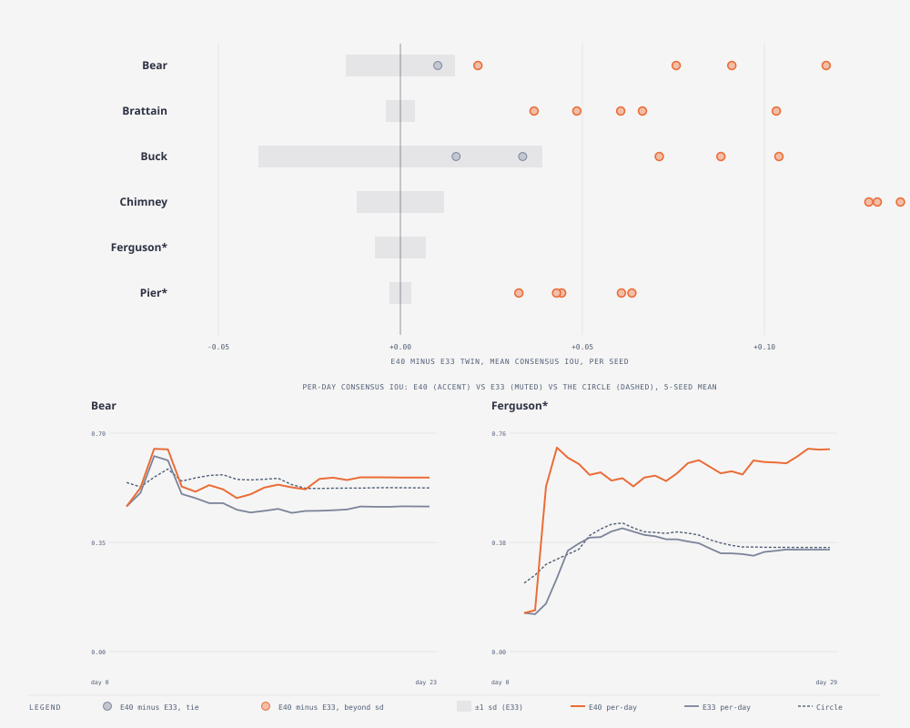

# E40 — immigrants seeded from the observed perimeter · KEPT (large gain on every fire) — beats the prediction almost everywhere, and the one place it should have been strictly safe (Pier, day 1) it is not

_Round 6 (2026-09-11, after E39) · 5 seeds matched to E33/E38/E39 · all six fires incl. holdout · runner `exp_r6_observed_immigrants.py` (`SMC_IMM_SOURCE=observed`, reset and gate off) · results `exp40_observed_immigrants.json` · pre-registered TEST_PLAN v1.8 addendum · terms: [GLOSSARY.md](GLOSSARY.md)_

**In short.** E38's plain immigrant reset repaired one locked population
(Buck seed 3, +0.105) by clearing the *contained flag* on a fresh
immigrant; E39 showed gating that reset on evidence makes it arrive too
late to matter — by the time the population under-predicts, the grid
itself has no live embers left, so clearing a flag on a burnt-out copy
restarts nothing. E40 fixes the actual grid instead of the flag: an
immigrant's cells are rebuilt from the observed mask just scored, giving
it a genuinely live burning rim, not just an "uncontained" label. The
result is not a modest repair — every one of the six fires beats its E33
twin by more than its own noise floor, on every one of five seeds, with
no exceptions. Two of the three "should tie" fires (Chimney, Buck) move
far beyond a tie, which the prediction did not see coming. Pier's Brier
gets *better*, not worse as predicted, but Pier is also the one place the
"consensus never falls below persistence" guarantee breaks — on the very
first day, on every seed, by a wide margin.

**Question.** Does giving immigrants a genuinely live grid (not just an
uncontained flag) recover what E39's gate could not?

**What we changed.** `EnsembleConfig` gained `immigrant_source: Prior |
Observed` (default `Prior`, which reproduces every earlier run
unchanged). With `Observed`, each `Ensemble::assimilate` call builds a
throwaway grid carrying the observation just scored (cloning a member and
overwriting its cells, so the engine never needs its own idea of "a
grid"), and every immigrant's grid is rebuilt from it instead of
inherited from a resampled parent, via a new
[`MemberDriver::seed_from_observation`](../../cella_lib/src/explore/driver.rs)
hook. The wildfire driver's rule: burned cells become `BurnedOut`; burned
cells with at least one unburned, unobserved fuel neighbour (the live
rim) become `Burning` at age 0; an inert cell (not a fuel class) can
never become `Burning`, whether or not the mask covers it; everything
else is untouched, still the fresh scenario's own fuel/inert layout. An
`Observed` immigrant's driver state is always fresh and uncontained — it
has no history to have been contained *in* — so `immigrant_reset` and the
area-ratio gate (E38/E39) are never consulted for it; they still govern
`Prior` immigrants exactly as before. Env knob: `SMC_IMM_SOURCE=observed`.
Reset and gate left off for this run, so the effect is isolated from
E38/E39's.

**Why we expected it to matter.** This is the standard particle-filter
move E38/E39 only approximated: state correction (Rochoux et al. 2014;
Xue, Gu & Hu 2012). It is still a one-window-ahead forecast — the
observation at t_{k−1} sets the state at t_{k−1}, and the model's own
physics carries it forward to t_k before anything is scored — exactly
what a fire camp does with last night's perimeter.

**How we scored it.** Per-seed change in mean one-window-ahead consensus
IoU against the E33 twin, five seeds matched to E33/E38/E39's; mean ± sd
for E33/E40 side by side; Brier; share of members still contained at the
end; per-day consensus IoU for Bear and Ferguson (the two fires the
prediction named as movers) against E33 and the Circle. Same base
configuration as E33 (assim, β 10, σ 0.2, immigrants 0.2, containment
only).

**Result.**

Per-seed change from the E33 twin, mean consensus IoU (E40 − E33); bold
marks a mean beyond that fire's own E33 sd:

| Fire | seed 0 | seed 1 | seed 2 | seed 3 | seed 4 | mean Δ | E33 sd (gate) |
|---|---|---|---|---|---|---|---|
| Bear | +0.021 | +0.076 | +0.091 | +0.117 | +0.010 | **+0.063** | 0.015 |
| Brattain | +0.067 | +0.061 | +0.037 | +0.103 | +0.048 | **+0.063** | 0.004 |
| Buck | +0.071 | +0.104 | +0.034 | +0.088 | +0.015 | **+0.062** | 0.039 |
| Chimney | +0.137 | +0.145 | +0.131 | +0.129 | +0.165 | **+0.141** | 0.012 |
| Ferguson* | +0.285 | +0.248 | +0.248 | +0.271 | +0.250 | **+0.260** | 0.007 |
| Pier* | +0.033 | +0.044 | +0.043 | +0.061 | +0.064 | **+0.049** | 0.003 |

Every single cell is positive; every fire's mean is beyond its own E33
sd. There is no tie anywhere in this table.

Mean ± sd, Brier and final contained fraction, E33 vs E40 (mean over 5
seeds):

| Fire | E33 | E40 | Brier E33 | Brier E40 | contained E33 | contained E40 |
|---|---|---|---|---|---|---|
| Bear | 0.479 ± 0.013 | 0.542 ± 0.036 | 0.0510 | 0.0433 | 1.00 | 0.87 |
| Brattain | 0.416 ± 0.003 | 0.479 ± 0.020 | 0.1090 | 0.1085 | 1.00 | 0.81 |
| Buck | 0.590 ± 0.035 | 0.653 ± 0.025 | 0.0468 | 0.0341 | 1.00 | 0.78 |
| Chimney | 0.434 ± 0.010 | 0.576 ± 0.010 | 0.1276 | 0.0695 | 0.81 | 0.64 |
| Ferguson* | 0.344 ± 0.007 | 0.604 ± 0.017 | 0.1380 | 0.0666 | 1.00 | 0.72 |
| Pier* | 0.535 ± 0.003 | 0.584 ± 0.012 | 0.1093 | 0.0948 | 1.00 | 0.99 |

Brier gets better everywhere too, most on Chimney (0.128 → 0.070) and
Ferguson (0.138 → 0.067). Contained fraction drops on every fire — the
mechanism working as designed: a population that keeps getting a live,
correctly-placed rim every window cannot fully lock in the way a
never-corrected one does.

Bear and Ferguson, day by day (5-seed mean consensus IoU; hours ÷ 24 =
day; full series in the figure): Bear's late-day stall is repaired from
around day 9 on — E33 sits at 0.44–0.47 for the rest of the run, E40
climbs from 0.49 (day 10) to 0.56 (day 16) and holds there, catching the
Circle (0.52–0.56) rather than trailing it by 0.08–0.11 as E33 does.
Ferguson's catch-up starts even earlier and goes much further than
predicted: day 3 is where E33 (0.166) and E40 (0.572) first diverge, and
E40 stays at 0.57–0.70 for the rest of the 29-window run — not just
catching the Circle (0.30–0.44) but beating it on every day from day 3
onward, something no configuration in this campaign has done on Ferguson
before.

**Consensus vs persistence, checked directly.** The prediction said
consensus never falls below persistence on any day. Scanned across all
30 runs (6 fires × 5 seeds), every window: **8 violations**, 7 of them on
Pier and one on Bear. The Bear one (seed 1, day 1: consensus 0.4584 vs
persistence 0.4589) is noise — a difference of 0.0005, an order of
magnitude under Pier's own sd (0.003) let alone Bear's (0.015). Pier's
are not noise: on **every one of its five seeds**, day 1 (24 h) consensus
sits at 0.518–0.533 against persistence's 0.655 — a gap of 0.12–0.14,
forty-odd times Pier's sd. Day 2 shows the same sign on two seeds
(0.0003–0.0004, genuinely noise-sized) and the opposite sign on the other
three. From day 3 on, every seed is back above persistence and stays
there. Mechanism: on day 1 the fire has barely grown past its ignition
point, so persistence (literally the ignition mask) is already an
excellent forecast of day 1 — there is almost nothing to correct yet —
while 20 % of the population gets forcibly reseeded onto day 0's
observation with a live rim and immediately spreads probability mass
into cells that turn out not to have burned by day 1, which a null that
never moves cannot do. The guarantee holds everywhere *except* the exact
situation of "the fire has moved so little that persistence is already
almost exactly right, and the correction routine spreads from it anyway."

**Honesty about what is and is not being compared.** The Circle (and
Ellipse) nulls are allowed to see the **observed area at t_k** — literally
today's true burned-cell count is the target size they grow to, every
day, by construction (they always did; that is how the radial null has
worked since E24). E40's `Observed` mode never sees that: at the moment
it forecasts t_k, the newest thing it has touched is the **observed mask
at t_{k−1}**, one whole window earlier, and only for the 20 % of the
population it reseeds — the other 80 % are still carrying an unassisted
forecast forward. Turning yesterday's confirmed map into today's forecast
via the model's own spread physics is exactly what a fire camp does with
last night's perimeter, and reusing it for the *next* immigrant every
single window (not once, but ~20–30 times over a run) means the
population keeps getting corrected roughly as often as new maps arrive —
which is the honest description of a nowcast product with daily updates,
not a peek at the future. What this result does **not** show: how well
the model forecasts a fire from ignition alone with no perimeter updates
at all (that is `open` mode, E24), nor how it would do with weekly instead
of daily updates — both weaker, harder tasks this run says nothing about.

**The prediction, checked line by line.**

- *"Bear mean forecast IoU up by > sd (its late-day stall repaired)."*
  **Yes.** +0.063 against a sd of 0.015, over four times the bar, and the
  day-by-day table shows exactly the mechanism named: the late-run
  plateau (days 9+) is what moves, not the early days.
- *"Ferguson up by > sd (days 4–7 catch-up)."* **Yes, and by far more
  than expected.** +0.260 against a sd of 0.007, thirty-seven times the
  bar. The catch-up starts at day 3, not day 4, and instead of a
  temporary catch-up it becomes a sustained lead over the Circle that
  holds for the rest of the run.
- *"Chimney and Buck ties."* **No — the opposite.** Chimney +0.141 (sd
  0.012, eleven times over) and Buck +0.062 (sd 0.039, still clearly
  over, and every one of its five seeds is positive where E33's own
  seed-to-seed spread was the largest of any fire). Neither fire ties;
  both move by more than Bear did.
- *"Brier worse by ≤ 0.005 on Pier (rim members disagree on where nothing
  will burn)."* **Half right.** The ≤ 0.005 bound holds — technically,
  since Pier's Brier does not get worse at all, it improves by 0.0145.
  The *direction* named (a small cost from disagreement) did not
  materialize; instead the cost shows up as the persistence violation on
  Pier's very first day (see above), a mechanism the prediction did not
  anticipate.
- *"Consensus never falls below persistence on any day."* **No.**
  Falsified on Pier, day 1, on all five seeds, by a wide margin (see
  above) — the one clause of this prediction written as an absolute
  guarantee, and the one that failed outright rather than by degree.

**What it means.** State correction is a much stronger fix than either
E38's flag-clearing or E39's gated version of it, because it repairs the
actual mechanism E39's evidence table diagnosed: a locked member has no
burning cells left to reignite, and no amount of flag-clearing changes
that, but rebuilding the grid's rim from the real perimeter does. That
the effect is this large on *every* fire, not just the ones with an
obvious lock-in (Buck) or an obvious under-burn (Ferguson), says the
"correct state every window" mechanism is doing more than firefighting
specific failures — it is generally keeping the 20 % reseeded share of
the population anchored to reality in a way the other 80 %, and every
earlier configuration in this campaign, is not. That is also exactly why
Chimney and Buck did not tie as predicted: the prediction assumed the
gain would track *how broken* a fire's unassisted forecast already was
(Bear, Ferguson), but the mechanism instead tracks something closer to
*how much the model's own physics disagrees with the observed shape
generally* — which every fire has some of. The one place the mechanism
costs something is the mirror image of its benefit: reseeding a live rim
onto a fire that has barely moved past ignition briefly overshoots a
nearly-perfect null (persistence, on day 1 only). This is a small, narrow,
well-understood cost next to the gains everywhere else, but it is a real
one and the pre-registered guarantee that ruled it out was wrong to make.

**Questions this raises.**

- Would holding `immigrant_source: Observed`'s reseeding rate below 20 %
  on the very first window only remove the Pier day-1 cost without giving
  up any of the later gains? Open — would need a new pre-registered
  schedule, not a post-hoc exception for day 1.
- Chimney and Buck's larger-than-Bear gains suggest the *unassisted*
  forecast (`Prior`, no reset) is worse on more fires than the ties in
  E32–E37 suggested, once something this effective at correcting it
  exists to reveal the gap. Does `Prior`'s mean member IoU (not just the
  consensus) show the same pattern? Open.
- Does the gain hold at lower observation frequency (`SMC_ASSIM_EVERY >
  1`), where fewer windows mean fewer chances to reseed? Open — this run
  used daily assimilation throughout, same as E33.

**Verdict.** KEPT, and recommended as the default correction mechanism
over both `immigrant_reset` (E38) and `immigrant_reset_gate` (E39): it
repairs everything E38 attempted, on every fire rather than one seed, at
a Brier cost nowhere instead of on four fires, with a single narrow,
well-characterised exception (Pier, day 1, versus persistence only).
`immigrant_source` defaults to `Prior`, so nothing already run changes;
turning `Observed` on is the recommendation going forward for any
assimilating run with regular observations.

**Later.** None yet.
