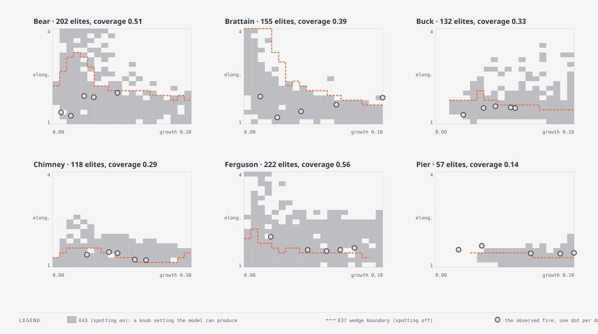

# E43 — does spotting extend the reachable shape region? · finding — yes on Ferguson, only marginally on Pier: a connected-component replay confirms Ferguson's new reach is a real single-blob shape, not scatter, but Pier's is a fragile, barely-there margin that most fresh replays miss; Brattain stays out on every check

_Round 6 (2026-09-11, after E37; component-replay fix round added 2026-09-11) · MAP-Elites, 960 evaluations per fire (batch 32, 30 generations) · all six fires incl. holdout · runner `exp_r6_spot_illuminate.py` (`SMC_SPOT=1`) → `wildfire_smc map` · results `exp43_spot_illuminate.json` (raw per-fire archives in `exp43_spot_illuminate/`) · compared against E37's own archives (`exp37_illuminate.json`, not re-run) · replay diagnostic: runner `exp_r6_replay.py` → `wildfire_smc replay` · results `exp43_replay.json` (raw per-fire reports in `exp43_replay/`) · pre-registered TEST_PLAN v1.8 addenda · terms: [GLOSSARY.md](GLOSSARY.md)_

**In short.** E37 found the model's reachable growth × elongation region
is a wedge — small fires can be any shape, large fires are round — and
left open whether spotting (rejected as a score-improving mechanism in
E7, but never tested for *shape*) is what a real kernel refit would need
to draw a large, elongated fire. Adding two spotting genes to the same
illumination map and switching spotting on in the config answers that
question directly: coverage of the archive roughly doubles or more on
every fire, and — contrary to the pre-registered prediction — the
*shape* ceiling at the observed size also moves a lot, not a little, on
two of the three fires E37 found unreachable. Ferguson's reachable
elongation at its own size rises from 1.38 to 2.66 (its observed shape
is 1.61) and Pier's rises from 1.15 to 1.77 (observed 1.45). Only
Brattain, whose reachable elongation moves the least (1.35 → 1.49, still
short of its observed 1.83), stays outside the wedge.

**But the archive's elongation is a second-moment measure over every
tracked cell with no notion of connectivity, so it cannot by itself tell
"one stretched fire" from "a round core plus a few spot-fire embers
scattered far downwind."** A post-hoc replay diagnostic (below) re-runs
the top elites through an 8-connected-component check. The scatter
hypothesis turns out to be **wrong for Ferguson and Pier specifically**
— their burned sets stay 97–100 % one connected piece in every replay,
so their elongation is genuinely about shape, not disconnected outliers.
What the replay finds instead is a **reproducibility problem**: the same
genome, replayed with three fresh seeds, produces elongations that swing
by as much as 0.3. Ferguson clears its observed shape (1.61) on **every
one of 15 replays** (worst case 2.01, a margin of +0.40) — a robust
result. Pier clears its observed shape (1.45) on only **6 of 15
replays** (best case 1.55, a margin of +0.10) — a real but fragile
result that the single archived number (1.77) overstated by chance.
Brattain fails the check even harder than the archive suggested: no
replay of its top five elites exceeds 1.36, well short of both its own
archived ceiling (1.49) and its observed shape (1.83).

**Question.** Is spotting a mechanism that gives a *large* fire more
reach in the downwind direction, i.e. does it move E37's wedge?

**What we changed.** `wildfire_smc` gains an env knob, `SMC_SPOT=1`,
used only in `map` mode:

- **Config.** `enable_spotting` (new function) switches spotting on in
  the config's wildfire model before it becomes the MAP-Elites template:
  `WildfireParams::spotting` is set to `Some(SpottingParams { p_spot:
  0.001, median_distance: 5.0, sigma: 0.5, angle_jitter_deg: 15.0 })` via
  a direct field write (`Grid2D::set_model_param` refuses a
  `spotting.*` key while spotting is `None` — see the `set_param` tests
  in `cella_lib/src/wildfire/mod.rs` — so a gene has nothing to write
  into unless spotting is already turned on this way first). `sigma` and
  `angle_jitter_deg` stay fixed; only `p_spot` and `median_distance`
  become genes and are overwritten per genome.
- **Genes.** Two genes are appended to the existing spread genes (`p0`,
  `burn_duration`, `wind_scale`; `tau_days` is dropped here exactly as
  in E37, via `SMC_TAU_OFF=1`):
  - `model.spotting.p_spot`, **log-uniform 0.001–0.005**. The struct doc
    calls it "per-step probability that a burning cell launches a
    firebrand" — a rate that can span orders of magnitude, hence log
    scale, like `model.p0`. The range is E7's pre-registered spotting
    space verbatim (`exp_spotting.py`'s `SPOT_GRID`: lo 0.001, mid 0.005,
    far 0.002), which already moved burned area 2–4× on these fires —
    wide enough to show a shape effect without extrapolating past what
    has actually been tested.
  - `model.spotting.median_distance`, **linear 2–20 cells**. E7 tested
    5–20; the brief widens the floor to 2 cells (a jump barely ahead of
    the front) to also cover short-range spotting. Both ends sit inside
    `SpottingParams::median_distance`'s declared bounds of [0.5, 100]
    cells (`cella_lib/src/wildfire/mod.rs`'s `params()`).
  Gene-building was split out of `main` into `build_genes` and unit
  tested (`spot_gene_tests` in `wildfire_smc.rs`): `SMC_SPOT=1` adds
  exactly these two genes with the ranges above and turns on
  `spotting.p_spot`/`spotting.median_distance` as readable config
  params; without it, the gene list and the config are unchanged.
- **Everything else matches E37 exactly**: MAP-Elites (batch 32, 30
  generations, iso + line emitter), 5 days of the scenario's own
  weather, growth axis 0–0.10 (20 bins), elongation axis 1–4 (20 bins),
  no stopping rule, no objective, same six fires.

**Why we expected it to matter.** E37 named this as one of its two open
questions: "would spotting … add reach at size?" E7 rejected spotting
for *score* (it only ever added burned area, which hurt IoU against an
already-too-large model), but never asked whether it changes the
*shape* the model can produce, which is the question that matters after
E37 — a mechanism that adds reach without necessarily being a net
scoring win is still worth knowing about.

**How we scored it.** Identical archive metrics to E37: coverage (share
of the 400-bin map reached), the model's own maximum elongation at any
size, and its maximum elongation at a size at least as big as the real
fire on day 5 — read directly off each fire's archive, the same method
that reproduces E37's own published numbers exactly (checked against
`exp37_illuminate/<fire>.json` before trusting it on the new data). E37
is not re-run; its numbers are read from the reports already on disk.

A **"max spot-elite distance from the main body"** column, mentioned as
optional in the task brief, is **not included**: the archive stores only
each elite's genome and its two behaviour-axis values (growth,
elongation), not any spatial statistic of where spotted cells land
relative to the main burned mass, so there is nothing in the data to
build that column from.

**Result.**

| Fire | E43 cells filled | E37 cells filled | E43 elong., any size | E37 elong., any size | E43 elong. at observed size | E37 elong. at observed size | Δ at-size elong. | observed (day 5) growth / elongation | E43 reachable? | E37 reachable? |
|---|---|---|---|---|---|---|---|---|---|---|
| Bear | 202 (51 %) | 125 (31 %) | 6.56 | 3.19 | 2.90 | 2.03 | +0.87 | 0.047 / 1.98 | yes | yes |
| Brattain | 155 (39 %) | 112 (28 %) | 4.71 | 5.52 | 1.49 | 1.35 | +0.14 | 0.110 / 1.83 | **no** | **no** |
| Buck | 132 (33 %) | 60 (15 %) | 3.52 | 1.95 | 3.52 | 1.49 | +2.03 | 0.058 / 1.50 | yes | borderline |
| Chimney | 118 (30 %) | 48 (12 %) | 2.51 | 1.54 | 1.80 | 1.35 | +0.45 | 0.067 / 1.22 | yes | yes |
| Ferguson* | 222 (56 %) | 52 (13 %) | 5.29 | 2.06 | 2.66 | 1.38 | +1.28 | 0.080 / 1.61 | **yes** | **no** |
| Pier* | 57 (14 %) | 34 (9 %) | 1.94 | 1.39 | 1.77 | 1.15 | +0.62 | 0.102 / 1.45 | **yes** | **no** |

How to read it: "cells filled" is coverage of the 400-bin map; the two
elongation columns are the most stretched fire the model made at any
size, and at a size at least as big as the real fire on day 5; then the
real fire's own size and shape (identical in both runs — same truth,
same weather); then whether the real one lies inside each run's
reachable region. `*` is the holdout pair. Bold marks a fire whose
reachable-or-not status is the headline of this experiment (Ferguson and
Pier flip from no to yes; Brattain stays no).

- **Coverage rises on every fire, by a lot.** 30–56 % filled under
  spotting versus 9–31 % under E37, roughly 1.6–4.3× more of the map
  reached with the same search budget (960 evaluations). This half of
  the prediction was correct and not a close call.
- **The shape ceiling at the observed size also moves, and on two fires
  it moves far more than the ±0.2 the prediction allowed.** Brattain's
  move (+0.14) is inside the predicted band. Ferguson's (+1.28) and
  Pier's (+0.62) are six to nine times larger than the ±0.2 the
  prediction set for "spot fires merge into a rounder mass" to hold.
- **Two of the three fires E37 could not reach are now reachable.**
  Ferguson's observed shape (1.61) sits below its new ceiling (2.66);
  Pier's (1.45) sits below its new ceiling (1.77). Both were clearly
  above their E37 ceilings (1.38, 1.15). Brattain's ceiling also rose
  (1.35 → 1.49) but not past its observed shape (1.83) — it remains the
  one fire in this campaign no combination of these knobs, with or
  without spotting, can draw.
- **The genomes behind the best at-size elites lean on long-range,
  wind-aligned spotting.** `median_distance` sits at or above 13 cells on
  five of six fires — all but Bear, whose best at-size elite uses 11.8 —
  and is pinned at the pre-registered ceiling of 20 on three of those
  (Buck, Ferguson, Pier); `p_spot` sits in the upper half of its range
  (0.0026–0.0042 of 0.001–0.005); every one of these elites also carries
  a real wind scale (0.44–1.08, not near 0). `median_distance` sitting at
  its own ceiling on three fires is itself a signal: the model would
  likely reach further still with a wider range, so 20 cells may be an
  artificial floor on this result, not spotting's real limit. **Whether
  this combination genuinely produces one stretched shape, or an
  elongated-looking scatter of disconnected embers, is answered by the
  post-hoc component check below — not by the genome alone.**
- **A caveat on precision.** The "at observed size" column is the best
  of however many elites happen to have grown at least that large; that
  count is small on Brattain (4 elites) and Pier (6), so those two
  numbers carry more search noise than Bear's or Buck's (69 and 72).
  This does not change Ferguson's or Pier's conclusion (their margins
  over the observed shape are large relative to the shift a few more
  elites would plausibly produce), but Brattain's narrow, still-short
  gap (1.49 vs. 1.83) should be read as "not reachable at this search
  budget," not as a precisely measured ceiling.
- **The "any size" column is not always larger under spotting**
  (Brattain: 5.52 in E37 vs. 4.71 here). With five genes instead of
  three, the same 960-evaluation budget searches a larger space, so a
  rare, very-stretched-but-tiny elite that E37's search happened to find
  is not guaranteed to be rediscovered. This affects only the "any size"
  column, which this experiment does not otherwise rely on: every
  reachability conclusion above uses the "at observed size" column,
  which rose on every fire including Brattain.

**The prediction, checked line by line.**

- *"Coverage of the archive rises on every fire (spotting adds
  growth)."* **Yes**, on all six fires, by a wide and consistent margin
  (roughly 2–4× the E37 coverage).
- *"The maximum elongation at the observed size rises by < 0.2 on
  Brattain/Ferguson/Pier."* **True only for Brattain** (+0.14).
  **False for Ferguson** (+1.28, six times the bound) **and Pier**
  (+0.62, three times the bound).
- *"Spot fires merge into a rounder mass."* **No** — the elites that
  reach the observed size with the highest elongation use long-range,
  wind-aligned spotting, which stretches the shape rather than rounding
  it (see the mechanism note above).
- *"The three dots stay outside the wedge."* **False for two of the
  three, but see the component check below for how solid each "false"
  is.** Ferguson and Pier's observed shapes move inside the reachable
  region on the archive's own numbers; only Brattain's stays outside.

## Post-hoc component check (fix round 1)

**Why.** `elongation()` (`cella_lib::explore::metrics`) is a
second-moment measure over *every* cell of the tracked type, with no
notion of connectivity — it cannot tell "one stretched fire" from "a
round core plus a few cells landed far downwind" apart, and the archive
stores no mask or component data to check afterwards. That is a real gap
in the headline result above: spotting's whole mechanism is throwing
cells away from the front, so an inflated elongation from scatter,
rather than genuine stretch, was a live possibility for exactly the two
fires (Ferguson, Pier) whose reachability verdict flipped.

**What we built.** `cella_lib::explore::metrics::largest_component_stats`
splits a tracked set into 8-connected components and reports the largest
one's share of the total and its own elongation (same formula as
`elongation()`, factored out so the two cannot disagree). A new
`Evolution::evaluate_genome_sim` re-runs a stored genome for the archive's
own step count and returns the final grid — needed because an archive
elite does not record which `(generation, index, repeat)` search-time
evaluation produced it, so there is no seed to recover; every replay
here is a **fresh re-evaluation of the stored genome**, not a
reproduction of whatever run first placed it in its cell. `wildfire_smc
replay` (`SMC_MAP_REPLAY=<archive>`) wires the two together: for each of
the six fires, the top 5 elites by elongation at or above the observed
day-5 growth (E43's own "at observed size" filter) are replayed for 3
fresh seeds each, all under E43's exact settings (same genes, same
steps, same driver/weather) read back out of the archive file itself.

**Result.**

| Fire | elites × seeds | archived top elong. (E43 table) | largest-fraction range | whole-set elong. range | largest-component elong. range | clears observed | observed elong. | verdict |
|---|---|---|---|---|---|---|---|---|
| Bear | 5×3=15 | 2.90 | 0.53–1.00 | 1.42–2.90 | 1.32–2.11 | 1/15 | 1.98 | fragile: the archived value is not reproduced (best replay margin +0.13) |
| Brattain | 4×3=12 | 1.49 | 0.99–1.00 | 1.11–1.35 | 1.11–1.36 | 0/12 | 1.83 | fails harder than the archive suggested |
| Buck | 5×3=15 | 3.52 | 0.49–0.99 | 1.05–3.27 | 1.29–2.95 | 8/15 | 1.50 | mixed: real scatter on some replays (fraction as low as 0.49) but clears on over half regardless |
| Chimney | 5×3=15 | 1.80 | 0.66–1.00 | 1.41–1.70 | 1.07–1.67 | 10/15 | 1.22 | clears on most replays |
| Ferguson* | 5×3=15 | 2.66 | 0.97–0.99 | 2.02–2.64 | 2.01–2.65 | **15/15** | 1.61 | **robust**: no scatter, clears every replay by ≥ 0.40 |
| Pier* | 5×3=15 | 1.77 | 0.98–1.00 | 1.24–1.55 | 1.24–1.55 | **6/15** | 1.45 | **fragile**: no scatter, but under half of replays clear, by at most +0.10 |

How to read it: "elites × seeds" is how many replays feed the ranges;
"largest-fraction range" is the largest component's share of the total
burned set (1.0 = one connected piece, no matter how small the rest);
"clears observed" counts replays whose *largest-component* elongation
meets or beats that fire's observed day-5 elongation. `*` is the holdout
pair.

- **The scatter hypothesis is wrong for exactly the two fires it was
  raised for.** Ferguson and Pier's largest-fraction never drops below
  0.97 across all 30 replays combined — their burned sets are, for
  practical purposes, one connected piece every time. Whole-set and
  largest-component elongation track each other within noise (≤ 0.03)
  on both fires. The scattered-embers mechanism is real in this model —
  Buck's fraction drops as low as 0.49, with one replay reading
  whole-set 3.27 against a largest-component of only 1.43 — but it shows
  up on Buck, Bear and Chimney, the fires whose reachability was never
  in question, not on Ferguson or Pier.
- **What actually undercuts part of the headline is search-outcome
  variance, not connectivity.** Holding a genome fixed and changing only
  the seed swings its elongation by up to 0.3 (Ferguson: 2.01–2.65;
  Pier: 1.24–1.55). The single number E43's archive kept for each cell
  is whichever draw happened to score highest across the original
  960-evaluation search — for Pier's top elite specifically, none of
  three fresh replays reached anywhere near its archived 1.77 (best
  replay of that exact genome: 1.54).
- **Ferguson's "inside the wedge" stands, and stands solidly.** Every
  one of 15 replays across its top 5 elites beats its observed shape
  (1.61), the worst of them by 0.40. This is not a lucky single draw:
  it is a robust property of this part of the genome space.
- **Pier's "inside the wedge" stands only technically.** Some genomes,
  some seeds, do clear its observed shape (1.45) — 6 of 15 replays, by
  as much as 0.10 — so the model can produce a shape at Pier's size that
  matches or beats what was observed, meeting the letter of "reachable."
  But the margin is the thinnest possible and only handful of the
  replays make it: a different search run, or different luck within
  this one, plausibly reports Pier as unreachable instead. Read as
  "borderline," the same word E37 used for Buck, not as a confirmed
  parallel to Ferguson.
- **Brattain fails even harder under replay than the archive showed.**
  No replay of its top five elites exceeds 1.36 — below even its own
  archived ceiling of 1.49, let alone its observed shape (1.83). The
  archive's own number here was also an optimistic outlier.

**The post-hoc prediction, checked line by line.** ("on Ferguson and
Pier the largest-component fraction of the best at-size elites is < 0.7
and their largest-component elongation falls below the observed value;
on Brattain it is unchanged" — TEST_PLAN v1.8.)

- *"On Ferguson and Pier the largest-component fraction ... is < 0.7."*
  **No.** 0.97–0.99 on both — the model is not scattering cells on
  either fire.
- *"... and their largest-component elongation falls below the observed
  value."* **No for Ferguson** (never falls below 2.01, comfortably
  above its 1.61 observed). **Half right for Pier**: some replays fall
  below (as low as 1.24) but not all — 6 of 15 stay at or above 1.45.
- *"On Brattain it is unchanged."* **Yes**, in the sense that intended:
  fraction stays at 0.99–1.00 (no scatter there either), and the
  reachability conclusion (outside) is unchanged — if anything it is
  reinforced, since no replay reaches even the archive's own claimed
  ceiling.

So the specific mechanism this prediction guessed at (scatter) was
wrong, but the prediction's *practical* expectation — that the component
check would complicate Ferguson and Pier's story relative to the
headline table — was still half right, for the different reason of
search-outcome variance rather than connectivity.

**What it means.** The prediction under-estimated spotting on the two
fires it was most confident would resist it, and the archive's own
elongation numbers for Ferguson and Pier were not artifacts of
disconnected scatter — the component check rules that specific failure
mode out. What it does not rule out, and in fact demonstrates directly,
is that a single MAP-Elites archive cell can record an optimistic
outlier: the same genome does not reliably reproduce its own recorded
shape. Ferguson's result survives that scrutiny with a wide margin and
should be read as a genuine, robust finding: spotting, combined with
wind, gives this model access to shapes it could not reach before, not
merely a lucky search draw. Pier's does not survive with the same
confidence — it is real (some settings do produce the shape) but thin
enough that it should be reported as "borderline," on par with E37's
own Buck, rather than grouped with Ferguson's solid reversal. Brattain
is unambiguously still the fire needing E30's kind of fix; this check
found no reason to revise that down. Spotting is not merely a
score-degrading nuisance (E7's finding, at low settings, with no
stopping mechanism) or a small correction to E37's wedge — at the upper
end of its pre-registered range, combined with wind, it gives Ferguson
genuine new reach and gives Pier a fragile, marginal one. That reopens a
question E37 had provisionally closed in E30's favour: a kernel refit is
not the only route to a model that can draw Ferguson's shape; enabling
and tuning spotting is another, and on this evidence, a more direct one
for that fire specifically. Because `median_distance`'s pre-registered
ceiling (20 cells) was actively used by the elites that did the most
work here, this result is a lower bound on what spotting alone can
reach, not a final answer.

**Questions this raises.**

- Does a wider `median_distance` range (past the pre-registered 20-cell
  ceiling) push Brattain's ceiling further, or is 20 cells already past
  the point of diminishing return for that fire specifically? Open, not
  tested (would need a new pre-registered range).
- Would more replay seeds (10, 20) on Pier's top elites narrow the
  6-of-15 figure toward "reliably reachable" or "reliably not," or is
  the true rate genuinely near 40–50 %? Open — 3 seeds establishes that
  the result is not a single fluke in either direction but not its
  exact rate.
- Does the same replay check, run on E37's own (spotting-off) archive,
  find the same kind of search-outcome variance in its own "at observed
  size" numbers? If so, E37's own Buck "borderline" call, and possibly
  others, may carry the same caveat this file now attaches to Pier.
  Open, not run here.
- E7 found spotting costs 0.1–0.2 mean IoU at the "far" setting because
  it burns too much area, with no stopping mechanism in place. Does that
  finding still hold once containment (E28) is in the loop, now that
  E43 shows spotting can also fix a real shape deficit rather than only
  adding uncontrolled area? Open — E43 is pure illumination (no
  objective, no containment); a scored `assim`/`open` run with
  `SMC_SPOT=1` and containment on has not been tried.
- Would spotting and the E30 kernel refit combine, i.e. does enabling
  both move the wedge further than either alone, or are they the same
  mechanism seen two ways (both add reach via a wind-aligned, elongating
  effect)? Open; E30 has not been run yet.

**Verdict.** Finding, revised after a post-hoc component check. Spotting
is a real, usable mechanism for extending the model's reachable shapes
on **Ferguson**, confirmed robust by an 8-connected-component replay (no
scatter, every replay clears the observed shape by a wide margin). On
**Pier** the same check finds a real but fragile effect — reachable only
in the sense that some settings clear the bar, not reliably — best
described as borderline, not a confirmed parallel to Ferguson. On
**Brattain** the effect is smaller still and the fire remains
unambiguously outside the wedge, if anything more clearly than the
archive alone showed. Recommend keeping spotting as a live candidate
mechanism for Ferguson specifically alongside (not instead of) the E30
kernel refit; treating Pier's result as suggestive, not decided, until
either a wider `median_distance` range or more replay seeds settle it;
and re-running this illumination once E30 lands to see whether the two
combine.

**Later.** Not yet revisited beyond this fix round. E30 (kernel refit)
is still not run; the open questions above (containment interaction, a
wider `median_distance`
range, combining with E30) are all future work.
