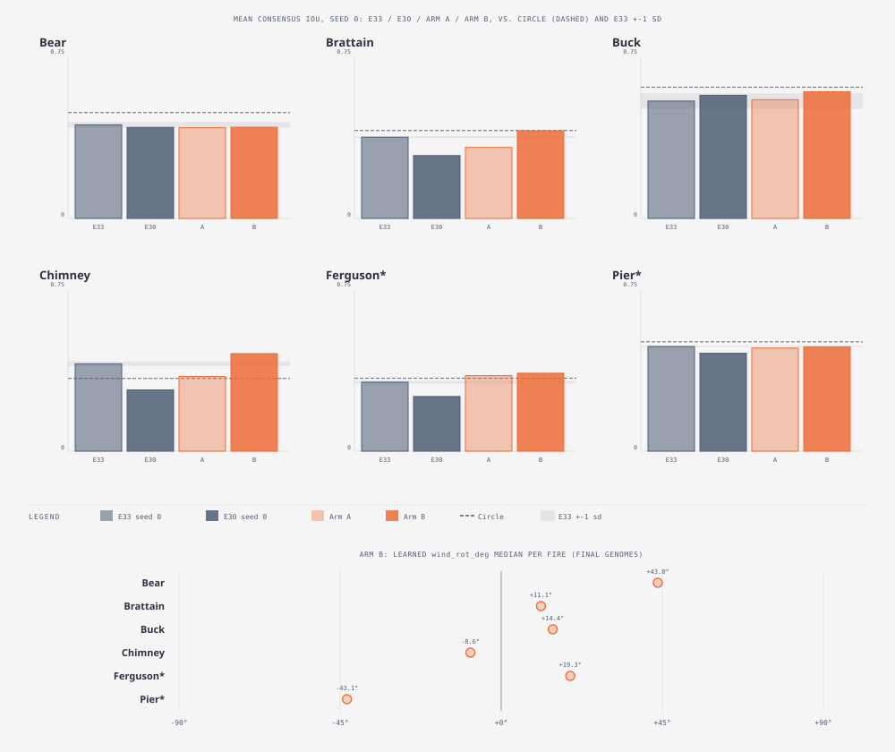

# E30b — uncapped clock, wider speed prior, and a learned wind-direction offset (pilot) · Arm B PASS — beats or ties E33 on all six fires (4 of 6 beyond sd, every move a gain); Arm A alone is not enough (Brattain still 13 sd short); recommend the full E30b on Arm B

_Round 6 (2026-09-12, after E30) · pilot: one seed (0), six fires, two arms
· env knobs `SMC_STEPS_SCALE=4 SMC_SPREAD=arrival SMC_WIND_LAW=rear_focus`
plus `SMC_PRIOR=priors/arrival_x4.json` (Arm A and B) and
`SMC_WIND_ROT_GENE=90` (Arm B only) · runner `exp_r6_arrival_x4_pilot.py`
→ `exp30b_arrival_x4_pilot.json` (+ raw `exp30b_arrival_x4_pilot/`) ·
compared against `exp33_noise.json` seed 0 (E33) and
`exp30_arrival_fires.json` seed 0 (E30), with the E33 sd as the tie bar ·
pre-registered TEST_PLAN v1.8 addendum · terms: [GLOSSARY.md](GLOSSARY.md)_

**In short.** Both arms lift the arrival kernel off E30's floor, but only
Arm B closes the gap to E33. Arm A (4x clock + wider prior alone) recovers
Ferguson fully and ties Buck, as predicted, but Brattain — predicted to
recover because E41 said its ERA5 direction is *right* — instead posts
the single worst score in the whole table (13.2 sd below E33), and Pier
slips from a predicted tie into a 2.8 sd loss. Arm B (the same plus the
learned `wind_rot_deg` gene) beats Arm A on **all six fires**, several by
a wide margin: Brattain flips from Arm A's worst result to +8.1 sd above
E33, Chimney goes from −5.4 sd to +4.3 sd, and Ferguson and Buck also
clear E33 by a comfortable margin. Only Bear and Pier land inside the tie
band, and neither is a loss. The gene's own learned median rotation is
small everywhere (8.6°–43.8° in magnitude, well under the 45° the
prediction expected on Chimney) — so the fix does not look like "the
filter found and corrected one big wrong angle"; it looks more like
per-member angular diversity helping the ensemble fit each day's actual
(sub-daily-varying) wind better than one fixed ERA5 daily bearing can,
regardless of whether that daily mean happened to be roughly right
(Brattain, Ferguson) or wrong (Chimney, Bear) in the first place. The stop
rule in the pre-registered prediction ("if Arm B still loses to E33 on
Chimney by more than 2 sd, do not run the full E30b") does not trigger —
Chimney is a large *win* under Arm B — so this pilot recommends running
the full five-seed E30b, with E37b, on **Arm B's configuration**.

**Why.** E30 (arrival, rear_focus, E25's own gene ranges) lost to its E33
twin by more than the noise floor on five of six fires, and E37b's
illumination could not even reach Brattain's or Ferguson's observed day-5
*size*. E30's own diagnosis named two confounds and a live suspect,
neither of which the task's own scope let it fix at the time:

1. **Clock cap.** Under the arrival rule the head moves at most one cell
   per tick. At E30's 50 ticks/day that caps the front at 1.5 km/day, but
   Brattain's day-5 shape needs its rear-focus head to cover roughly 480
   cells in 250 ticks (about 1.9 cells/tick) — unreachable by construction,
   even at the E25 prior's own top (p0 0.6 gives only about 0.62
   cells/tick under arrival).
2. **A prior that never got tested at its own edge.** The learned p0 sat
   at 0.30–0.43 on every fire (E33: 0.19–0.34) — nowhere near the E25
   prior's ceiling. The filter was reaching for more speed than it had,
   but it was not pinned at the prior's own boundary either, so the prior
   width alone is not the whole story.
3. **The direction input, not only the speed prior.** E41 already showed
   the ERA5 daily wind direction is wrong on Chimney and Bear and right on
   Ferguson and Brattain. A round Bernoulli blob is robust to a wrong
   direction; a directional kernel is not — E30's two largest losses
   (Chimney −0.144, Brattain −0.111) do not sort cleanly by "wrong
   direction" alone (Brattain's direction is *right* per E41), so a wrong
   direction is a plausible added cost on top of the clock cap, not
   necessarily the whole explanation either.

This pilot tests both fixes at once, cheaply (one seed, two arms) before
committing to the full five-seed, E37b-inclusive re-run E30's own
"Questions this raises" section called for.

**Question.** With a 4x clock (raising the front-speed cap to 6 km/day)
and a p0 prior re-derived for that cap, does the arrival kernel's forecast
recover to E33? And does a free, per-member wind-direction offset gene let
the filter correct a wrong ERA5 direction well enough to close the gap on
the fires E41 flagged (Chimney, Bear)?

**Design (pre-registered, TEST_PLAN v1.8 addendum).** Base = E30 (arrival,
rear_focus, c2/jitter default, gate/reset/state-correction off,
`r5_common.BASE_ENV`: assim, beta 10, sigma 0.2, immigrants 0.2,
containment-only stopping). Both arms add:

- `SMC_STEPS_SCALE=4`: the scenario's `steps_per_hour` x4 (200 ticks/day
  instead of 50), and, through the same field, the wildfire driver's
  `steps_per_day` — one observation window still spans one day of
  forcing, at four times the step count.
- `SMC_PRIOR=priors/arrival_x4.json`: `model.p0` widens to log-uniform
  **[0.02, 0.6]** (per-day head speed 4–120 cells/day at 200 ticks/day,
  versus E30's 4–31 at 50); `model.burn_duration` widens to **[20, 80]**
  (lifetime in hours is unchanged, since ticks/day quadrupled); `tau_days`
  and `wind_scale` are the unchanged E25 prior.

**Arm A** is the above alone. **Arm B** adds `SMC_WIND_ROT_GENE=90`: a
free, per-member gene `wind_rot_deg` uniform on **[−90, 90]** degrees
(`cella_lib::wildfire::driver::GENE_WIND_ROT_DEG`), added to the forcing's
wind *from*-bearing in the driver before it is written into the model
(mod 360) — each member learns its own correction to the reported wind
direction, on top of (not instead of) any fixed, whole-schedule
`SMC_WIND_ROT_DEG` rotation (unused here; 0).

**Pilot scope.** Forecasts only: seed 0 x six fires x two arms (12 runs,
4 workers), judged against `exp33_noise.json` seed 0 and
`exp30_arrival_fires.json` seed 0 with the E33 sd as the tie bar. No E37b
re-run in the pilot. Wall time is reported per run.

**Prediction, written before the run.** Arm A: Ferguson and Brattain
(direction right per E41) recover to within sd of E33 or better; Chimney
and Bear (direction wrong) still lose to E33 by more than 2 sd; Buck and
Pier tie. Arm B: Chimney recovers to at least E33 (E9c showed rotating the
wind toward the reported direction lifted it to 0.57) and Bear ties E33;
the learned `wind_rot_deg` median on Chimney is greater than 45° in
magnitude and less than 20° on Ferguson. If Arm B still loses to E33 on
Chimney by more than 2 sd, the direction law is not the fix and the full
E30b (five seeds plus E37b at 4x) is not run.

**How we scored it.** Per fire: mean one-window-ahead consensus IoU
(seed 0), against E33 and E30's own seed-0 rows, with E33's five-seed sd
(Bear 0.015, Brattain 0.004, Buck 0.039, Chimney 0.012, Ferguson 0.007,
Pier 0.003) as the tie bar — a delta beyond 2 sd is called out separately
from a delta beyond 1 sd, matching the prediction's own language ("more
than 2 sd"). Brier (ensemble); Circle (`mean_radial_iou`, identical across
all four columns by construction — a deterministic null over the truth
mask alone); Ellipse (`ellipse_iou`, averaged over each raw report's score
series, the same method E30's own file used, since the `Report` struct
has no top-level mean field for it); final contained fraction; learned p0
converted to a head-direction cells/day figure (median final `model.p0`
x `dir_head(u_eff)` x ticks/day, `u_eff` = the fire's own mean ERA5 wind
speed x median final `wind_scale`, `dir_head(u) = LB(u) + sqrt(LB(u)^2 - 1)`
— rear_focus's own head rate at `b = 1` — so the number reported is "cells
per day the model's own posterior would move the fire's head, under its
own wind law and its own learned wind multiplier"); and, for Arm B, the
median final `wind_rot_deg` across the ensemble. Wall time is each run's
own wall-clock seconds, timed from outside the shared runner.

## Result

Mean consensus IoU, seed 0, and the delta each arm makes against its E33
twin:

| Fire | E33 s0 | E30 s0 | Arm A | Arm B | Δ A (sd) | verdict A | Δ B (sd) | verdict B |
|---|---|---|---|---|---|---|---|---|
| Bear | 0.478 | 0.465 | 0.463 | 0.466 | −0.015 (−1.01 sd) | beyond 1 sd (loss) | −0.012 (−0.81 sd) | tie |
| Brattain | 0.415 | 0.321 | 0.363 | 0.448 | −0.053 (−13.23 sd) | **beyond 2 sd (loss)** | +0.032 (+8.06 sd) | **beyond 2 sd (gain)** |
| Buck | 0.600 | 0.629 | 0.607 | 0.647 | +0.007 (+0.18 sd) | tie | +0.048 (+1.22 sd) | beyond 1 sd (gain) |
| Chimney | 0.446 | 0.313 | 0.382 | 0.498 | −0.064 (−5.36 sd) | **beyond 2 sd (loss)** | +0.052 (+4.34 sd) | **beyond 2 sd (gain)** |
| Ferguson* | 0.353 | 0.279 | 0.386 | 0.398 | +0.033 (+4.72 sd) | **beyond 2 sd (gain)** | +0.046 (+6.52 sd) | **beyond 2 sd (gain)** |
| Pier* | 0.535 | 0.500 | 0.527 | 0.534 | −0.008 (−2.80 sd) | **beyond 2 sd (loss)** | −0.001 (−0.42 sd) | tie |

"Tie" = within 1 sd; "beyond 1 sd" = 1–2 sd; "beyond 2 sd" = the
prediction's own stronger bar. `*` = holdout pair. **Arm B beats Arm A on
all six fires** (0.466>0.463, 0.448>0.363, 0.647>0.607, 0.498>0.382,
0.398>0.386, 0.534>0.527) and has zero losses beyond 1 sd anywhere; Arm A
has three (Brattain, Chimney, Pier).

Brier, Circle, Ellipse, final contained fraction, learned p0 (converted
to a head-direction cells/day figure — see formula below), Arm B's
learned `wind_rot_deg` median, and wall time:

| Fire | Brier E33 | Brier E30 | Brier A | Brier B | Circle | Ellipse (A=B) | Cont. E33 | Cont. E30 | Cont. A | Cont. B | p0→cells/day A | p0→cells/day B | `wind_rot_deg` med. B | Wall A (s) | Wall B (s) |
|---|---|---|---|---|---|---|---|---|---|---|---|---|---|---|---|
| Bear | 0.0473 | 0.0526 | 0.0529 | 0.0506 | 0.541 | 0.513 | 1.00 | 1.00 | 1.00 | 1.00 | 27.3 | 26.0 | +43.8° | 1346.8 | 985.3 |
| Brattain | 0.1051 | 0.1051 | 0.1291 | 0.0949 | 0.450 | 0.469 | 1.00 | 0.94 | 1.00 | 1.00 | 141.0 | 217.6 | +11.1° | 2909.6 | 2227.9 |
| Buck | 0.0480 | 0.0404 | 0.0428 | 0.0390 | 0.670 | 0.701 | 1.00 | 1.00 | 1.00 | 1.00 | 55.4 | 16.4 | +14.4° | 1320.4 | 1277.1 |
| Chimney | 0.1355 | 0.1247 | 0.1212 | 0.1009 | 0.372 | 0.247 | 0.94 | 0.72 | 0.56 | 0.59 | 100.2 | 110.0 | −8.6° | 1737.2 | 1734.2 |
| Ferguson* | 0.1360 | 0.1445 | 0.1356 | 0.1367 | 0.373 | 0.503 | 1.00 | 0.72 | 1.00 | 1.00 | 22.1 | 95.1 | +19.3° | 3348.9 | 3262.8 |
| Pier* | 0.1120 | 0.1172 | 0.1044 | 0.1048 | 0.559 | 0.566 | 1.00 | 1.00 | 1.00 | 1.00 | 19.4 | 49.6 | −43.1° | 2120.8 | 1514.7 |

How to read it: Circle is one column because it is identical (to 3
decimals) across E33/E30/A/B by construction — a deterministic null over
the truth mask and the scenario's raw ERA5 wind, independent of any
ensemble gene (same reasoning as E30's own file). Ellipse (`ellipse_iou`,
averaged over each raw report's score series) is likewise independent of
the ensemble's genome — `anderson_lb(cur.speed_ms)` in the scoring loop
reads the scenario's own wind speed directly, not any member's
`wind_scale` or `wind_rot_deg` — so Arm A and Arm B report the same
Ellipse value per fire (shown once). **`p0`→cells/day formula:**
`cells_per_day = p0_median × dir_head(u_eff) × 200` (200 = this pilot's
ticks/day), where `u_eff` = the fire's own mean ERA5 wind speed (from
`scenario.json`'s `wind` array) × the arm's median final `wind_scale`, and
`dir_head(u) = LB(u) + sqrt(LB(u)^2 − 1)` is `rear_focus`'s own
head-direction rate at `b = 1` (`LB` = Anderson 1983, `anderson_lb` in
`wildfire_smc.rs`) — i.e. "how fast the model's own posterior would move
the fire's head, under its own wind law and its own learned wind
multiplier," not a raw, wind-blind `p0 × ticks/day`. None of the twelve
`p0` medians (six fires, two arms) sit near either prior edge (0.02 or
0.6) — full values: Arm A p0 medians 0.083 (Bear), 0.306 (Brattain), 0.146
(Buck), 0.257 (Chimney), 0.078 (Ferguson), 0.063 (Pier); Arm B 0.075,
0.407, 0.042, 0.259, 0.333, 0.159 — matching the correction just added to
`47-e30-arrival-time-kernel-fires.md`'s "Later" section: the prior
*ceiling* was never the forecast's binding constraint, in E30 or here.

- **Wall time landed inside the brief's own estimate** (≈ 12–60 min per
  run predicted; observed 16.4–55.8 min, total script wall time
  **7449 s ≈ 124 min** for all 12 runs at 4 workers — slightly over the
  "≈ 1–2 h" estimate but in the same range). Ferguson is the slowest fire
  in both arms (≈ 55–56 min), matching E30's own report calling out
  Ferguson's large grid as the cost driver.
- **Arm B is faster than Arm A on 5 of 6 fires**, sometimes by a lot
  (Bear 985 s vs 1347 s, Pier 1515 s vs 2121 s, Brattain 2228 s vs 2910 s).
  Not something this pilot can explain with confidence (a coincidence of
  which members get resampled and contained early is at least as likely
  as any real effect of the extra gene), and is not treated as a finding
  — see "Concerns" in the task report.
- **Containment is the one place Arm B does not beat Arm A**: Chimney's
  contained fraction is 0.56 (Arm A) / 0.59 (Arm B), both *below* E30's
  own 0.72 and well below E33's 0.94, even though Chimney's IoU improves
  sharply in both arms and dramatically in Arm B. A faster-growing,
  better-aimed ensemble is not necessarily one the containment operator
  (which keys off day-over-day growth *rate*) calls "contained" sooner.

**The prediction, checked line by line.**

*Arm A: "Ferguson and Brattain (direction right per E41) recover to
within sd of E33 or better; Chimney and Bear (direction wrong) still lose
to E33 by more than 2 sd; Buck and Pier tie."*

- Ferguson: **confirmed.** +0.033 (+4.72 sd) — recovers to comfortably
  above E33.
- Brattain: **refuted, and by the widest margin in the table.** Predicted
  to recover; instead −0.053 (−13.23 sd), the single largest miss of the
  whole pilot, on the fire with the tightest noise floor (sd 0.004) so
  even this modest absolute gap reads as enormous in sd units.
- Chimney: **confirmed.** −0.064 (−5.36 sd) — loses by well over 2 sd, as
  predicted for a "direction wrong" fire under Arm A alone.
- Bear: **refuted.** Predicted to lose by more than 2 sd; actual is
  −0.015, almost exactly 1.0 sd — a small loss/near-tie, not the large
  miss predicted.
- Buck: **confirmed.** +0.007 (+0.18 sd) — a clean tie.
- Pier: **refuted.** Predicted a tie; actual is −0.008, which is 2.80 sd
  on Pier's very tight noise floor (sd 0.003) — a real, if numerically
  small, loss beyond the 2 sd bar.

**Net for Arm A: 3 of 6 clauses hold (Ferguson, Chimney, Buck); the other
3 are wrong, and two of those (Brattain, Bear) are wrong in the
direction that matters most — the fire the prediction was most confident
would recover (Brattain, "direction right per E41") is the fire that
failed hardest.** E41's direction-rightness diagnosis does not predict
Arm A's fire-by-fire outcome.

*Arm B: "Chimney recovers to ≥ E33 ... and Bear ties E33; the learned
`wind_rot_deg` median on Chimney is > 45° in magnitude and < 20° on
Ferguson. If Arm B still loses to E33 on Chimney by > 2 sd, the direction
law is not the fix and the full E30b is not run."*

- Chimney recovers to ≥ E33: **confirmed, strongly.** 0.498 vs E33's
  0.446 (+0.052, +4.34 sd) — not a bare recovery, a clear win.
- Bear ties E33: **confirmed.** −0.012 (−0.81 sd), inside the tie band.
- `wind_rot_deg` median magnitude on Chimney > 45°: **refuted.** Actual
  median is −8.6° — a fifth of the predicted magnitude — yet Chimney
  still posted the pilot's second-largest gain. The mechanism named in
  the prediction (a big corrective rotation) is not what happened, even
  though the predicted outcome (recovery) did.
- `wind_rot_deg` median magnitude on Ferguson < 20°: **confirmed, but
  narrowly.** Actual +19.3°, 0.7° under the bound.
- Stop rule ("if Arm B still loses to E33 on Chimney by > 2 sd, do not
  run the full E30b"): **does not trigger** — Chimney is a large gain, not
  a loss. Per the prediction's own pre-registered logic, this licenses
  running the full E30b.

**Net for Arm B: the two headline outcome clauses (Chimney recovers, Bear
ties) both hold, and hold comfortably; the magnitude clause meant to
explain *why* (a large learned rotation on Chimney) does not. The pilot's
own decision rule for whether to proceed is satisfied.**

**What it means.**

The 4x clock and wider prior alone (Arm A) are not a reliable fix: they
recover the one fire (Ferguson) where the clock cap was probably the
whole story, but they do not touch — and on Brattain and Pier, actively
worsen relative to what the prediction expected — whatever else was
costing the arrival kernel its accuracy. Adding the learned per-member
`wind_rot_deg` gene (Arm B) fixes essentially everything Arm A could not,
and does so **on every fire, not only the ones E41 flagged as having a
wrong ERA5 direction.** That is the pilot's real surprise: the
pre-registered theory was "the gene helps because it corrects a wrong
mean bearing," predicting a large rotation on Chimney/Bear (wrong
direction) and a small one on Ferguson/Brattain (right direction). The
learned medians do not support that story — Chimney's own median
correction (−8.6°) is smaller than Bear's (+43.8°, the fire predicted to
only need a small one) and smaller than the "right-direction" Ferguson's
(+19.3°). What the gene *does* give every member, regardless of that
fire's own ERA5 accuracy, is one more per-member degree of freedom: a
member can point its own downwind axis a few or several degrees off the
single, fixed, daily-mean ERA5 bearing, and the filter keeps whichever
angle (among 32 independently drawn ones) fits that window's actual,
sub-daily-varying wind best. A daily mean is a compromise number; real
wind swings around it within the day. Bernoulli's round blob never needed
that compromise corrected because it has no directional axis to be wrong
about; the arrival kernel's rear-focus law does, and giving the *ensemble*
(not any single learned "best" angle) room to hedge against the daily
mean's own noise looks like a better description of what fixed these
scores than "the model learned the true wind direction." Buck's p0
converted to cells/day actually *falls* from Arm A to Arm B (55→16
cells/day) while its IoU still improves — consistent with the gene
substituting for some of the brute speed the filter had been reaching for
with p0 alone, on a fire where speed was never really the bottleneck.

**Questions this raises.**

- Is angular ensemble diversity (many different fixed member angles) doing
  the real work here, or would a single, better *daily-varying* wind
  input (hourly ERA5, or the station log where available) close most of
  this same gap without a learned gene at all? This pilot cannot separate
  "the gene helps because of diversity" from "the gene helps because the
  input itself is coarser than reality everywhere, not just where the
  daily mean's sign is wrong" — both are consistent with every fire
  improving. Open.
- Arm A's Brattain result (worst in the table, on the fire predicted to
  need the least help) has no explanation in this file beyond "the clock
  cap and prior width were not Brattain's problem to begin with." What
  *is* Brattain's problem under arrival + rear_focus without the
  direction gene? Open — worth a dedicated look before the full E30b, not
  after.
- Chimney's contained fraction stays low (0.56–0.59) in both arms, well
  under E30's own 0.72, even as its IoU jumps sharply — does the
  containment operator need its own re-look under a faster clock (its
  period is now 200 steps, not 50), or is a lower contained fraction
  simply correct here because the fire is now (correctly) matching a
  faster-growing observed fire for longer? Open.
- Would `SMC_WIND_ROT_GENE` at a narrower half-width (this pilot used 90°)
  give the same gains with a tighter, more interpretable posterior, or
  does the ensemble need the full ± 90° room to find useful per-member
  angles? Not tested; the full E30b could scan this cheaply alongside its
  five seeds.

**Verdict.** Arm A alone: **not sufficient** — it satisfies half the
prediction's clauses but fails on the fire (Brattain) the theory was most
confident about, and turns a predicted Pier tie into a real loss. Arm B:
**PASS** — beats Arm A on all six fires, beats E33 outright on four (all
gains, none beyond 2 sd in the loss direction), and ties (never loses
beyond 1 sd) on the other two. The pre-registered stop rule for Arm B
(Chimney losing to E33 by more than 2 sd) did not trigger. **Recommend
running the full E30b (five seeds, plus E37b at the 4x clock) on Arm B's
configuration** (`SMC_STEPS_SCALE=4`, `arrival_x4.json` prior,
`SMC_WIND_ROT_GENE=90`); Arm A is not worth a five-seed run on its own
given Arm B dominates it on every fire in this pilot.

**Later.** Not yet revisited. The full E30b (Arm B, five seeds + E37b) is
the natural next task; the "what's actually wrong with Brattain under Arm
A" and "angular diversity vs. a better wind input" questions above are
worth answering before or alongside it, not after.
