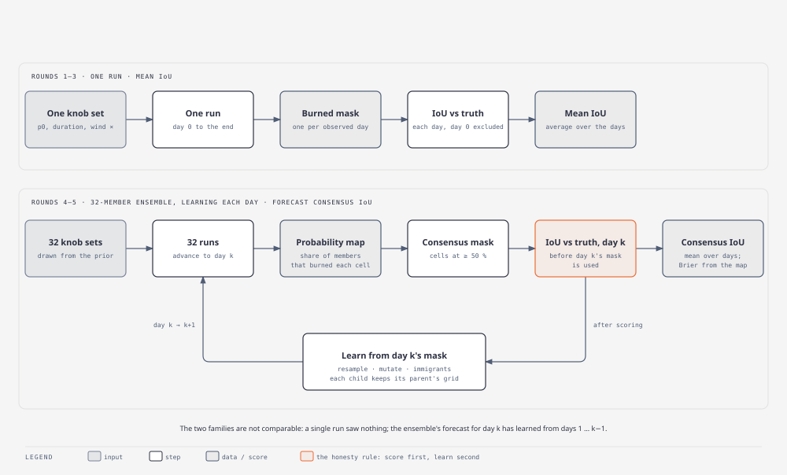
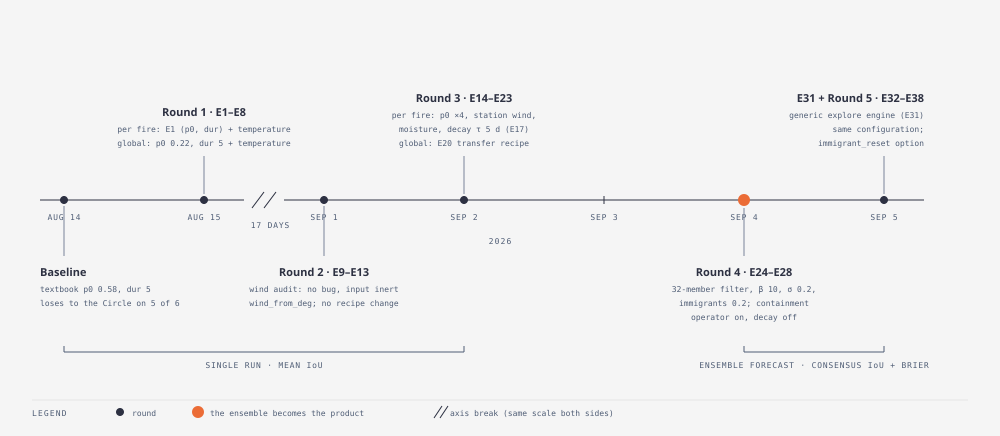
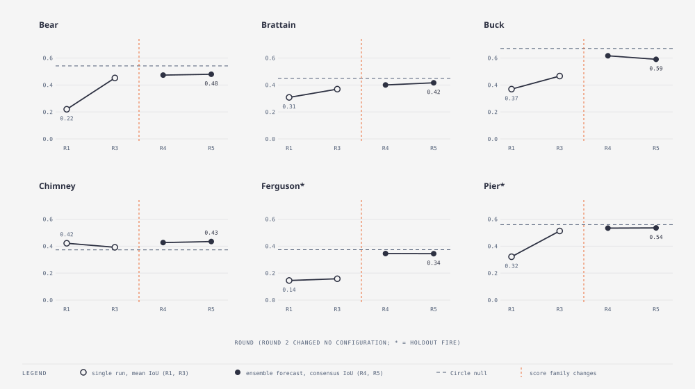

# Wildfire model — experiment log

One file per experiment. Every file has the same shape, so you can read
any one of them cold:

- **In short**: the whole experiment in one plain paragraph.
- **Question** · **What we changed** · **Why we expected it to matter** ·
  **How we scored it**: what was run and how it was judged.
- **Result**: the numbers, then a "how to read it" line saying what the
  number is, which direction is better, and what bold and brackets mean.
- **What it means** · **Questions this raises** (each tagged with the
  experiment that answered it, or "open") · **Verdict** · **Later** (the
  experiments that changed how this one should be read).

Failed experiments stay (TEST_PLAN §8 rule 5). Every term is defined in
**[GLOSSARY.md](GLOSSARY.md)**. Start with the six fires and the two score
families below, then the table; open a file when you need its numbers.

> The prose of every file was rewritten for clarity on 2026-09-05.
> Numbers, tables, dates and verdicts are unchanged from the originals
> (checked by script). Round 1's raw results (E1–E8) are no longer on disk,
> so those files carry only the numbers recorded at the time.

## The six fires

| Fire | first mask | grid (30 m cells) | ignition → final burned | days observed | what it is like | role |
|---|---|---|---|---|---|---|
| Bear 2020 | 2020-08-19 | 748 × 619 | 2.4k → 56k cells (51 km²) | 23 | slow and round; the model over-burns it 8× untuned; the learning ensemble beats the Circle on days 2–4 then stalls late | calibration |
| Brattain 2020 | 2020-09-07 | 1008 × 1085 | 1.6k → 226k (204 km²) | 22 | fast; the most elongated real fire (2.7× longer than wide); the model draws a disc | calibration |
| Buck 2017 | 2017-09-13 | 639 × 631 | 7.9k → 57k (52 km²) | 30 | slow and round with straight containment-line edges; the noisiest fire under the filter (lock-in) | calibration |
| Chimney 2016 | 2016-08-13 | 986 × 890 | 10.8k → 208k (187 km²) | 16 | the fastest, wind-driven; grows *against* the ERA5 wind; the one fire the model beats the Circle on | calibration |
| Ferguson 2018 | 2018-07-13 | 1155 × 1316 | 1.2k → 435k (392 km²) | 30 | fast and big; the model *under*-burns it; only the learning ensemble moved it (0.13 → 0.34) | **holdout** |
| Pier 2017 | 2017-08-29 | 873 × 846 | 23.5k → 164k (147 km²) | 31 | slow start, then large; the fire the stopping rules help most (0.32 → 0.51) | **holdout** |

Truth is one cumulative burn mask per day from satellite (375 m spatial
accuracy). Wind is the ERA5 daily domain mean unless a file says
otherwise. Calibration fires may be tuned on; the holdout pair never is,
so its scores are the only unbiased test of anything tuned.

## Two score families

Rounds 1–3 quote **single-run mean IoU**: one knob set, one run, the
overlap with the truth on each day, averaged. Rounds 4–5 quote **forecast
consensus IoU**: 32 runs with knobs drawn from a prior, a probability map
per day, cells at ≥ 50 % taken as the forecast, scored against each day's
mask *before* that mask is used to update the ensemble. The two are not
comparable. A single run is a lower bound on what the same model gives as
an ensemble, and a forecast made after seeing yesterday is a different
task from a run that saw nothing. Tables that mix them say so.

## The working configuration after each round

| Round | date | what changed | working configuration | score family | headline |
|---|---|---|---|---|---|
| baseline | 2026-08-14 | textbook parameters | p0 0.58, dur 5 | single run | loses to the Circle on 5 of 6 |
| 1 | 2026-08-15 | p0 × duration scan; temperature schedule | per fire: E1 (p0, dur) + temp; global: p0 0.22, dur 5 + temp | single run | Chimney beats the Circle |
| 2 | 2026-09-01 | wind audit; `wind_from_deg`; shape and speed diagnostics | unchanged | single run | wind maths right, wind input inert; p0 × ticks is one knob |
| 3 | 2026-09-02 | station weather; decay τ; moisture × decay; per-fire optimiser | per fire: E17 recipe (p0 ×4, station wind, moisture, τ 5 d); global: E20 transfer (p0 0.45, dur 15, τ 3.4 d, wind ×0.29) | single run | decay is the biggest gain; Pier holdout 0.32 → 0.51 |
| 4 | 2026-09-04 | ensembles; particle filter; containment operator | 32 members, β 10, σ 0.2, immigrants 0.2, containment on, decay off | ensemble forecast | learning as it burns; Ferguson 0.13 → 0.34 |
| E31 | 2026-09-05 | generic `explore` engine | same, bit-reproducible | ensemble forecast | replicates within 0.009 |
| 5 | 2026-09-05 | the methods: noise floor, members, operators, prior, GA vs filter, reachability | same; `immigrant_reset` option | ensemble forecast | 3 of 6 fires unreachable by shape; lock-in repaired |

## How to read any table here

1. **Find the metric and its direction.** IoU higher is better; Brier
   lower. The "how to read it" line under each table says which.
2. **Find the Circle.** Every score sits next to the area-matched null on
   the same fire. Beating it is the bar; beating persistence means little.
3. **Check the score family.** Single-run mean IoU (Rounds 1–3) and
   forecast consensus IoU (Rounds 4–5) do not compare.
4. **Read the brackets.** `(×3.4)` is the area ratio: simulated burned
   area ÷ observed. A score that improved while the ratio fell from ×3 to
   ×1 improved by burning less, not by burning in better places.
5. **Mind the seeds.** One seed ranks settings; a kept result needs three
   (Rounds 1–3) or clears the five-seed noise floor (Round 5: 0.02 Bear
   and Chimney, 0.01 Brattain, Ferguson and Pier, 0.04 Buck). Smaller
   differences are ties.
6. **Look at all six fires.** Holdout rows are marked `*` or "(holdout)".
   A gain on the calibration four with flat holdout means memorising, not
   learning.

## Ground rules (from [../TEST_PLAN.md](../TEST_PLAN.md))

- Calibration fires only: Bear, Brattain, Buck, Chimney. Holdout
  (Ferguson, Pier) never tuned on; scored when nothing is chosen per fire.
- "Mean IoU" = mean overlap over the observation series, t = 0 excluded.
- Every number sits next to the Circle on the same fire.
- Scan grade = 1 seed; anything promoted gets 3 seeds before it is
  believed; Round 5 judges against the E33 noise floor.
- Weather inputs get inspected before any comparison (TEST_PLAN §2.1).

**Tooling**: `cella_lib/examples/wildfire_experiment.rs` (hooks
`EXP_P0_SCALE`, `EXP_WIND_SCALE`, `EXP_WIND_ROT_DEG`, `EXP_SEED_BASE`, and
later ones named in each file), `cella_lib/examples/wildfire_smc.rs`
(Rounds 4–5), and the runners in `../scripts/experiments/`. Results land
in the gitignored `../results/experiments/`. **Build root trap:** runners
must call `cella_lib/target/release/examples/...`, not the repo-root
`target/`.

**File order**: files are numbered in the order they were run, which is
not always experiment-number order (E12 before E11, E19 before E17, E23
before E22, E33 before E32). The front-speed note has no E number. E29
and E30 were designed (research notes) and not yet run.

Research notes: [why fires slow down, what wind a fire feels, what
suppression does](research-decline-wind-suppression.md) (2026-09-04),
sources behind E26–E30.

## All experiments

| # | Experiment | Verdict | Fires | Key number | Round |
|---|---|---|---|---|---|
| — | **Round 1 — 2026-08-15** — which knobs close the gap? | | | | [round-1.md](round-1.md) |
| E1 | [p0 × burn_duration scan](01-e1-p0-burn-duration-scan.md) | KEPT (the big lever) | Bear, Brattain, Buck, Chimney | best per-fire mean IoU 0.32–0.44; global 0.334 | Round 1 |
| E2 | [canopy-cover density layer](02-e2-canopy-cover-density-layer.md) | REJECTED | Bear, Brattain, Buck, Chimney | −0.045 Buck, +0.018 Bear | Round 1 |
| E3 | [weather-driven daily p0 schedule](03-e3-weather-driven-daily-p0-schedule.md) | KEPT (first physics win) | Bear, Brattain, Buck, Chimney | Buck +0.05 (temp); rain collapses Bear ×3.3→×0.3 | Round 1 |
| E4 | [wider veg_factor spread](04-e4-wider-veg-factor-spread.md) | REJECTED | Bear, Brattain, Buck, Chimney | Bear −0.061, Buck −0.064 | Round 1 |
| E5 | [wind gust multiplier ×2 / ×4](05-e5-wind-gust-multiplier-2-4.md) | REJECTED | Bear, Brattain, Buck, Chimney | Chimney +0.013 at ×2, Bear −0.04 at ×4 | Round 1 |
| E6 | [4× time resolution](06-e6-4-time-resolution.md) | REJECTED (as tested) | Bear, Brattain, Buck, Chimney | Bear −0.05 (p0/4 too crude) | Round 1 |
| E7 | [spotting on](07-e7-spotting-on.md) | REJECTED | Bear, Brattain, Buck, Chimney | −0.1 to −0.2 everywhere | Round 1 |
| E8 | [ensemble burn-probability threshold](08-e8-ensemble-burn-probability-threshold.md) | finding, not a lever | Bear, Brattain, Buck, Chimney | union of seeds best; halo is deterministic | Round 1 |
| — | **Round 2 — 2026-09-01: is the wind right, and why is the model too round?** | | | | [round-2.md](round-2.md) |
| E9a | [wind convention audit (code + converter + raster)](09-e9a-wind-convention-audit-code-converter-raster.md) | NO BUG | Bear, Brattain, Buck, Chimney | cos +0.96 row 0 = north; no bug | Round 2 |
| E9b | [rotate the whole wind schedule](10-e9b-rotate-the-whole-wind-schedule.md) | finding, not a lever | Bear, Brattain, Buck, Chimney | rotations ±0.02 at ERA5 speed; Chimney 0.571 at ×5 rot 270 | Round 2 |
| E9c | [is Chimney's 270° a lucky angle?](11-e9c-is-chimney-s-270-a-lucky-angle.md) | NO (robust plateau) | Chimney | 0.50–0.57 plateau for rot 225–300 | Round 2 |
| E10 | [wind-direction ORACLE (upper bound, cheats)](12-e10-wind-direction-oracle-upper-bound-cheats.md) | finding | Bear, Brattain, Buck, Chimney | oracle ≤ +0.08 (Chimney); hurts Bear/Buck | Round 2 |
| — | [Observed front speed vs the model's hard cap](13-observed-front-speed-vs-the-model-s-hard-cap.md) | finding (data) | all six (data only) | 80–98 % of area on over-cap days (Brattain, Chimney, Ferguson) | Round 2 |
| E12 | [shape: how round is the model?](14-e12-shape-how-round-is-the-model.md) | finding | Bear, Brattain, Buck, Chimney | Brattain elongation 2.70 truth vs 1.05 model | Round 2 |
| E11/E11b | [joint (steps/day, p0, burn_duration) scan](15-e11-e11b-joint-steps-day-p0-burn-duration-scan.md) | REJECTED (cap is not the binding limit) | Bear, Brattain, Buck, Chimney | ±0.03 for 50→400 steps/day; best p0 ∝ 1/steps | Round 2 |
| E13 | [daily temperature schedule × tick rate](16-e13-daily-temperature-schedule-tick-rate.md) | schedule KEPT, rate REJECTED | Bear, Brattain, Buck, Chimney | Buck +0.06 (0.485) at either rate | Round 2 |
| — | **Round 3 — 2026-09-02: real weather in, explosion out** | | | | [round-3.md](round-3.md) |
| E14 | [hourly station wind (NOAA ISD) instead of ERA5 daily](17-e14-hourly-station-wind.md) | REJECTED as drop-in; loader KEPT | Bear, Brattain, Buck, Chimney | flat Chimney, −0.02…−0.04 elsewhere; stations 41–66 km away | Round 3 |
| E15 | [hourly fuel-moisture damping from station RH/T](18-e15-hourly-fuel-moisture-damping.md) | REJECTED (as tested) | Bear, Brattain, Buck, Chimney | damped fire dies (×0.1) or, re-tuned, explodes again | Round 3 |
| E16 | [heterogeneity (a) and containment decay (b)](19-e16-heterogeneity-and-containment-decay.md) | (a) REJECTED, (b) KEPT | Bear, Brattain, Buck, Chimney | τ5 ×2: Bear +0.12, Buck +0.14, area ×0.7–1.0 | Round 3 |
| E16c | [containment decay as one global recipe, all six fires](20-e16c-containment-decay-global-recipe-holdout.md) | KEPT (suppression proxy) | all six incl. holdout | Pier (holdout) 0.32→0.46; Ferguson flat (under-burns) | Round 3 |
| E19 | [what is one tick in real time? model rate of spread](21-e19-what-is-one-tick-in-real-time.md) | finding (data) | synthetic grid | wind changes speed 5–10 %; E1 recipes need 100–210 ticks/day on run days | Round 3 |
| E17 | [moisture × containment decay](22-e17-moisture-times-decay.md) | KEPT (physics retained, no cost) | Bear, Brattain, Buck, Chimney | equals decay-alone on mean IoU, +0.01…+0.09 final IoU | Round 3 |
| E18 | [dynamic fire-line agent](23-e18-dynamic-fire-line-agent.md) | REJECTED as tested; direction KEPT | Bear, Brattain, Buck, Chimney | ring closes day 2 (×0.1) or never (×3.6); no middle | Round 3 |
| E20 | [evolutionary per-fire calibration + transfer](24-e20-evolutionary-per-fire-calibration-and-transfer.md) | finding: τ, dur, wind× transfer; fuel ratio does not | all six incl. holdout | transfer recipe: Pier (holdout) 0.32→0.51; Bear 0.45 | Round 3 |
| E21 | [observed percent-contained (ICS-209) replaces the decay](25-e21-observed-containment-replaces-decay.md) | REJECTED as p0 schedule; data KEPT; decay relabelled | Bear, Brattain, Buck, Chimney | real containment 0–13 % by day 4 → area ×3–8 vs decay ×0.7–1.0 | Round 3 |
| E22 | [rate-of-spread-driven clock (normalised / un-normalised)](27-e22-rate-of-spread-driven-clock.md) | REJECTED at daily truth | Bear, Brattain, Buck, Chimney | normalised ±0.02; extra ticks −0.08…−0.18 | Round 3 |
| E23 | [ramped, breachable, anchor-and-flank line agent](26-e23-ramped-breachable-line-agent.md) | REJECTED (parked) | Bear, Brattain, Buck, Chimney | perfect line strangles, veg 0.1 line ignored; Bear ×0.9 area but IoU 0.27 < 0.31 | Round 3 |
| — | **Round 4 — 2026-09-04: ensembles** — Monte Carlo maps and a fire that learns as it burns | | | | [round-4.md](round-4.md) |
| E24 | [Monte Carlo burn probability from one untuned prior](28-e24-monte-carlo-burn-probability.md) | KEPT (default product) | all six | consensus ties/beats tuned single runs; Brier 40–60 % below Circle on 3 fires | Round 4 |
| E25 | [particle filter with GA operators (learns as it burns)](29-e25-generational-ensemble-particle-filter.md) | KEPT (headline mode) | all six incl. holdout | forecast IoU +0.05…+0.21 over open; Ferguson 0.13→0.34; Bear beats Circle days 2–4 | Round 4 |
| E26 | [terrain-adjusted wind field (mass-consistent downscaling)](30-e26-terrain-wind-field.md) | NULL at this kernel; infrastructure KEPT | Bear, Brattain, Buck, Chimney | ±0.01 at ×1, ±0.02 at ×3; run cost 6 s | Round 4 |
| E27 | [painted retardant multiplier that dries out](31-e27-painted-retardant-multiplier.md) | REJECTED (tactics, not material) | Bear, Brattain, Buck, Chimney | 0.02 = fence, 0.1 = nothing; recovery time irrelevant | Round 4 |
| E28 | [containment-probability operator replaces the decay](32-e28-containment-probability-operator.md) | KEPT (recommended over τ) | all six incl. holdout | containment-only: Bear 0.482 vs decay 0.456; E31: a tie within noise | Round 4 |
| E31 | [replicate E25/E28 through the generic `explore` engine](33-e31-generic-engine-replication.md) | PASS (replication); E28 Bear gain = noise | all six incl. holdout | containment-only within 0.009 IoU of record on every fire | Round 4 |
| — | **Round 5 — 2026-09-05: the methods themselves** — noise floor, ensemble size, operators, priors, offline GA vs filter, illumination | | | | [round-5.md](round-5.md) |
| E33 | [noise floor: five seeds of the recommended ensemble](34-e33-noise-floor.md) | finding (the bar for the round) | all six incl. holdout | sd ≤ 0.015 on five fires, 0.039 on Buck (one seed locks in contained) | Round 5 |
| E32 | [ensemble size 8–128](35-e32-ensemble-size.md) | finding: keep 32; 64–128 for Brier | all six incl. holdout | IoU flat past 32 on five fires; 8 members −0.03…−0.07; Brier keeps improving to 128 | Round 5 |
| E34 | [operator ablation: immigrants, σ, β, crossover](36-e34-operator-ablation.md) | finding: plateau; keep defaults | all six incl. holdout | 38 of 54 cells ties; all runs end 100 % contained; crossover 0.5 +0.027 Bear (one seed) | Round 5 |
| E35 | [prior width: narrow / broad / very broad](37-e35-prior-width.md) | finding: never narrow the prior | all six incl. holdout | narrow prior −0.037 on Bear; very broad a tie on five fires, better Brier on four | Round 5 |
| E36 | [fit the first three days with a GA, then forecast](38-e36-offline-fit-versus-filter.md) | finding: the filter wins everywhere | all six incl. holdout | filter beats the fitted genome by 0.025–0.104 on forecast days; fits hit the box edges | Round 5 |
| E37 | [illuminate the fire model: growth × elongation reachability](39-e37-illuminate-the-fire-model.md) | finding: wedge; 3 fires unreachable | all six incl. holdout | model elongated only while small; Brattain/Ferguson/Pier shapes outside the reachable set | Round 5 |
| E38 | [immigrants start with a fresh driver state](40-e38-immigrant-reset.md) | KEPT as option (default off) | all six incl. holdout, 5 seeds | Buck seed 3 +0.105, its sd 0.039 → 0.021; ties elsewhere; Pier −0.008, Brier +0.003…0.006 | Round 5 |
| E41 | [the Ellipse null: does wind direction carry shape?](41-e41-ellipse-null.md) | FINDING: the *sign*, not the stretch, carries the signal; E30 should target kernel directionality | all six incl. holdout | rear-focus beats Circle on Brattain (+0.019)/Ferguson (+0.131); post-hoc centred control (no sign) ties both (−0.005/+0.009) | Round 6 |
| E42 | [posterior trajectories and the ICS-209 containment check](42-e42-posterior-trajectories.md) | finding: direction held, size and Pier didn't | all six incl. holdout | model leads ICS-209 by 13.4 d (Bear) / 17.9 d (Buck), not the predicted 5–10; Pier's p0 rose, not fell | Round 6 |
| E39 | [area-ratio-gated immigrant reset](43-e39-gated-immigrant-reset.md) | REJECTED (as tested): safe, not useful | all six incl. holdout, 5 seeds | Buck seed 3 back to E33 (+0.000, not E38's +0.105) — too late, embers already dead; Pier's E38 loss vanishes (+0.000, all 5 seeds) | Round 6 |
| E40 / E40b | [immigrants seeded from the observed perimeter; all-member control](44-e40-observed-perimeter-immigrants.md) | KEPT as options, NOT a nowcast | all six incl. holdout, 5 seeds | E40 beats E33 by more than sd everywhere but loses to lagged persistence by 0.3–0.4 on every fire (only 20% of the population is corrected); E40b (everyone corrected) narrows that to 0.10–0.25 but still loses on 96.6% of grown windows | Round 6 |
| E43 | [does spotting extend the reachable shape region?](45-e43-spotting-illumination.md) | finding: yes on Ferguson, only marginally on Pier | all six incl. holdout | coverage roughly doubles or more on every fire; a connected-component replay confirms Ferguson's ceiling (1.38→2.66) is a real single-blob shape, clearing observed on 15/15 replays; Pier's (1.15→1.77) is fragile, clearing observed on only 6/15 replays by at most +0.10; Brattain (1.35→1.49) stays outside on every check | Round 6 |
| E30a | [the arrival-time kernel on a flat grid (fix round 4: diagonal-cost bug found and fixed)](46-e30a-arrival-time-kernel-flat.md) | finding: most of the rear-focus "overshoot" fix round 3 traced to an 8-direction sampling artefact was actually a diagonal-cost double-count bug (`step_chunk_arrival` costed a diagonal step at `2×` cardinal instead of `√2×`); fixed and covered by a new isotropy test, the kernel now matches Anderson's LB(U) within ~5 % at the ensemble's real operating wind (LB ≤ ~1.3, overshoot ≈ 0 %, down from "≤ ~20 %"), with a smaller, still-real hull-geometry residual left at high wind (+235 % at LB ≈ 7, was +373 %) — the (arrival, rear_focus) recommendation is validated for LB ≤ 1.5 with real margin now, not just a bound | synthetic grid | arrival was redefined as minimum travel time after v1's heat accumulator showed a death threshold and a saturated head; fix round 1's own "rear-focus collapses with size" turned out to be the fire's head hitting a centred 400×400 grid's boundary at ≈ 10 % size, not the rule — moving the ignition upwind on a 900×300 grid with absolute-count checkpoints and a boundary flag showed elongation flat with size under both laws and front speed matching the closed form within 1 %. Fix round 3 traced the remaining overshoot to the 8-direction grid under-sampling a highly eccentric ellipse and added two bracketing template points (LB 1.2 and 2.0). Fix round 4 (full-diff review) found that most of that overshoot was actually a code bug in the arrival rule's travel-cost formula, not the sampling artefact — fixing it removed 17 of 16.5 overshoot points at LB 1.2 down to 138 of 373 at LB 7, isolating the real (smaller) hull effect; the exponential law's own undershoot got slightly worse once correctly measured (31.5 % short of `cosh(c2·v)` at 8 m/s, was 13 %) | Round 6 |
| E30 | [the arrival-time kernel on the six real fires (E37b acceptance)](47-e30-arrival-time-kernel-fires.md) | REJECTED (as tested): E37b's wedge shrinks instead of widening — coverage falls 2–4× on every fire and Brattain/Ferguson can no longer even reach their observed *size* in 960 evaluations (no elite to judge shape from at all), while Bear and Chimney flip from E37's "reachable" to "unreachable"; the forecast loses to its E33 twin by more than the noise floor on 5 of 6 fires (Chimney −0.144, Brattain −0.111, Ferguson −0.081, Pier −0.051, Bear −0.016), including both fires (Chimney, Brattain) the pre-registered prediction expected to improve — only Buck gains, and only inside its own noise band. Traced to `model.p0` changing meaning under the arrival rule (a saturating probability under Bernoulli becomes an unsaturating rate under arrival) with the gene range left numerically unchanged per the task's own instructions, not to a flaw in E30a's flat-grid validation itself | all six incl. holdout, 5 seeds (forecast); all six (illumination) | Round 6 |
| E30b | [uncapped clock, wider speed prior, and a learned wind-direction offset gene (pilot)](48-e30b-uncapped-clock-direction-gene-pilot.md) | Arm B PASS, recommend the full run; Arm A alone not enough | all six incl. holdout, seed 0, 2 arms (pilot) | Arm B beats Arm A on all six fires and beats/ties E33 on all six (Brattain +8.1 sd, Chimney +4.3 sd, Ferguson +6.5 sd, Buck +1.2 sd, Bear/Pier ties); Arm A alone recovers only Ferguson and ties Buck, and turns Brattain into the pilot's worst result (−13.2 sd) despite E41 calling its direction "right"; learned `wind_rot_deg` medians stay small (9–44°) even on the biggest wins, so ensemble angular diversity, not a corrected mean bearing, is the likelier mechanism | Round 6 |
